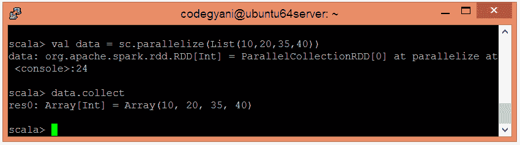
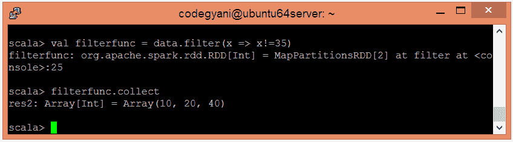

# Spark过滤功能

> 原文：<https://www.javatpoint.com/apache-spark-filter-function>

在 Spark 中，Filter 函数返回一个新的数据集，该数据集是通过选择函数返回 true 的源元素而形成的。因此，它只检索满足给定条件的元素。

### 过滤器功能示例

在这个例子中，我们过滤给定的数据并检索除 35 以外的所有值。

*   要在 Scala 模式下打开Spark，请遵循以下命令。

```

$ spark-shell

```


*   使用并行集合创建 RDD。

```

scala> val data = sc.parallelize(List(10,20,35,40))

```

*   现在，我们可以使用以下命令读取生成的结果。

```

scala> data.collect

```



*   应用筛选函数并传递执行所需的表达式。

```

scala> val filterfunc = data.filter(x => x!=35)

```

*   现在，我们可以使用以下命令读取生成的结果。

```

scala> filterfunc.collect

```



在这里，我们得到了期望的输出。

* * *