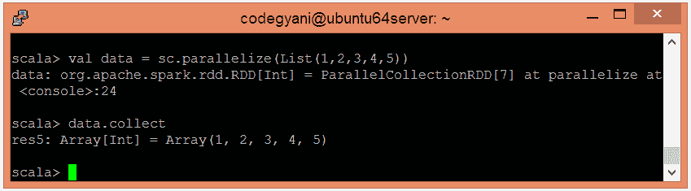
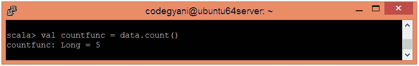

# Spark 计数函数

> 原文：<https://www.javatpoint.com/apache-spark-count-function>

在 Spark 中，Count 函数返回数据集中存在的元素数量。

### 计数功能示例

在本例中，我们计算数据集中存在的元素数量。

*   使用并行集合创建 RDD。

```

scala> val data = sc.parallelize(List(1,2,3,4,5))

```

*   现在，我们可以使用以下命令读取生成的结果。

```

scala> data.collect

```



*   应用 count()函数计算元素的数量。

```

scala> val countfunc = data.count()

```



在这里，我们得到了期望的输出。

* * *