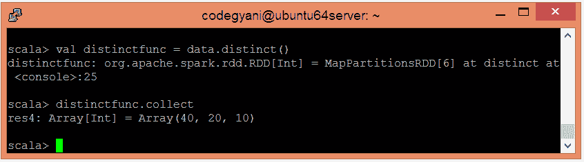

# 火花独特功能

> 原文：<https://www.javatpoint.com/apache-spark-distinct-function>

在 Spark 中，Distinct 函数从提供的数据集中返回不同的元素。

### 独特功能的示例

在这个例子中，我们忽略重复的元素，只检索不同的元素。

*   要在 Scala 模式下打开火花，请遵循以下命令。

```

$ spark-shell

```


*   使用并行集合创建 RDD。

```

scala> val data = sc.parallelize(List(10,20,20,40))

```

*   现在，我们可以使用以下命令读取生成的结果。

```

scala> data.collect

```


*   应用 distinct()函数忽略重复的元素。

```

scala> val distinctfunc = data.distinct()

```

*   现在，我们可以使用以下命令读取生成的结果。

```

scala> distinctfunc.collect

```



在这里，我们得到了期望的输出。

* * *