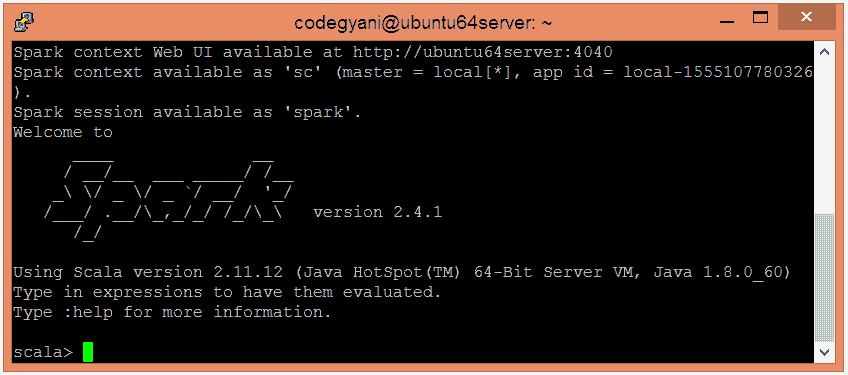
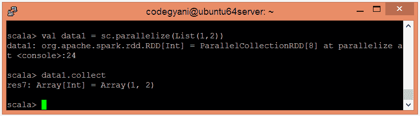
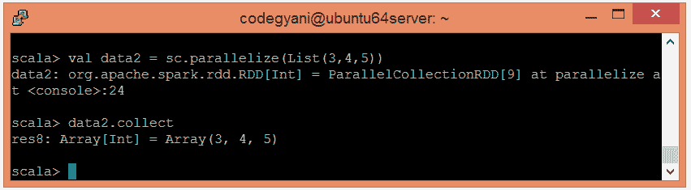
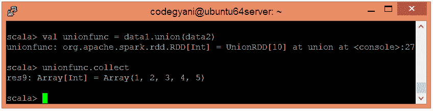

# 火花联合函数

> 原文：<https://www.javatpoint.com/apache-spark-union-function>

在 Spark 中，Union 函数返回一个包含不同数据集中元素组合的新数据集。

### 联合函数示例

在这个例子中，我们结合了两个数据集的元素。

*   要在 Scala 模式下打开火花，请遵循以下命令。

```

$ spark-shell

```



*   使用并行集合创建 RDD。

```

scala> val data1 = sc.parallelize(List(1,2))

```

*   现在，我们可以使用以下命令读取生成的结果。

```

scala> data1.collect

```



*   使用并行集合创建另一个 RDD。

```

scala> val data2 = sc.parallelize(List(3,4,5))

```

*   现在，我们可以使用以下命令读取生成的结果。

```

scala> data2.collect

```



*   应用 union()函数返回元素的并集。

```

scala> val unionfunc = data1.union(data2)

```

*   现在，我们可以使用以下命令读取生成的结果。

```

scala> unionfunc.collect

```



在这里，我们得到了期望的输出。

* * *