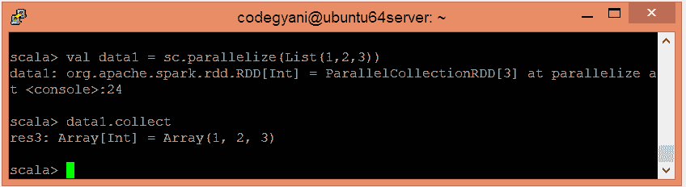
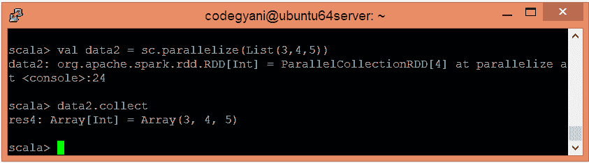
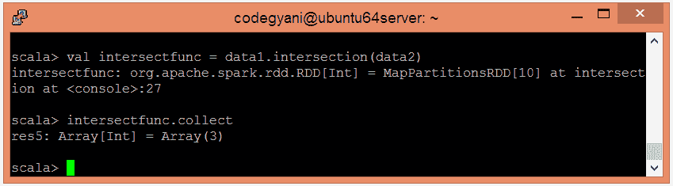

# 火花相交函数

> 原文：<https://www.javatpoint.com/apache-spark-intersection-function>

在 Spark 中，交集函数返回一个新的数据集，该数据集包含不同数据集中元素的交集。因此，它只返回一行。这个函数的行为就像 SQL 中的 INTERSECT 查询一样。

## 交集函数示例

在本例中，我们将两个数据集的元素相交。

*   要在 Scala 模式下打开火花，请执行以下命令。

```

$ spark-shell

```


*   使用并行集合创建 RDD。

```

scala> val data1 = sc.parallelize(List(1,2,3))

```

*   现在，我们可以使用以下命令读取生成的结果。

```

scala> data1.collect

```



*   使用并行集合创建另一个 RDD。

```

scala> val data2 = sc.parallelize(List(3,4,5))

```

*   现在，我们可以使用以下命令读取生成的结果。

```

scala> data2.collect

```



*   应用交集()函数返回元素的交集。

```

 scala> val intersectfunc = data1.intersection(data2)

```

*   现在，我们可以使用以下命令读取生成的结果。

```

scala> intersectfunc.collect

```



在这里，我们得到了期望的输出。

* * *