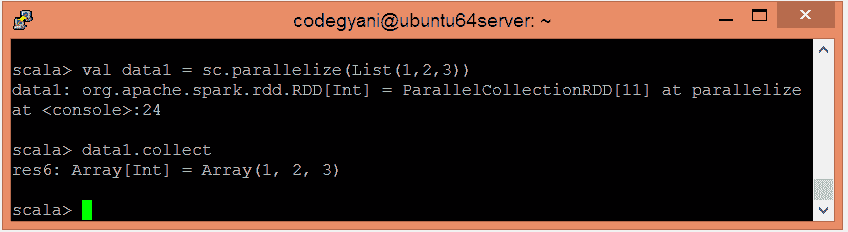
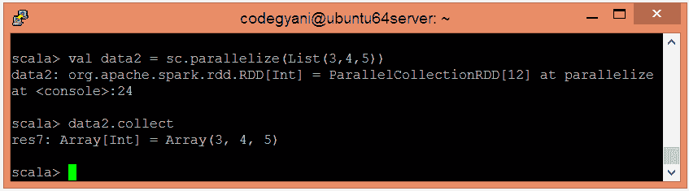
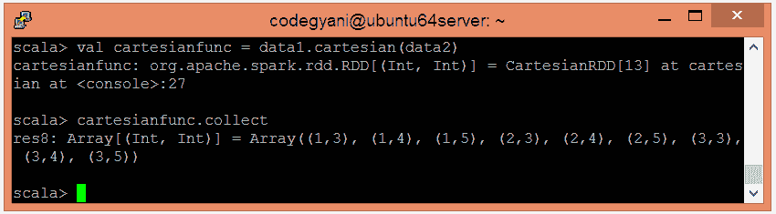

# 火花笛卡尔函数

> 原文：<https://www.javatpoint.com/apache-spark-cartesian-function>

在 Spark 中，笛卡尔函数生成两个数据集的笛卡尔乘积，并返回所有可能的对组合。这里，一个数据集的每个元素与另一个数据集的每个元素配对。

## 笛卡尔函数的例子

在这个例子中，我们生成了两个数据集的笛卡尔乘积。

*   要在 Scala 模式下打开火花，请执行以下命令。

```

$ spark-shell

```


*   使用并行集合创建 RDD。

```

scala> val data1 = sc.parallelize(List(1,2,3))

```

*   现在，我们可以使用以下命令读取生成的结果。

```

scala> data1.collect

```



*   使用并行集合创建另一个 RDD。

```

scala> val data2 = sc.parallelize(List(3,4,5))

```

*   现在，我们可以使用以下命令读取生成的结果。

```

scala> data2.collect

```



*   应用笛卡尔()函数返回元素的笛卡尔乘积。

```

scala> val cartesianfunc = data1.cartesian(data2)

```

*   现在，我们可以使用以下命令读取生成的结果。

```

scala> cartesianfunc.collect

```



在这里，我们得到了期望的输出。

* * *