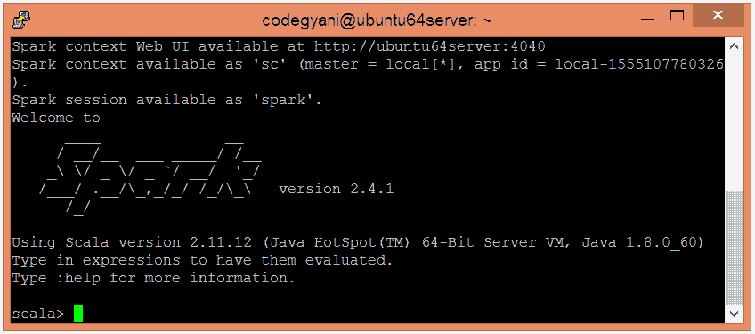
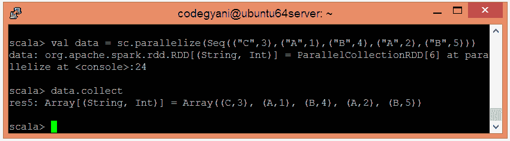
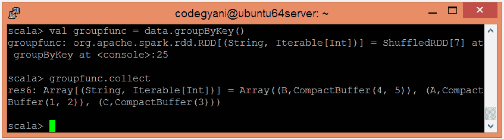

# Spark 组按键功能

> 原文：<https://www.javatpoint.com/apache-spark-groupbykey-function>

在 Spark 中，groupByKey 函数是一个常用的转换操作，用于执行数据的洗牌。它接收键值对(K，V)作为输入，基于键对值进行分组，并生成(K，Iterable <v>)对的数据集作为输出。</v>

## groupByKey 函数示例

在本例中，我们根据键对值进行分组。

*   要在 Scala 模式下打开 Spark，请执行以下命令。

```

$ spark-shell

```



*   使用并行集合创建 RDD。

```

scala> val data = sc.parallelize(Seq(("C",3),("A",1),("B",4),("A",2),("B",5)))

```

现在，我们可以使用以下命令读取生成的结果。

```

scala> data.collect

```



*   应用 groupByKey()函数对值进行分组。

```

scala> val groupfunc = data.groupByKey()

```

*   现在，我们可以使用以下命令读取生成的结果。

```

scala> groupfunc.collect

```



在这里，我们得到了期望的输出。

* * *