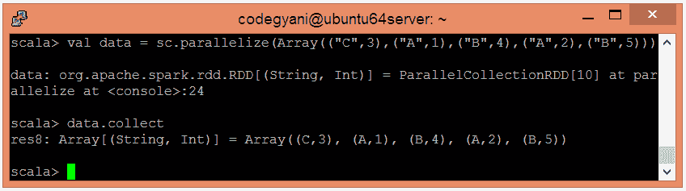
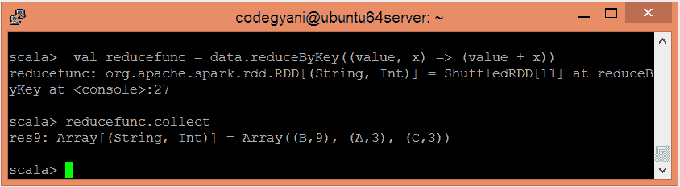

# 按键功能减少Spark

> 原文：<https://www.javatpoint.com/apache-spark-reducebykey-function>

在 Spark 中，reduceByKey 函数是一个常用的转换操作，用于执行数据聚合。它接收键值对(K，V)作为输入，根据键聚合值，并生成(K，V)对数据集作为输出。

## 缩减键函数示例

在这个例子中，我们根据关键字聚合这些值。

*   要在 Scala 模式下打开Spark，请执行以下命令。

```

$ spark-shell

```


*   使用并行集合创建 RDD。

```

scala> val data = sc.parallelize(Array(("C",3),("A",1),("B",4),("A",2),("B",5)))

```

现在，我们可以使用以下命令读取生成的结果。

```

scala> data.collect

```



*   应用 reduceByKey()函数来聚合这些值。

```

scala> val reducefunc = data.reduceByKey((value, x) => (value + x))

```

*   现在，我们可以使用以下命令读取生成的结果。

```

scala> reducefunc.collect

```



在这里，我们得到了期望的输出。

* * *