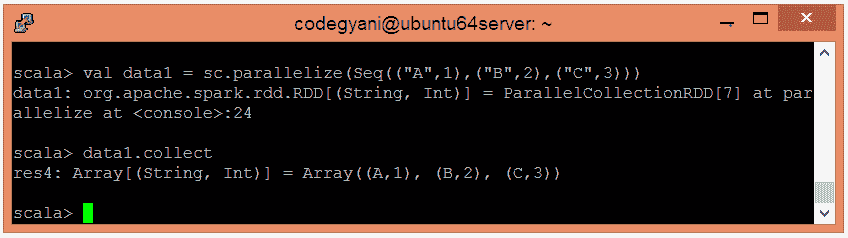
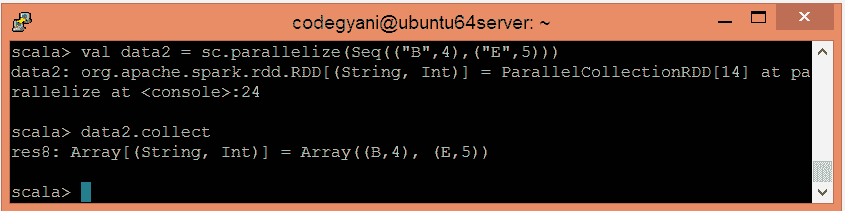
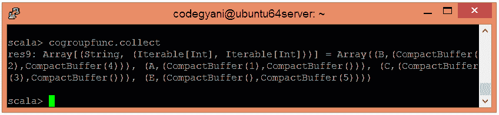

# Spark 群函数

> 原文：<https://www.javatpoint.com/apache-spark-cogroup-function>

在 Spark 中，cogroup 函数在不同的数据集上执行，比如(K，V)和(K，W)，并返回一个(K，(可迭代<v>，可迭代<w>)元组的数据集。这种操作也被称为**组与**。</w></v>

## 共组函数示例

在本例中，我们使用操作执行**组。**

*   要在 Scala 模式下打开 Spark，请执行以下命令。

```

$ spark-shell

```


*   使用并行集合创建 RDD。

```

scala> val data1 = sc.parallelize(Seq(("A",1),("B",2),("C",3)))

```

现在，我们可以使用以下命令读取生成的结果。

```

scala> data1.collect

```



*   使用并行集合创建另一个 RDD。

```

scala> val data2 = sc.parallelize(Seq(("B",4),("E",5)))

```

现在，我们可以使用以下命令读取生成的结果。

```

scala> data2.collect

```



*   应用 cogroup()函数对值进行分组。

```

scala> val cogroupfunc = data1.cogroup(data2)

```

*   现在，我们可以使用以下命令读取生成的结果。

```

scala> cogroupfunc.collect

```



在这里，我们得到了期望的输出。

* * *