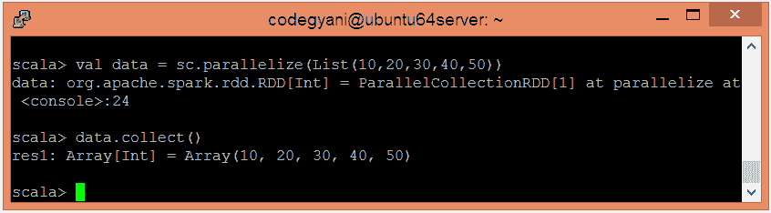
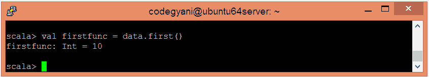

# Spark 优先函数

> 原文：<https://www.javatpoint.com/apache-spark-first-function>

在 Spark 中，First 函数总是返回数据集的第一个元素。它类似于采取(1)。

## 第一功能示例

在本例中，我们检索数据集的第一个元素。

*   要在 Scala 模式下打开 Spark，请执行以下命令。

```

$ spark-shell

```


*   使用并行集合创建 RDD。

```

scala> val data = sc.parallelize(List(10,20,30,40,50))

```

*   现在，我们可以使用以下命令读取生成的结果。

```

scala> data.collect

```



*   应用 first()函数检索数据集的第一个元素。

```

scala> val firstfunc = data.first()

```



在这里，我们得到了期望的输出。

* * *