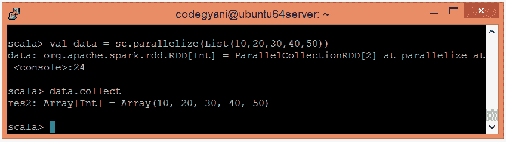
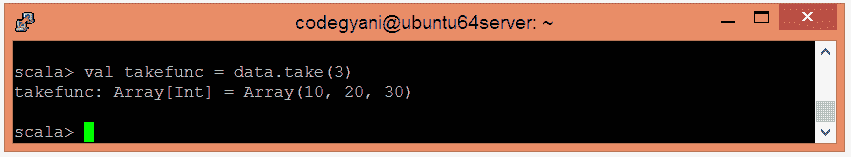

# Spark 获取功能

> 原文：<https://www.javatpoint.com/apache-spark-take-function>

在 Spark 中，take 函数的行为类似于数组。它接收一个整数值(比如 n)作为参数，并返回数据集前 n 个元素的数组。

## Take 函数示例

在本例中，我们返回现有数据集的前 n 个元素。

*   要在 Scala 模式下打开 Spark，请执行以下命令。

```

$ spark-shell

```


*   使用并行集合创建 RDD。

```

scala> val data = sc.parallelize(List(10,20,30,40,50))

```

*   现在，我们可以使用以下命令读取生成的结果。

```

scala> data.collect

```



*   应用 take()函数返回元素数组。

```

scala> val takefunc = data.take(3)

```



在这里，我们得到了期望的输出。

* * *