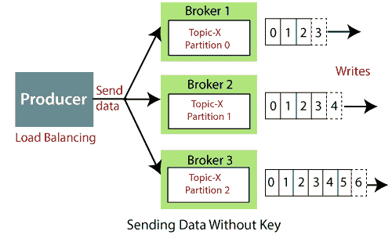
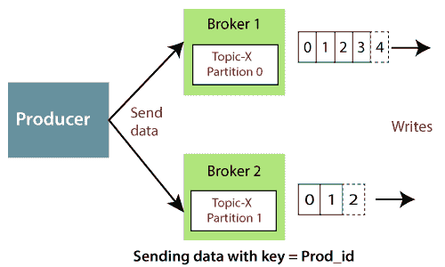
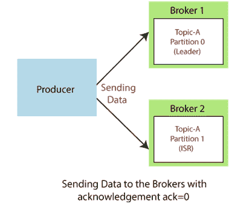
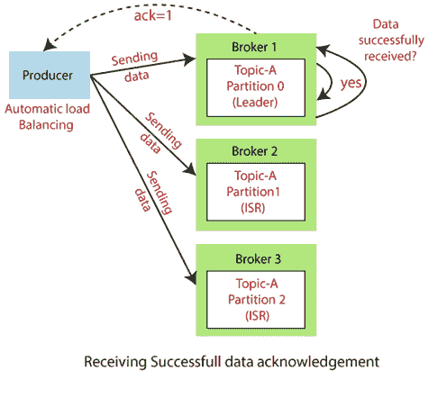
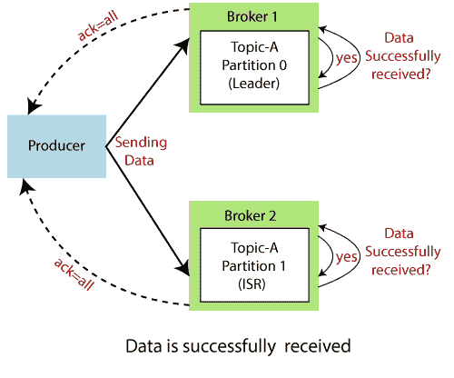

# 卡夫卡制作人

> 原文：<https://www.javatpoint.com/apache-kafka-producer>

生产者是将数据发布或写入不同分区内的主题的人。生产者自动知道，哪些数据应该写入哪个分区和代理。用户不需要指定代理和分区。

## 生产者如何将数据写入集群？

生产者使用以下策略将数据写入集群:

*   消息密钥
*   承认

### 消息密钥

Apache Kafka 使密钥的概念能够以特定的顺序发送消息。该键为生产者提供了两种选择，即向每个分区发送数据(自动)或仅向特定分区发送数据。使用消息键可以将数据发送到一些特定的分区。如果生产者在数据上应用密钥，那么该数据将总是被发送到相同的分区。但是，如果生产者在写数据时不应用密钥，它将以循环方式发送。这个过程叫做**负载均衡**。在 Kafka 中，负载平衡是在生产者向 Kafka 主题写入数据而不指定任何键时完成的，Kafka 将一点点的数据分发到每个分区。

因此，消息键可以是字符串、数字或我们希望的任何东西。

有两种方法可以知道数据是带还是不带密钥发送的:

1.  如果键值=空，则表示发送的数据没有键值。因此，它将以循环方式分布(即，分布到每个分区)。
2.  如果键的值！=NULL，这意味着密钥与数据一起附加，因此所有消息将始终传递到同一个分区。

**我们来看一个例子**

考虑一个场景，生产者将数据写入 Kafka 集群，数据写入时没有指定密钥。因此，数据分布在每个代理(即代理 1、代理 2 和代理 3)下的 Topic-T 的每个分区中。

考虑另一个场景，生产者指定一个关键字作为 Prod_id。因此，Prod_id_1 的数据(比如)将始终被发送到代理 1 下的分区 0，而 Prod_id_2 的数据将始终位于代理 2 下的分区 1。因此，在应用密钥之后，数据不会被分发到每个分区(如上面的场景所示)。

### 承认

为了将数据写入卡夫卡集群，制作人有另一种确认选择。这意味着生产者可以通过接收以下确认来获得其数据写入的确认:

*   **ack = 0:**这意味着生产者将数据发送给代理，但不等待确认。这可能会导致数据丢失，因为如果不确认数据是否成功发送到代理，或者代理是否停机，它就会发送另一个数据。
*   **ack = 1:**这意味着制作方将等待领导的确认。领导者询问代理是否成功接收到数据，然后将反馈返回给生产者。在这种情况下，只有有限的数据丢失。
*   **确认=全部:**在这里，确认是由领导者及其追随者共同完成的。当他们成功确认数据时，意味着数据被成功接收。在这种情况下，没有数据丢失。

**我们来看一个例子**

假设生产者将数据写入代理 1、代理 2 和代理 3。

**案例 1:** 生产者向每个代理发送数据，但没有收到任何确认。因此，可能会出现严重的数据丢失，并且无法将正确的数据传达给消费者。

**案例 2:** 生产者向经纪人发送数据。经纪人 1 掌握着领导。因此，领导者询问代理 1 是否已经成功接收数据。在收到经纪人的确认后，领导者将反馈发送给确认=1 的生产者。

**案例 3:** 生产者向每个经纪人发送数据。现在，领导者及其副本/ISR 将向各自的经纪人询问数据。最后，用反馈来感谢制作人。

#### 注意:上图中，经纪人 1 和经纪人 2 已经成功收到数据。因此，两家券商对各自的话题都回答“是”。

* * *