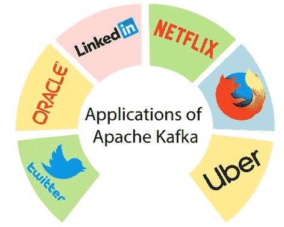

# ApacheKafka应用

> 原文：<https://www.javatpoint.com/apache-kafka-applications>

对ApacheKafka的需求正以惊人的速度增长。如今，许多优秀的企业利用Kafka来缓解和发展他们的数据流水线需求。

ApacheKafka有以下应用:

让我们逐一讨论每个应用程序:

### 商务化人际关系网

2010 年，领英开发了 Apache Kafka。由于 Kafka 是一个发布-订阅消息系统，因此各种 LinkedIn 产品(如 LinkedIn Today 和 LinkedIn Newsfeed)都使用它进行消息消费。

### 超级的

优步用Kafka作为连接生态系统不同部分的信息总线。Kafka帮助乘客和司机找到合适的匹配。它从骑手的应用程序和司机的应用程序中收集信息，然后将这些信息提供给各种下游消费者。

### 推特

因为 Kafka 已经满足了数据复制和持久性的要求，twitter 已经成为 Apache Kafka 最好的应用/用户之一。采用Kafka使推特节省了大量资源，高达 75%，也就是说，很好地降低了成本。

### 网飞

网飞在 Keystone 管道下使用Kafka。Keystone 是用于流和批处理的统一集合、事件发布和路由基础设施。Keystone 管道使用两组Kafka集群，即正面Kafka和消费Kafka。面对Kafka从制作人那里得到了信息。消费者Kafka包含主题子集，这些主题子集由 Samza(一个 Apache 框架)为实时消费者路由。因此，Kafka通过提供数据管道的无损传输来维持成本。

### 神谕

ApacheKafka作为Kafka的消费者支持甲骨文数据库。它还支持甲骨文向Kafka发布事件。Apache Kafka 提供可靠且可扩展的数据流。甲骨文用户可以很容易地从Kafka的主题中检索数据。Oracle 开发人员现在更有能力通过 OSB(Oracle 服务总线)实现分段数据管道。

### 浏览器名

Mozilla Firefox 是一个面向所有人的开源免费网络浏览器。它支持 Windows、Linux、macOS 和许多其他操作系统。Mozilla 使用 Kafka 来备份数据，即用作备份数据存储。很快，Kafka将取代 Mozilla 目前的生产系统，从终端用户那里收集性能和使用数据，用于类似遥测、测试试点的项目。

* * *