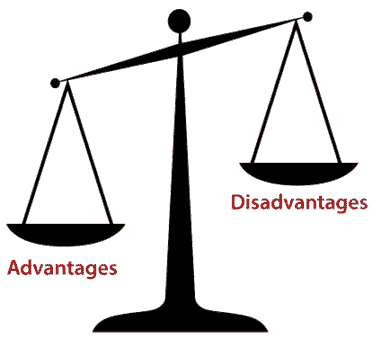

# Kafka:优点和缺点

> 原文：<https://www.javatpoint.com/apache-kafka-advantages-and-disadvantages>

## ApacheKafka 的优点

遵循 ApacheKafka 的优点使其有价值:

1.  **低延迟:** Apache Kafka 提供低延迟值，即最长 10 毫秒。这是因为它解耦了消息，让消费者可以随时消费该消息。
2.  **高吞吐量:**由于低延迟，Kafka 能够处理更多数量的高容量、高速度的消息。Kafka 一秒钟可以支持数千条信息。优步等许多公司使用 Kafka 加载大量数据。
3.  **容错:** Kafka 有一个基本特性，可以抵抗集群内的节点/机器故障。
4.  **持久性:** Kafka 提供了复制功能，这使得数据或消息通过磁盘更持久地保存在集群上。这使它经久耐用。
5.  **减少了对多个集成的需求:**生产者写入的所有数据都要经过 Kafka。因此，我们只需要与 Kafka 建立一个集成，它会自动将我们与每个生产和消费系统集成在一起。
6.  **容易访问:**随着我们所有的数据都存储在 Kafka，它变得对任何人都很容易访问。
7.  **分布式系统:** Apache Kafka 包含一个分布式架构，使其具有可扩展性。分区和复制是分布式系统下的两种能力。
8.  **实时处理:** Apache Kafka 能够处理实时数据管道。构建实时数据管道包括处理器、分析、存储等。
9.  **批处理方式:**Kafka 使用类批处理用例。由于其数据持久性能力，它也可以像 ETL 工具一样工作。
10.  **可扩展性:**Kafka 同时处理大量消息的品质，使其成为一款可扩展的软件产品。

## ApacheKafka 的缺点

凭借上述优势，ApacheKafka 有以下限制/缺点:

1.  **没有一套完整的监控工具:** Apache Kafka 不包含一套完整的监控以及管理工具。因此，新的创业公司或企业害怕与 Kafka 合作。
2.  **消息调整问题:**Kafka 经纪人使用系统调用向消费者传递消息。在这种情况下，消息需要一些调整，Kafka 的表现会明显下降。因此，如果消息不需要更改，它就能很好地工作。
3.  **不支持通配符主题选择:** Apache Kafka 不支持通配符主题选择。相反，它只匹配确切的主题名称。这是因为选择通配符主题会使其无法解决某些用例。
4.  **降低性能:**经纪人和消费者通过压缩和解压缩数据流来降低 Kafka 的性能。这不仅会影响其性能，还会影响其吞吐量。
5.  **笨拙的行为:**当 Kafka 集群中的队列数量增加时，ApacheKafka 最常表现得有点笨拙。
6.  **缺少一些消息范式:**某些消息范式，如点对点队列、请求/回复等。在 Kafka 的一些用例中是缺失的。

* * *