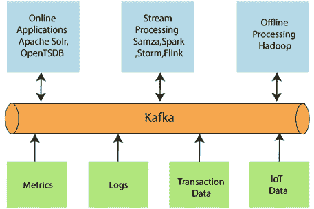
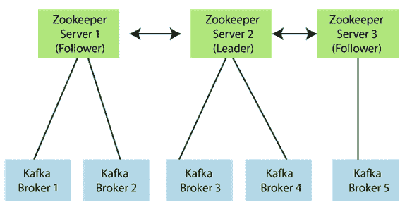
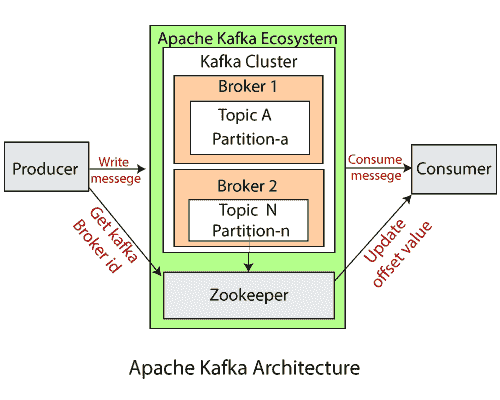

# 阿帕奇卡夫卡建筑

> 原文：<https://www.javatpoint.com/apache-kafka-architecture>

我们已经学习了阿帕奇卡夫卡的基本概念。这些基本概念，如主题、分区、生产者、消费者等。，共同构成了卡夫卡式的建筑。

随着不同的应用程序相应地设计卡夫卡的架构，设计阿帕奇卡夫卡架构需要以下基本部分。

*   **数据生态系统:**几个使用 Apache Kafka 的应用组成了一个生态系统。这个生态系统是为数据处理而构建的。它以创建数据的应用程序的形式接受输入，以度量、报告等形式定义输出。下图代表了卡夫卡的循环数据生态系统。

*   **卡夫卡集群:**卡夫卡集群是由不同的经纪人、主题和它们各自的分区组成的系统。数据被写入集群内的主题，并由集群本身读取。
*   **生产者:**生产者向集群内的主题发送或写入数据/消息。为了存储大量数据，应用程序中的不同生产者将数据发送到卡夫卡集群。
*   **消费者:**消费者是从卡夫卡集群中读取或消费消息的人。可能有几个消费者从集群中消费不同类型的数据。卡夫卡的美在于，每个消费者都知道自己需要从哪里消费数据。
*   **经纪人:**卡夫卡服务器被称为经纪人。经纪人是生产者和消费者之间的桥梁。如果生产者希望将数据写入集群，它将被发送到卡夫卡服务器。所有经纪人都位于卡夫卡集群内部。此外，可以有多个经纪人。
*   **主题:**它是一个通用名称或标题，用来表示类似类型的数据。在 Apache Kafka 中，一个集群中可以有多个主题。每个主题指定不同类型的消息。
*   **分区:**数据或消息被分成小的子部分，称为分区。每个分区携带的数据都有一个**偏移**值。数据总是以顺序方式写入。我们可以有无限多个具有无限偏移值的分区。但是，不能保证消息将被写入哪个分区。
*   **ZooKeeper:**ZooKeeper 用于存储关于 Kafka 集群的信息和消费者客户端的详细信息。它通过维护经纪人名单来管理经纪人。此外，动物园管理员负责为分区选择一个领导者。如果像经纪人死了，新的话题等任何变化。，发生时，ZooKeeper 向 Apache Kafka 发送通知。动物园管理员被设计成使用奇数个卡夫卡服务器。Zookeeper 有一个负责处理所有写操作的领导者服务器，其余的服务器是负责处理所有读操作的追随者。然而，用户并不直接与动物园管理员互动，而是通过经纪人。没有动物园管理员服务器，任何卡夫卡服务器都无法运行。必须运行动物园管理员服务器。

#### 注意:对于卡夫卡 0.10 及以上版本，动物园管理员不存储消费者补偿值。它存储在卡夫卡主题中(如卡夫卡主题部分所示)。

在上图中，有三个动物园管理员服务器，其中服务器 2 是领导者，另外两个被选为其追随者。五个代理连接到这些服务器。Kafka 集群会自动知道经纪人何时倒下，何时添加更多话题，等等..

因此，在综合所有必要条件的基础上，设计了一个卡夫卡集群架构。

* * *