# 安装阿帕奇卡夫卡

> 原文：<https://www.javatpoint.com/installation-of-apache-kafka>

Apache Kafka 在 Windows、macOS 以及 Linux 环境下都是可支持的。每个操作系统都有自己安装 Apache Kafka 的步骤/过程。

达到这个阶段意味着所有的野心家可能都清楚阿帕奇卡夫卡的基本概念。在这里，在这一节中，我们将讨论在 Windows 上的安装过程，设置路径，并启动 zookeeper 和 Kafka 服务器。

## 在 Windows 上安装 Apache 卡夫卡

**步骤 1:** 要安装 Apache Kafka，系统上应该安装 java8 JDK 套件。如果已经安装了，但是有其他版本，用户需要重新安装 Java。因为目前的卡夫卡版本只支持 java8。使用“ **java -version** ”在 Windows 命令提示符下检查版本。

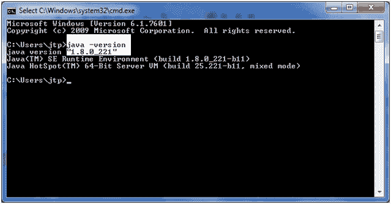

如果要安装 java8，请使用以下链接:[https://www . Oracle . com/technetwork/Java/javase/downloads/JDK 8-downloads-2133151 . html](https://www.oracle.com/technetwork/java/javase/downloads/jdk8-downloads-2133151.html)

**步骤 2:** 现在，在系统上下载 Apache Kafka，如下图:使用链接:[https://kafka.apache.org/downloads](https://kafka.apache.org/downloads)

**步骤 3:** 点击链接，从二进制下载中下载任意二进制，如下图:

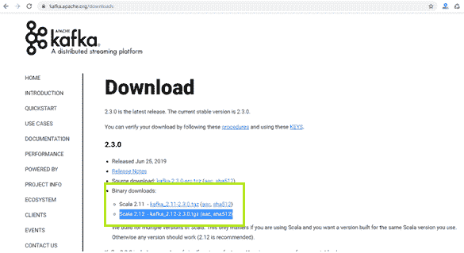

在本教程中，选择了 Scala 2.12 或者可以相应选择。

**步骤 4:** 将打开一个新窗口。现在，为卡夫卡选择镜子制造者。点击第一个链接，下载各自的“**”。tgz** 文件，如下图所示:

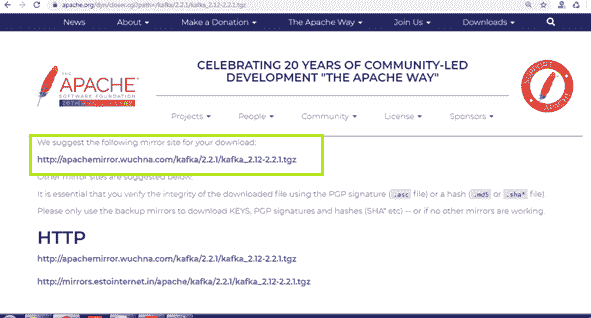

保存文件。

**步骤 5:** 前往各自的下载位置，使用 WinRAR 提取下载的文件。

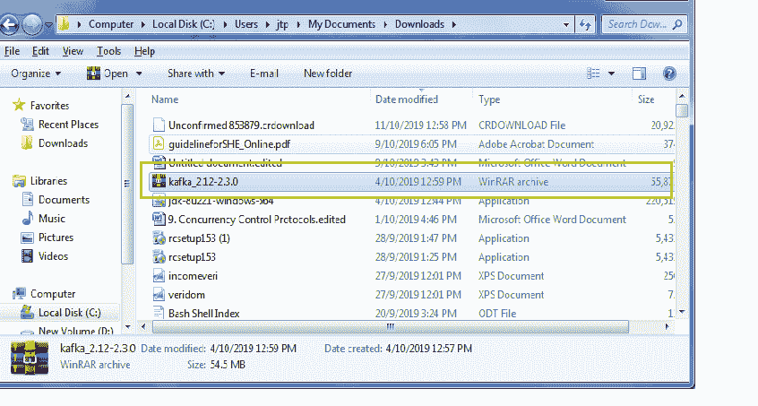

提取文件后，它将被转换为文件夹，如下所示:

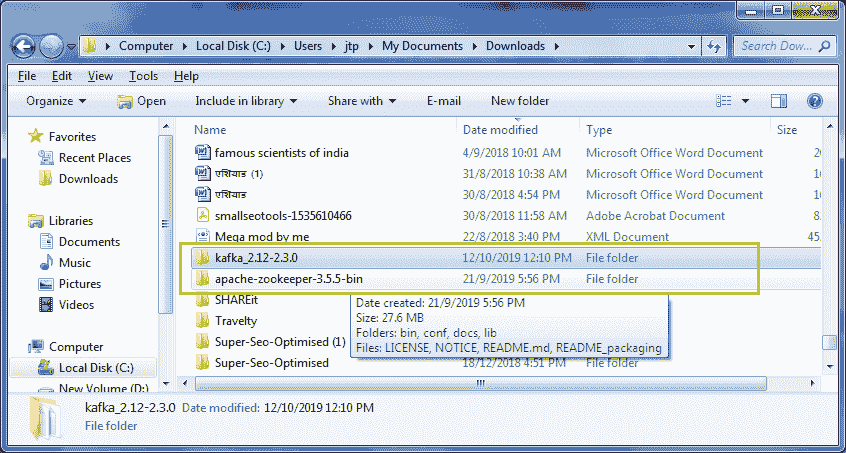

**步骤 6:** 将 Kafka 文件夹复制到根目录(本地磁盘 C)。

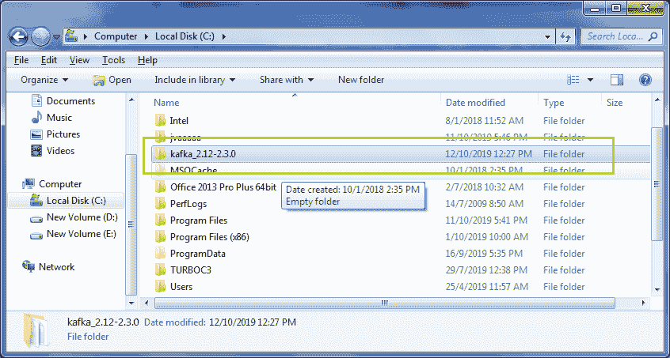

**步骤 7:** 打开命令提示符，使用“**光盘移动到 C:\驱动器..**'命令。现在，在以下命令的帮助下，转到卡夫卡目录:

**cd <卡夫卡文件夹名称>** 。按回车键。进入后，会是这样的:

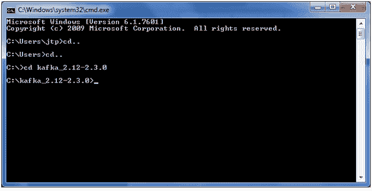

**步骤 8:** 检查 java 版本。如果安装正确，在应用“ **java 版本**命令后，将显示以下输出。否则，将显示一个错误。

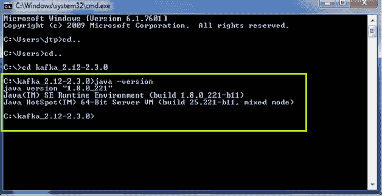

**步骤 9:** 成功安装 java8 后，在 kafka 文件夹中尝试一些 Kafka 命令，如:**“bin \ windows \ Kafka-topics . bat”**。如下所示:

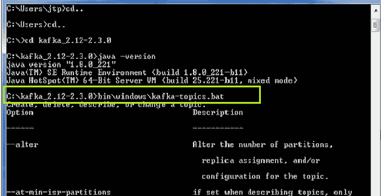

使用“**卡夫卡-** ”命令查看所有卡夫卡命令。

#### 注意:如果以上步骤都正确执行，那么 Windows Defender 防火墙框可能会显示安全警报。单击允许访问。

## 设置卡夫卡目录路径

到目前为止，我们已经理解了如何在卡夫卡目录中使用卡夫卡命令。但是，如果我们希望从任何地方使用命令，就需要设置卡夫卡的路径。

**步骤 1:** 打开卡夫卡文件夹> bin >窗口，复制其地址。

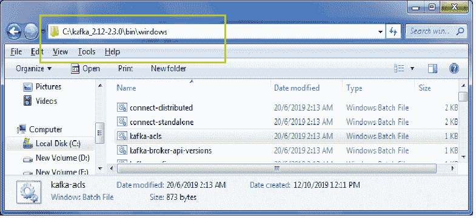

**步骤 2:** 转到我的电脑，然后右键单击。将会打开一个对话框。点击属性>高级系统设置>环境变量。

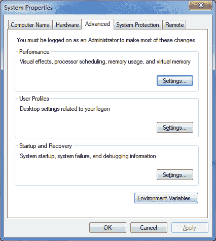

**步骤 3:** 通过粘贴复制的地址编辑路径变量。单击确定。

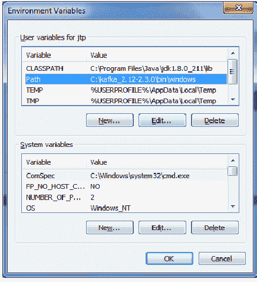
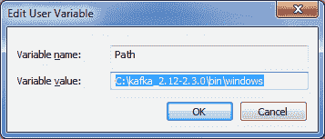

**步骤 4:** 再次打开命令提示符，从任意驱动器应用命令‘Kafka-topics . bat’。下面的快照显示了一个示例:

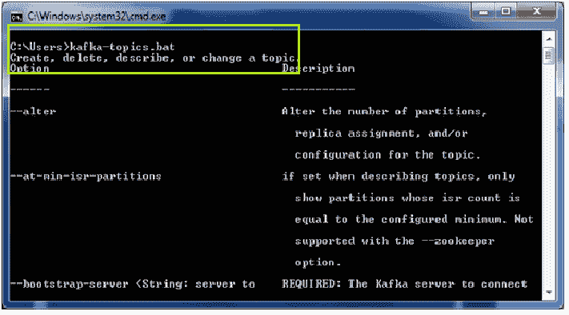

如果路径设置成功，将显示上述输出。卡夫卡的命令可以在任何地方执行。

## 安装动物园管理员

没有安装动物园管理员，阿帕奇卡夫卡无法运行。因此，要使用卡夫卡，用户需要在系统上启动动物园管理员。

启动动物园管理员有以下步骤:

**步骤 1:** 转到卡夫卡目录，创建一个新的文件夹作为“**数据**”。

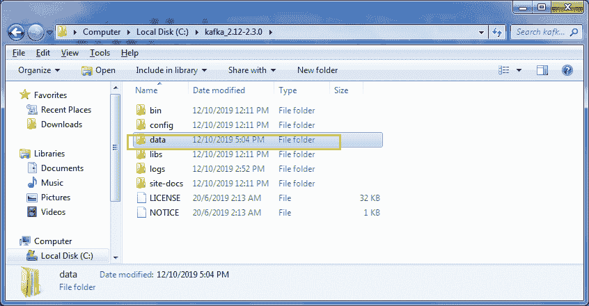

**步骤 2:** 打开新创建的数据文件夹，并在其下再创建两个文件夹。将文件夹命名为“**动物园管理员**和“**卡夫卡**”。

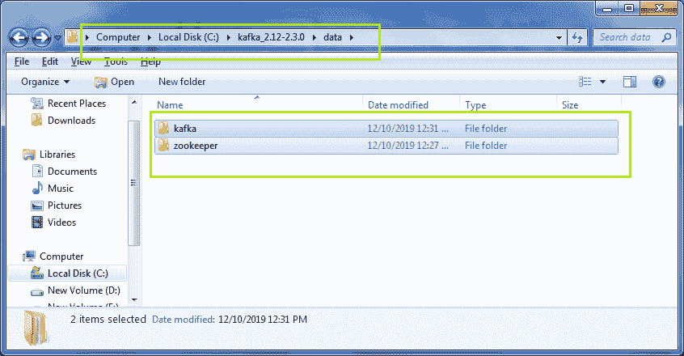

**步骤 3:** 现在，复制动物园管理员文件夹的地址。复制后，回到卡夫卡目录。

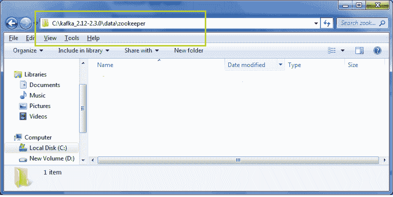

**步骤 4:** 移至卡夫卡目录下的**配置**文件夹。

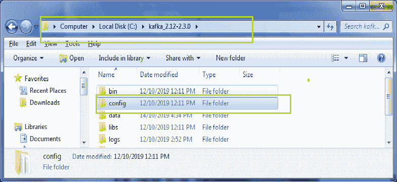

打开配置文件夹，进入 **zookeeper.properties** 文件。右键单击文件，然后单击“用记事本++”编辑，如下所示:

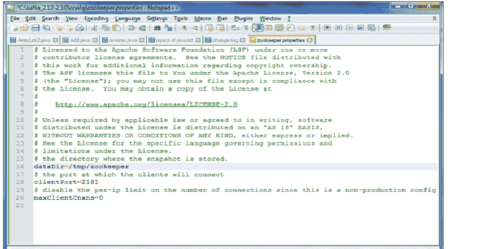

#### 注意:使用 Notepad++可以获得最佳视图，并且可以轻松编辑文件。

**步骤 5:** 通过粘贴动物园管理员文件夹地址，编辑“**数据目录**的值。省省吧。该地址将用于客户端连接。

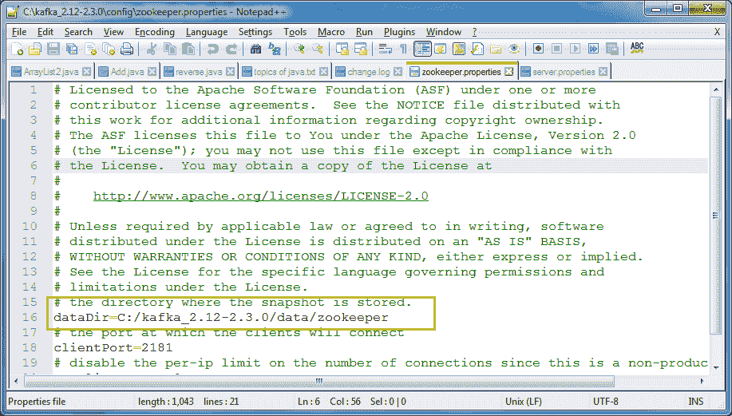

**步骤 6:** 动物园管理员服务器准备启动。打开命令提示符，转到卡夫卡目录。然后，键入命令:“**zookeeper-server-start . bat config \ zookeeper . properties**”。按回车键。

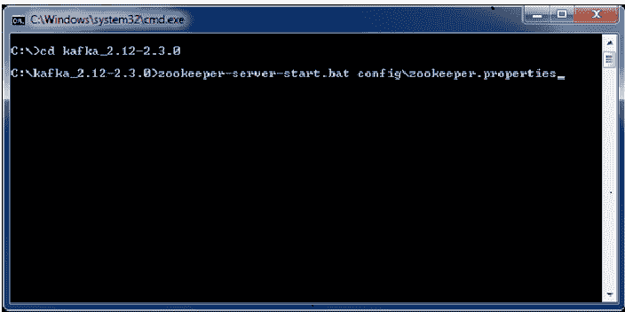

如果显示下面显示的输出，这意味着动物园管理员服务器已成功启动。在输出屏幕中，显示端口号 **2181** ，告知动物园管理员服务器成功启动。

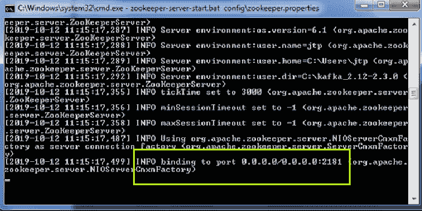

否则，端口 2181 将与其他一些应用程序绑定。

**第七步:**开放数据>动物园管理员。将自动创建一个新文件夹，**版本-2** 。如果不是这样，就说明出了问题。

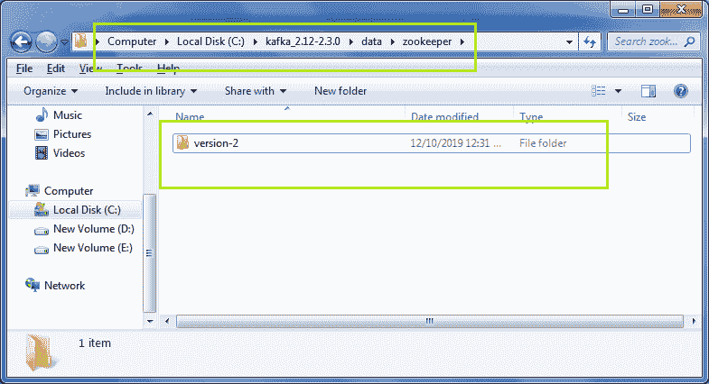

**步骤 8:** 当动物园管理员服务器启动时，转到卡夫卡目录>数据>卡夫卡。复制卡夫卡文件夹的地址。

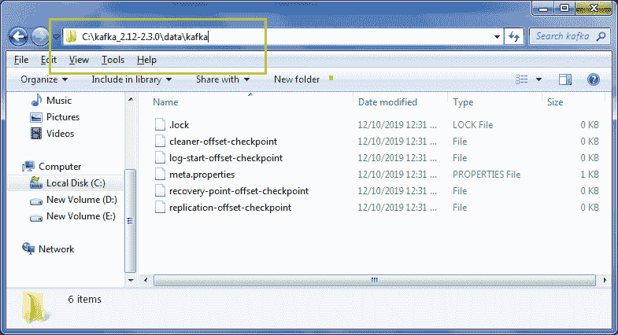

**步骤 9:** 移回卡夫卡目录>配置>服务器.属性。

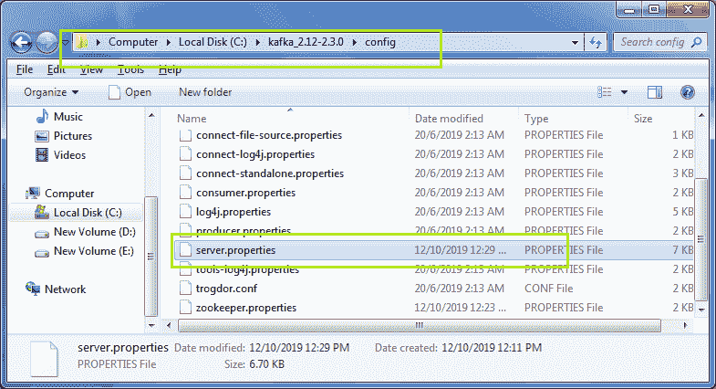

右键单击，然后单击“用记事本++”编辑。将打开下面显示的文件。

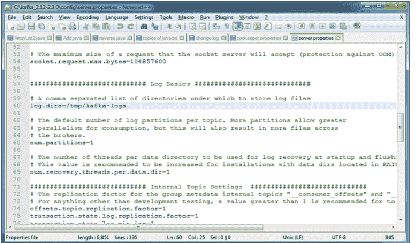

**步骤 10:** 再次将卡夫卡文件夹的复制地址粘贴为 **log.dirs** 的值。

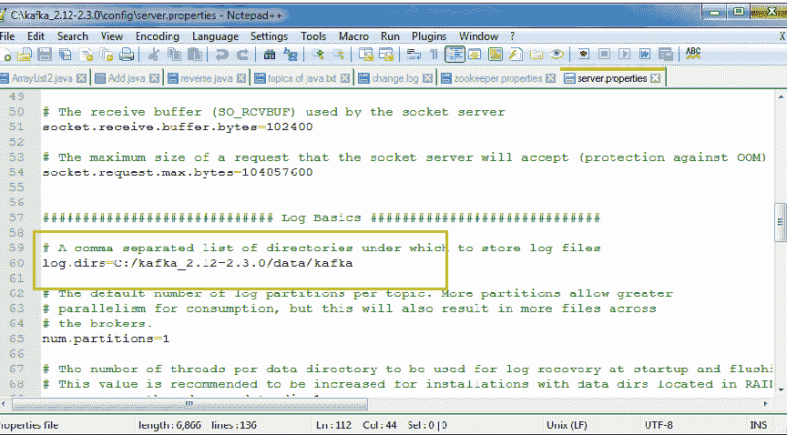

**第 11 步:**打开命令提示符，移至卡夫卡目录。键入以下命令:“**Kafka-server-start . bat config \ server . properties**”。请看下面的快照:

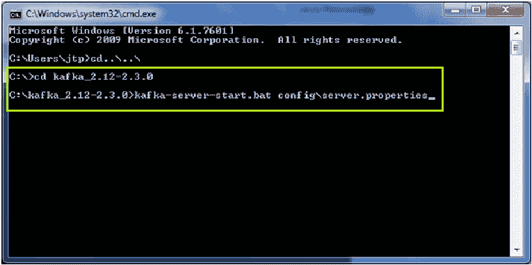

将显示输出屏幕，如下图所示:

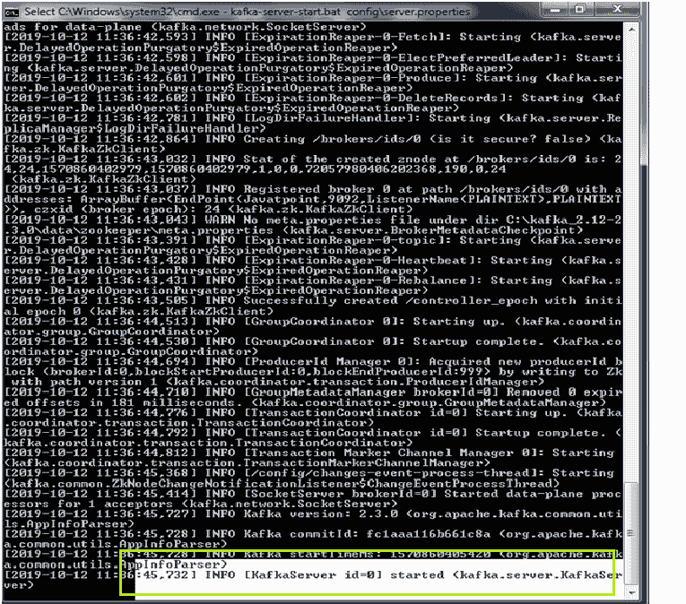

如果显示突出显示的输出，则表示 kafka 服务器已成功启动。

**步骤 12:** 打开卡夫卡目录>数据>卡夫卡。在这里，用户将找到一些文件，这些文件将在卡夫卡服务器成功启动时生成。

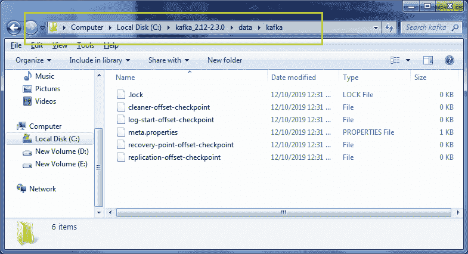

所以，这样一来，卡夫卡服务器就可以安装在 Windows 操作系统上了。

#### 注意:必须先启动 zookeeper 服务器才能运行 kafka 命令。

* * *