# 在 Linux 上安装 Kafka

> 原文：<https://www.javatpoint.com/installing-kafka-on-linux>

**先决条件:**系统上应该安装了 Java8。

在 Linux 系统上安装 Apache Kafka 有以下步骤:

**步骤 1:** 检查 java 版本。它应该与版本 8 一起安装，因为 Kafka 支持 java8 及更高版本。通过在搜索框中键入终端或简单地按下“ **ctrl+alt+t** 来打开终端。然后，使用命令:“**java-版本**”来检查 Java 的版本。

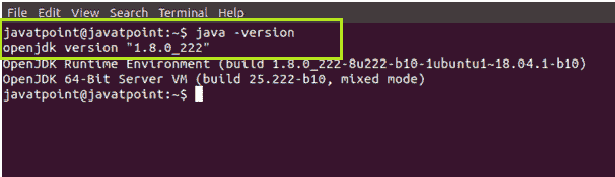

#### 注意:使用 java9 或以上可能会出现一些问题。所以，最好使用 java8。

**步骤 2:** 通过任何网络浏览器下载 ApacheKafka 或使用以下提供的链接:[https://kafka.apache.org/downloads](https://kafka.apache.org/downloads)。


**步骤 3:** 下载作为 Scala 2.12 或 2.11 的 Kafka 二进制文件(相应地)。

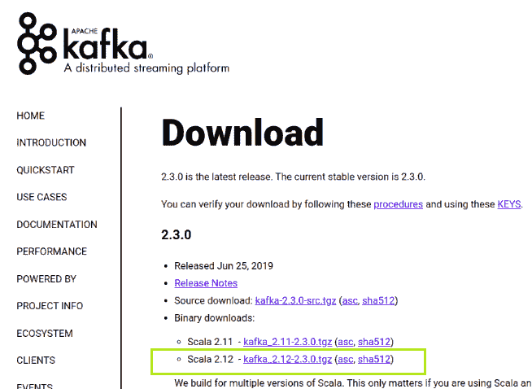

**步骤 4:** 现在，将打开一个新页面。本页包含 Kafka 镜子制造者。点击第一个链接。它将开始下载。选择位置并保存“tar”文件夹。

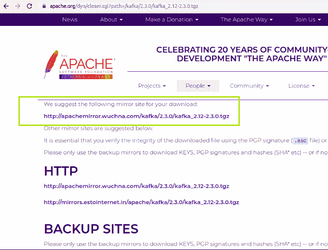

**步骤 5:** 需要解压或解压文件夹。使用命令:“ **tar -xvf <kafka directory=""></kafka>**提取文件夹。

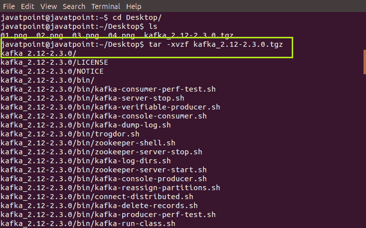

使用“ **ls** ”命令到提取“tar”文件夹的位置。就像，在下面的快照中，tar 文件和 untar 文件夹都是可见的。

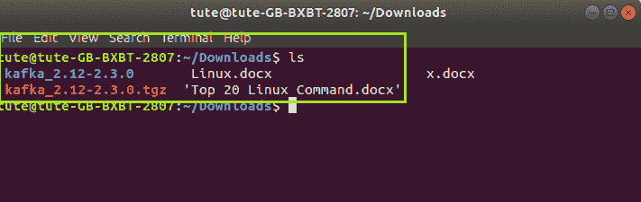

**步骤 6:** 现在，要测试 Kafka，请使用以下命令移动到 Kafka 目录中的任何位置:“**CD<kafka_directory>/bin/Kafka-topics . sh</kafka_directory>**”。

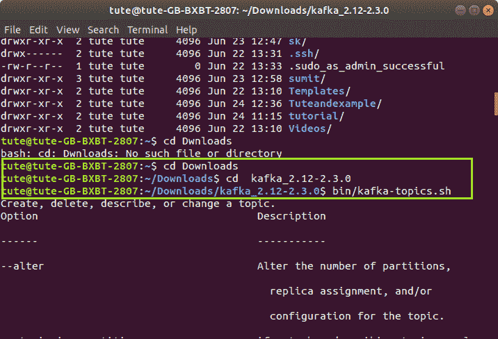

**步骤 7:** 如果显示上述输出，则表示 java8 已正确安装在系统上。

## 设置路径

为了简化工作，请在本地设置路径，以便从系统中的任何驱动器或位置访问 Kafka。如果用户不想这样做，请转到动物园管理员安装步骤。

**步骤 1:** 为了设置路径，搜索系统是否有’。使用“ll”或“ls -a”命令的“bashrc”文件。在下面的快照中，使用了“ls -a”命令。

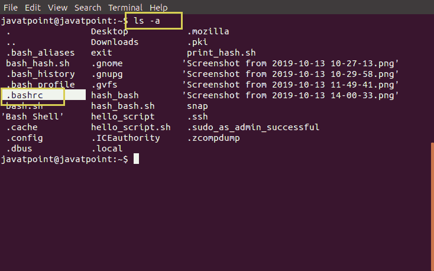

**步骤 2:** 打开。使用命令“nano”的“bashrc”文件。巴什尔克。文件将打开，如下所示:

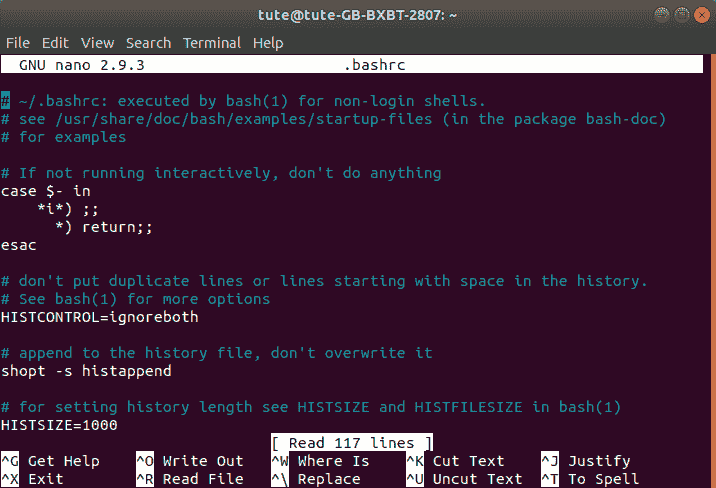

**步骤 3:** 移动到终点，并使用以下命令设置路径:

```

'export PATH=/home/tute/kafka_2.12-2.3.0/bin:$PATH'

```

要知道工作目录，请使用命令:“pwd”。此命令从根目录显示当前工作目录的名称。像，'/home/tute '是本教程中的工作目录。

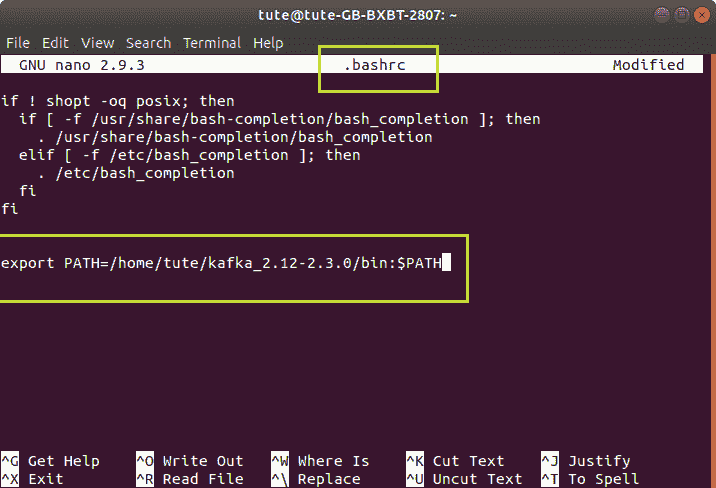

保存文件并退出。

要查看编辑后的文件，请使用命令:“cat”。巴什尔克。它将显示保存的文件内容。

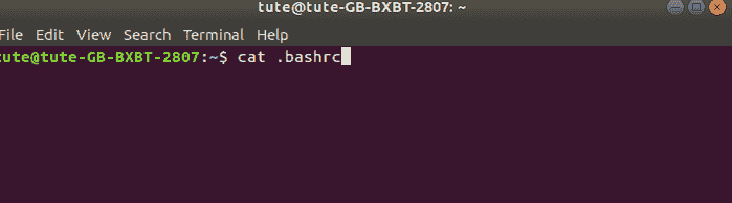

该文件将显示如下:

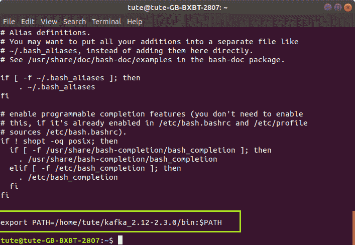

如果路径保存成功，它将显示在文件中。

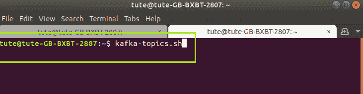

**步骤 4:** 要进行测试，请从任意目录运行命令:‘Kafka-topics . sh’。如果显示以下输出，则表示路径设置成功。如果没有，就说明出了问题。

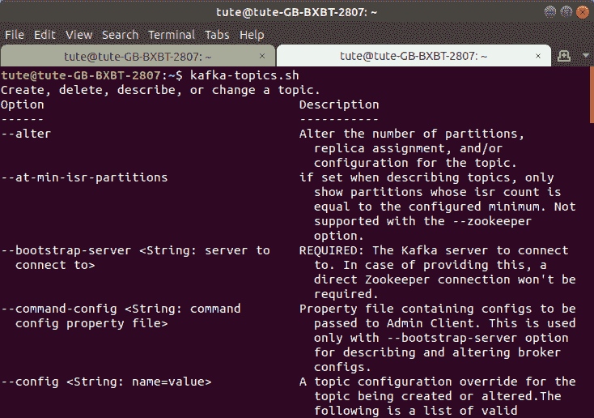

现在，不需要移动到指定的位置来运行 Kafka。

## 在 Linux 上启动动物园管理员服务器

要启动 zookeeper，可以使用以下步骤:

**步骤 1:** 移动到<kafka_directory>并使用命令“mkdir data”创建一个新目录“data”。检查是否在 Kafka 目录下使用“ls”命令创建。</kafka_directory>

**Stpe2:** 再次移动到数据目录，新建两个目录分别为“**动物园管理员**”和“**Kafka**”。这些目录是为启动 Kafka 和动物园管理员服务器而创建的。

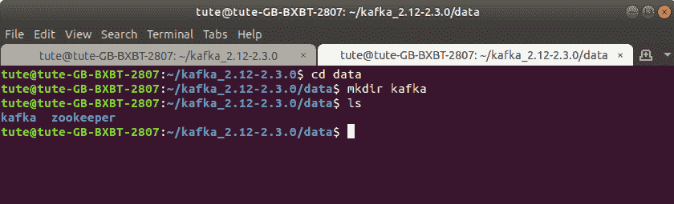

用户可以使用' ls '命令进行检查，如上面的快照所示。

**步骤 3:** 要运行动物园管理员服务器，请移回<kafka_directory>。打开 zookeeper.properties 文件，该文件位于配置文件夹下。使用命令:“**nano config/zookeeper . properties**”。</kafka_directory>

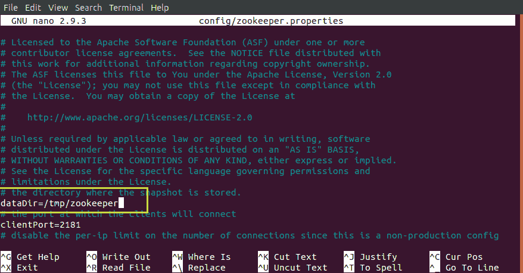

该文件看起来类似于上面的快照。

**步骤 4:** 通过放置新创建的 zookeeper 文件夹的路径来编辑 dataDir 的值。编辑为:“**DataDir =/home/tute/<kafka_directory>/data/zoo keeper</kafka_directory>**”。保存文件并退出。

**步骤 5:** 使用“**猫配置/动物园管理员.属性**查看编辑后的文件。如果成功完成，继续下一步。

**步骤 6:** 现在，在以下命令的帮助下启动动物园管理员服务器:

```

zookeeper-server-start.sh config/zookeeper.properties'.

```

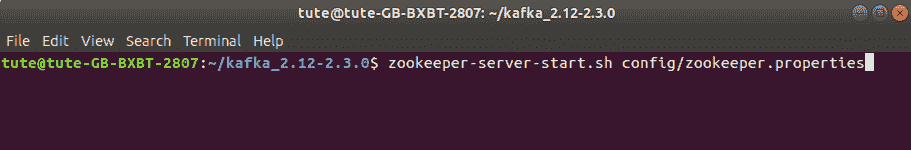

如果显示以下输出，显示端口号= **2181** 。这意味着动物园管理员安装成功。

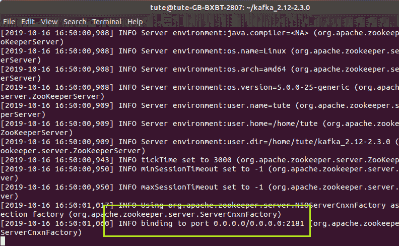

再次，移动到 zookeeper 文件夹，并键入“ls”命令。当 zookeeper 服务器成功启动时，将自动创建一个新文件夹“version-2”。

**步骤 7:** 再次移动到“配置”文件夹，打开**服务器.属性**文件。请使用命令:“nano config/server.properties”。

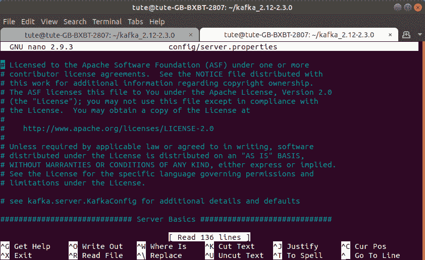

该文件看起来像上面的快照。

**步骤 8:** 编辑**log . dirs =/home/tute/<kafka_directory>/data/Kafka</kafka_directory>**的值，如下图。保存文件并退出。

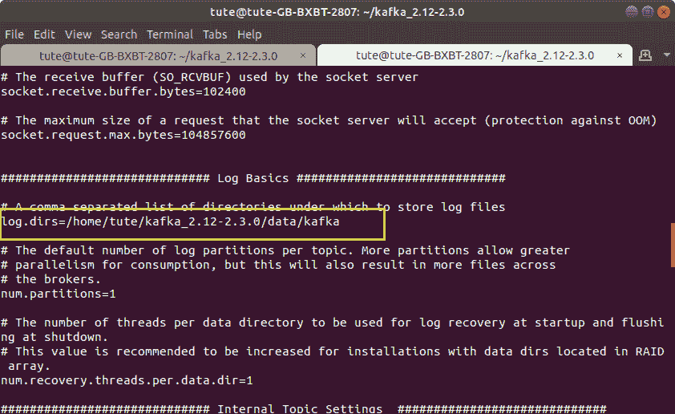

**步骤 9:** 现在，使用以下命令运行 Kafka 服务器:

```

'kafka-server-start.sh config/zerver.properties'. 

```

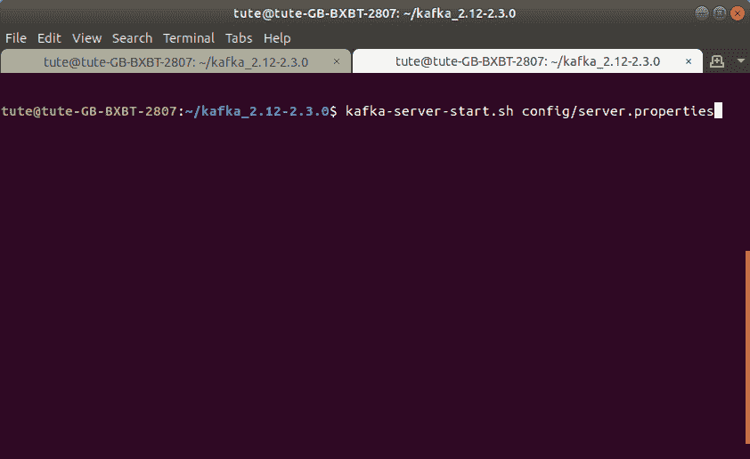

**步骤 10:** 如果所有步骤都成功完成，Kafka 服务器将启动，如下图输出所示:

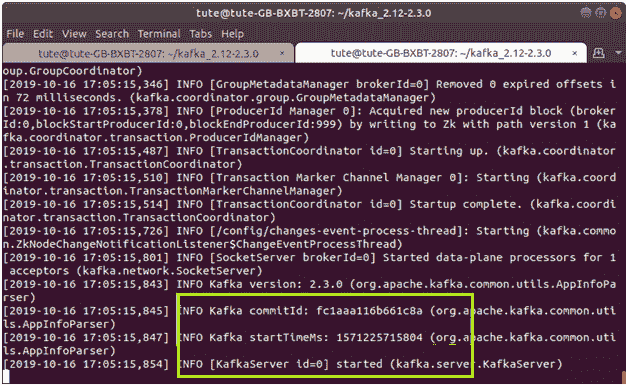

**步骤 11:** 同样，移动到 Kafka 文件夹并使用“ls”命令。它将显示所有新的自动创建的文件，这将告诉 Kafka 服务器的成功启动。

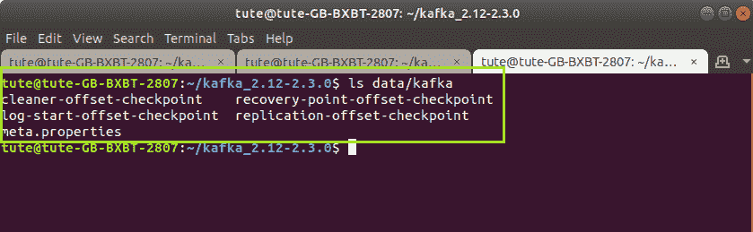

随着上述步骤的成功完成，Apache Kafka 将安装在 Linux 上。

* * *