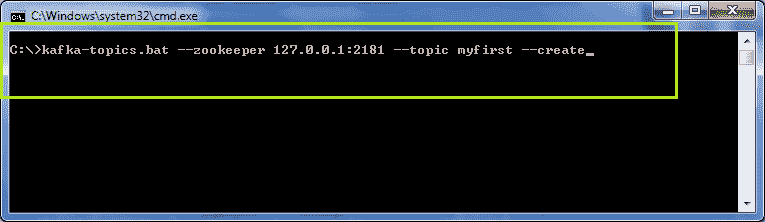
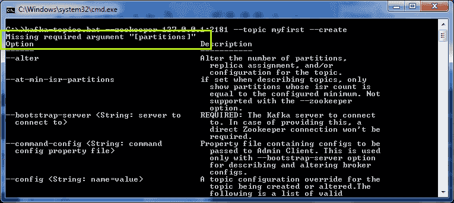
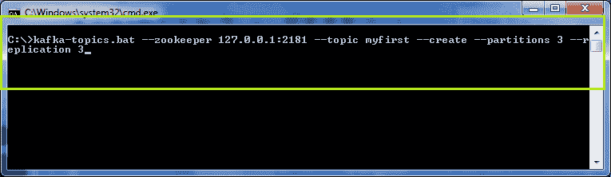
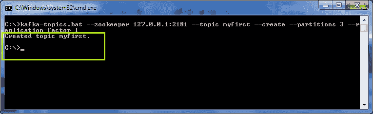
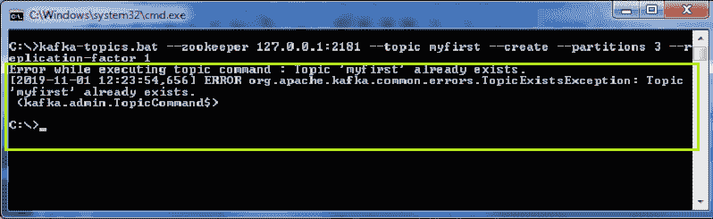
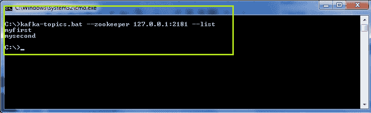
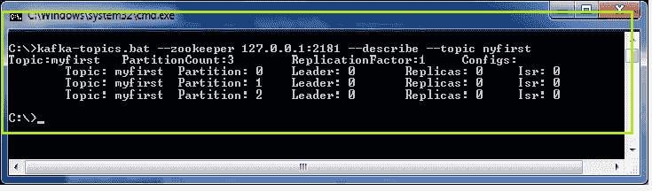
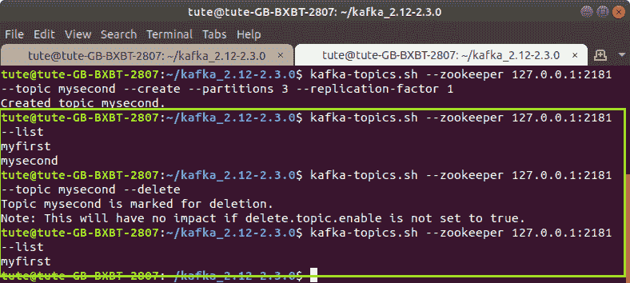

# 创造 Kafka 的主题

> 原文：<https://www.javatpoint.com/creating-kafka-topics>

在本节中，用户将学习在 Windows 上使用命令行界面创建主题。

创建主题有以下步骤:

**步骤 1:** 首先，确保动物园管理员和 Kafka 服务器都应该启动。

**步骤 2:** 在控制台上键入“**-Kafka-主题-动物园管理员 localhost:2181-主题<topic_name>-创建</topic_name>** ”，然后按回车键。这里，主题的名字是“我的第一个”

```

kafka-topics -zookeeper localhost:2181 -topic <topic_name> -create

```

#### 注:改为’。蝙蝠，使用。在 Linux 上创建主题时使用“sh”(相应地)。



输出将显示为:



上面的快照显示一个错误“**缺少必需的参数分区**”。因为在创建主题时，有必要声明分区数量及其 ISR(复制因子)。如果没有声明，这种类型的错误将被抛出。

**步骤 3:** 现在，在完成必需品后重写上述命令，如下所示:

**Kafka-topics . bat-zookeeper localhost:2181-topic<topic _ name>-create？分区<值> -复制因子<值>** 。按回车键。



同样，将引发一个错误，指示复制因子大于代理数量。到目前为止，我们只开始了一个经纪人，而不是多个经纪人。这样，就会出现这种类型的错误。

#### 注意:复制因子永远不能大于可用代理的数量。

**第 4 步:**暂时将复制因子考虑为 1，重写上面的命令。按回车键。输出将显示为:



因此，如果所有步骤都成功处理，那么主题将成功创建，如上面的输出所示。

## 主题已经存在

如果用户创建了另一个与现有主题同名的主题，则会抛出一个错误“**主题<主题 _ 名称>已经存在**”。



## 关于主题的更多信息

**1)列出主题数量**

要列出代理内创建的主题数量，请使用“ **-list** ”命令，如下所示:

**' Kafka-topics . bat-zoo keeper localhost:2181-list '。**



在上面的快照中有两个主题“myfirst”和“mysecond”。

**2)描述话题**

要描述代理中的主题，请使用“**-描述**”命令，如下所示:

**'Kafka-topics . bat-zookeeper localhost:2181-description-topic<topic _ name>'**。该命令给出了一个主题的完整描述，包括分区数量、前导、副本和 ISR。



**3)删除话题**

要删除主题，请使用“**-删除**”命令。删除命令用作:**' Kafka-topics . sh-zookeeper localhost:2181-topic<topic _ name>-delete '**

#### 注意:窗口用户删除任何话题都会面临问题。所以，更喜欢这个命令在 Linux 上，或者在 macOS 上。



在上面的快照中，可以看到有两个现有主题“myfirst”和“mysecond”。删除“mysecond”主题后，只有“myfirst”主题由“ **-list** ”命令列出。

因此，通过这种方式，可以创建各种主题，并且可以在不同的主题上应用几个命令。

* * *