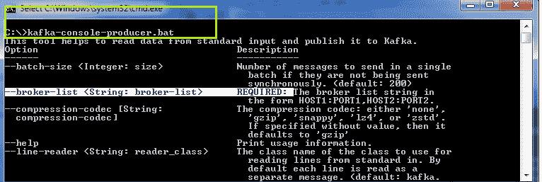
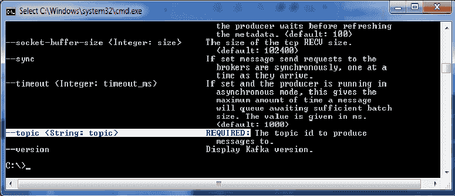
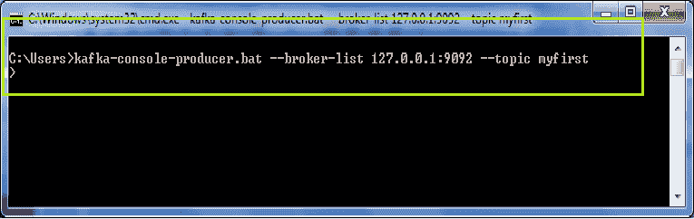
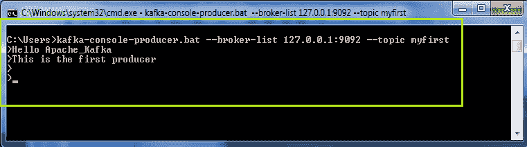
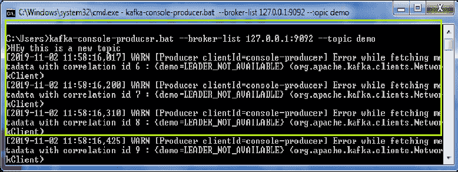
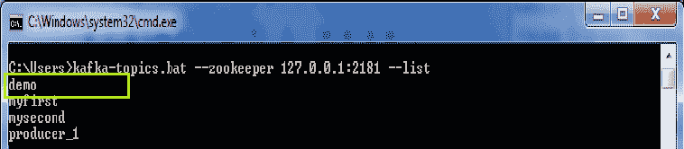
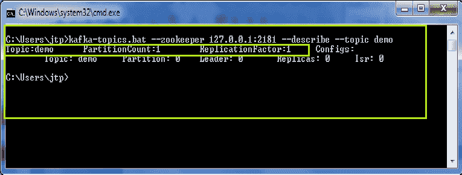

# 向卡夫卡主题发送数据

> 原文：<https://www.javatpoint.com/sending-data-to-kafka-topics>

## 卡夫卡控制台制作人

为了向卡夫卡主题发送数据，需要一个制作人。生产者的角色是发送或写数据/信息到卡夫卡的主题。

在本节中，我们将学习制作人如何向卡夫卡主题发送信息。

**有以下步骤用于启动制作人:**

**步骤 1:** 启动动物园管理员以及卡夫卡服务器。

**步骤 2:** 在命令行中键入命令:“**卡夫卡-控制台-制作人**”。这将帮助用户从标准输入中读取数据，并将其写入卡夫卡主题。

#### 注意:选择’。蝙蝠或。根据操作系统。




突出显示的文本表示生成消息需要一个“**经纪人列表**”和一个“**主题 id** ”。这是因为生产者必须知道要写入数据的主题的 id。

**步骤 3:** 了解所有需求后，尝试使用以下命令生成主题消息:

**'卡夫卡-控制台-制作人-经纪人-列表 localhost:9092-topic<topic _ name>'**。按回车键。



#### 注意:这里，9092 是卡夫卡服务器的端口号。

这里选择了“我的第一个”主题来编写消息。

一个“>”将出现在新行中。开始生成一些消息，如下所示:



**步骤 4:** 按下‘Ctrl+c’，按下‘Y’键存在。

所以，通过这种方式，一个制作人可以制作/发送几条关于卡夫卡主题的信息。

## 带钥匙的制作人

一个卡夫卡式的制作人可以在有或没有钥匙的情况下为主题写数据。如果生产者没有指定关键字，数据将存储到关键字=null 的任何分区，否则数据将只存储到指定的分区。需要一个“ **parse.key** 和一个“ **key.seperator** 来为主题指定一个键。使用的命令是:

```

'kafka-console-producer --broker-list localhost:9092 --topic --property parse.key=true --property key.separator=,
> key,value
> another key,another value' 
```

这里，key 是具体的分区，value 是生产者写给主题的消息。

## 当一个话题不存在时。

假设制作者想要向一个尚不存在的新主题发送消息。在这种情况下，在生成消息后，将出现警告，如下图所示。这只是一个警告。



**为什么会出现这个警告？**

出现警告是因为之前主题“演示”不存在。但是，制片人一写信息，卡夫卡就以某种方式创造了这个话题。虽然，没有为这个意外的话题举行领袖选举，但是可以看到“ **LEADER_NOT_AVAILABLE** ”错误。但是，在下一次，生产者可以继续写更多的消息，因为没有警告将再次出现。这是因为这个话题现在出现在现有的列表中。

用户可以使用“ **-list** ”命令进行检查，如下图所示:



在列表中可以看到主题“演示”。

## 描述新主题

这样，由生产者直接创建的主题获取缺省的分区数及其复制因子 1。

例如，



主题“演示”在使用“**-description**”命令进行描述时，将“分区计数”和“复制因子”的值设为 1(默认值)。因此，在向主题生成消息之前创建主题总是更好的选择。

## 更改默认值

按照以下步骤更改新主题的默认值:

1.  使用记事本++或任何其他文本编辑器打开“ **server.properties** ”文件。
2.  将 num.partitions=1 的值编辑为新值。让它变成 3。因此，每当引入这样的新主题时，分区计数和复制因子的数量将是 3(无论用户设置了什么)。
3.  保存文件。

*但是，总是在之前创造话题。*

* * *