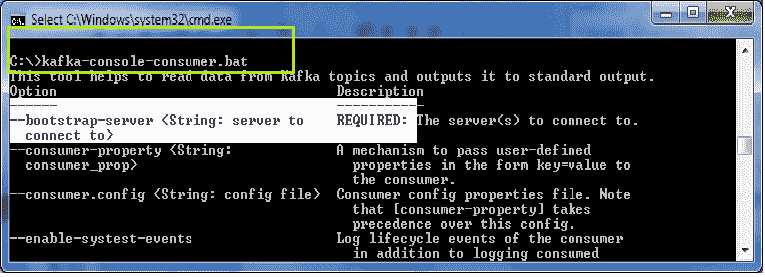
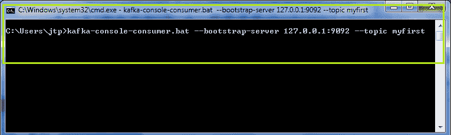
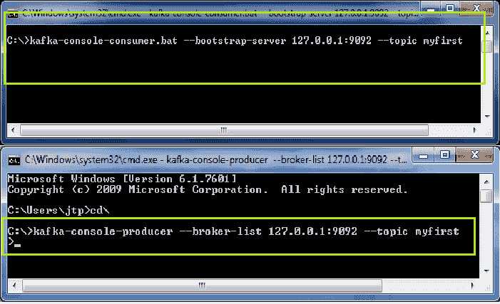
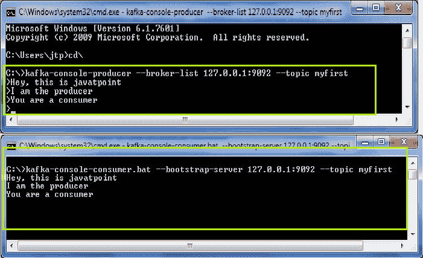
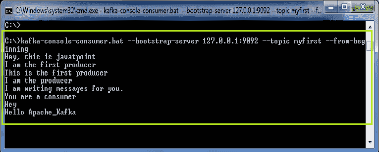

# Kafka 游戏机消费者

> 原文：<https://www.javatpoint.com/kafka-console-consumer>

在本节中，用户将了解消费者如何消费或阅读 Kafka 主题中的信息。

**消费者有以下步骤来消费来自主题的消息:**

**第一步:**首先启动动物园管理员和 Kafka 服务器。

**步骤 2:** 在命令行中键入命令:“**Kafka-控制台-消费者**”。这将帮助用户从 Kafka 主题中读取数据，并将其输出到标准输出。

#### 注意:选择’。蝙蝠或。根据操作系统。

突出显示的文本表示消费者需要“引导服务器”来连接到 Kafka 主题。此外，还需要一个“topic_id”来知道消费者将从哪个主题读取消息。

**步骤 3:** 了解所有需求后，尝试使用以下命令消费来自某个主题的消息:

**' Kafka-控制台-消费者-引导-服务器 localhost:9092-topic<topic _ name>'**。按回车键。

#### 注意: Bootstrap 服务器为 Kafka 服务器，端口号=9092。

在前一节中，针对这个主题产生了三条消息。但是，在上面的快照中，可以看到 0 条消息。这是因为 ApacheKafka 没有阅读所有的主题。Kafka 式的消费者只会消费那些只有在消费者处于活跃状态时才会产生的信息。这可以归类为 ApacheKafka 的一个缺点。

**我们来了解一下:**

打开一个新的终端。启动 Kafka 控制台制作人。将两个生产者-消费者控制台放在一起，如下所示:

现在，在生产者控制台中产生一些消息。完成后，按 Ctrl+C 并退出。

可以看到，当前由生产者控制台产生的所有消息都反映在消费者控制台中。这是因为消费者处于活跃状态。

## 阅读全部信息

ApacheKafka 允许产生数百万条信息。有时，消费者可能需要阅读特定主题的全部信息。

为此，使用“**-从头开始**”命令，上面的 Kafka 控制台使用者命令如下:

**' Kafka-console-consumer . bat-bootstrap-server 127 . 0 . 0 . 1:9092-topic my first-from-start '**。该命令告诉 Kafka 主题允许消费者从头开始(即从消费者不活动的时候)阅读所有消息。

例如，

在上面的快照中，很明显所有消息都是从头开始显示的。

#### 注意:消息的顺序不是‘总计’。这是因为序列仅处于分区级别(如 Kafka 导言部分所研究的)。

对于这个主题“我的第一个”，我们有三个分区。因此，如果用户希望查看订单，请创建一个具有单个分区值的主题。它将按顺序显示整个消息。

完成消息交换过程后，按下“Ctrl+C”并停止。

因此，当用户希望消费者阅读时，可以从开始或者从那个状态消费几条消息。

* * *