# Kafka消费集团

> 原文：<https://www.javatpoint.com/kafka-consumer-group-cli>

一般来说，Kafka式的消费者属于特定的消费群体。消费群基本上代表了应用程序的名称。为了消费消费组中的消息，使用了“**-组**”命令。

让我们看看消费者将如何消费来自Kafka主题的信息:

**步骤 1:** 打开 Windows 命令提示符。

**步骤 2:** 使用“**-组**”命令作为:**“Kafka-控制台-消费者-引导-服务器本地主机:9092-主题<topic_name>-组<组名> '</topic_name>** ”。给小组起个名字。按回车键。

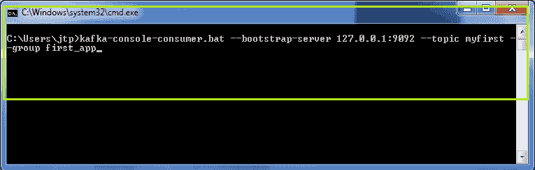

在上面的快照中，组的名称是“ **first_app** ”。可以看到，没有显示任何消息，因为没有为此主题生成新消息。如果使用“**-从头开始**”命令，将显示之前的所有消息。

**步骤 3:** 要查看一些新消息，请从生产者控制台生成一些即时消息(如前一节所述)。

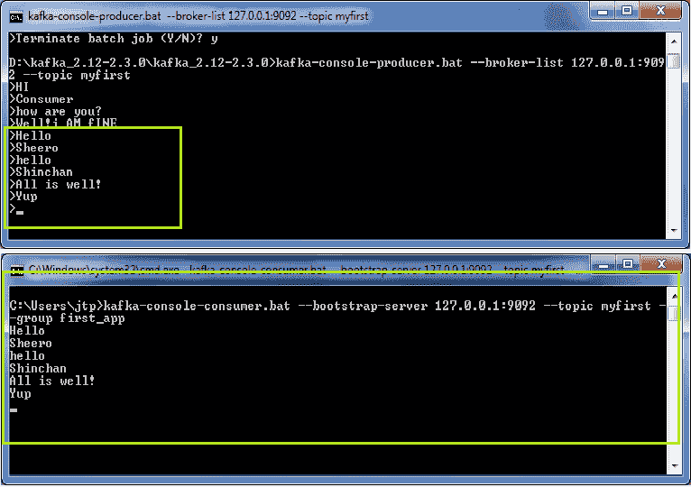

因此，生产者产生的新信息可以在消费者的控制台上看到。

**第四步:**但是，是单个消费者在群里读取数据。让我们创造更多的消费者来了解一个消费群体的力量。为此，打开一个新终端，键入与以下命令完全相同的使用者命令:

**' Kafka-console-consumer . bat-bootstrap-server 127 . 0 . 0 . 1:9092-topic<topic _ name>-group<group _ name>。**

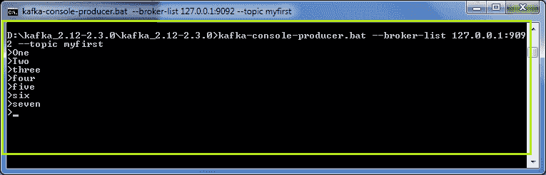
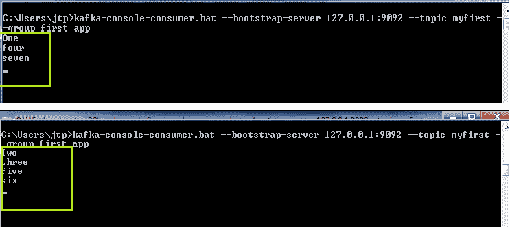

在上面的快照中，很明显制作人正在向Kafka主题发送数据。这两个消费者正在消费这些信息。看看信息的顺序。由于为“myfirst”主题创建了三个分区(前面已经讨论过)，因此消息只按该顺序拆分。

我们可以进一步在同一个组下创建更多的消费者，每个消费者将根据分区的数量来消费消息。努力让自己更好地理解。

#### 注意:组 id 应该相同，那么只有消息会在消费者之间拆分。

但是，如果任何使用者被终止，分区将被重新分配给活动使用者，这些活动使用者将接收消息。

因此，通过这种方式，一个消费群体中的各种消费者消费来自Kafka主题的信息。

## 带钥匙的消费者

当生产者在数据中附加了一个键值时，它将被存储到指定的分区。如果没有指定键值，数据将移动到任何分区。因此，当消费者用密钥读取消息时，如果没有指定密钥，它将显示为空。需要一个“ **print.key** 和一个“ **key.seperator** 来消费来自Kafka主题的消息。使用的命令是:

**' Kafka-console-consumer-bootstrap-server localhost:9092-topic<topic _ name>-从头开始-property print . key = true-property key . seperator =，'**

使用上面的命令，消费者可以用指定的键读取数据。

## 关于消费者群体的更多信息

**' -从头开始'命令**

该命令用于从开始处读取消息(如前所述)。因此，在消费者群体中使用它将产生以下输出:

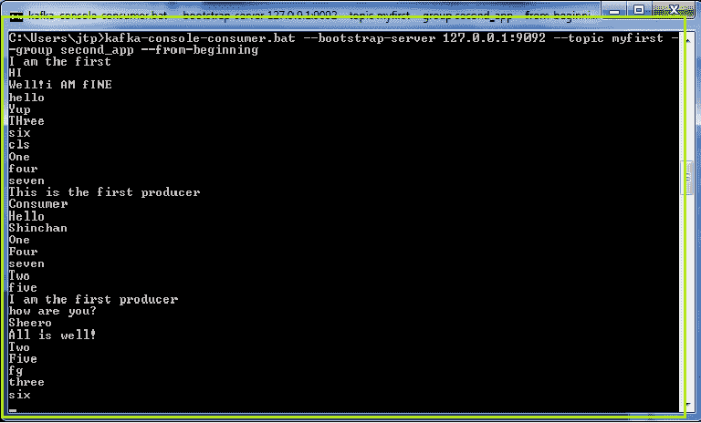

可以注意到，一个新的消费群体“second_app”被用来从头开始阅读消息。如果同一命令再次运行，它将不会显示任何输出。这是因为补偿是在ApacheKafka。因此，一旦一个消费者群已经阅读了所有的消息，下一次，它将只阅读新的消息。

例如，在下面的快照中，当再次使用“**-从头开始**”命令时，只读取新消息。这是因为之前所有的消息都是在更早的时候被消费掉的。

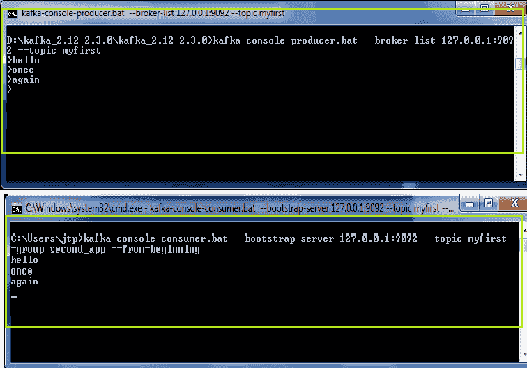

**‘Kafka-消费者-团体’命令**

此命令提供整个文档来列出所有组、描述组、删除消费者信息或重置消费者组偏移量。

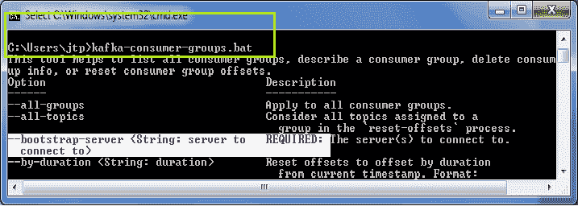

它需要一个引导服务器，以便客户端在使用者组上执行不同的功能。

**列出消费群体**

一个' **-list** '命令用于列出Kafka集群中可用的消费者群体的数量。该命令用作:

**' Kafka-consumer-groups . bat-bootstrap-server localhost:9092-list '。**

下面显示了一个快照，有三个消费群。

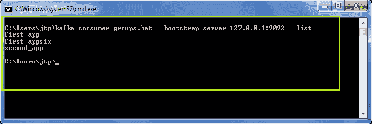

**描述一个消费群体**

一个'**-description**'命令用来描述一个消费群。该命令用作:

**'Kafka-消费者-团体. bat-bootstrap-服务器 localhost:9092-描述团体<团体 _ 名称> '**

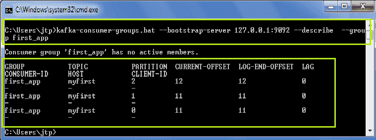

该命令描述是否存在任何活动的使用者，当前偏移值，滞后值为 0-表示使用者已读取所有数据。

## 重置偏移量

补偿是在ApacheKafka。因此，如果用户想要再次读取消息，需要重置偏移值。**Kafka-消费者-团体**'命令提供了一个重置偏移量的选项。重置偏移值意味着定义用户想要再次读取消息的点。它一次只支持一个使用者组，并且该组不应有活动实例。

**重置偏移量时，用户需要选择三个参数:**

1.  执行选项
2.  重置规格
3.  范围

**有两个执行选项可用:**

**'-试运行:**为默认执行选项。此选项用于规划需要重置的偏移。

'

**-执行:**该选项用于更新偏移值。

**有以下复位规格可用:**

**'-至日期时间:**它根据日期时间的偏移量重置偏移量。使用的格式是:' YYYY-MM-DDTHH:mm:SS.sss '。

**' -至-最早:**它将偏移量重置为最早的偏移量。

**'-to-latest:**它将偏移量重置为最新的偏移量。

**' -偏移:**它通过将当前偏移值偏移“n”来重置偏移。“n”的值可以是正数，也可以是负数。

**' -来自文件:**它将偏移量重置为 CSV 文件中定义的值。

**'-to-current:**它将偏移量重置为当前偏移量。

**有两个范围可以定义:**

**'-所有主题:**它重置组内所有可用主题的偏移值。

**'-主题:**仅重置指定主题的偏移值。用户需要指定用于重置偏移值的主题名称。

**我们来试试看:**

1)使用“**-至-最早**”命令

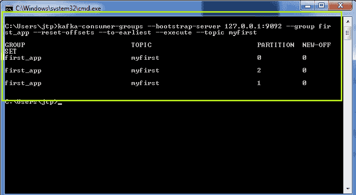

在上面的快照中，偏移量被重置为新的偏移量 0。这是因为使用了“**-至-最早**”命令，该命令将偏移值重置为 0。

2)使用“**-通过**换档”命令

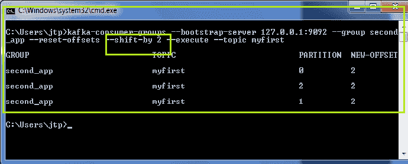
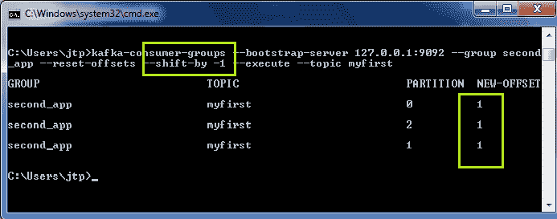

在第一个快照中，偏移值从“0”移动到“+2”。在第二种情况下，偏移值从“2”移动到“-1”。

#### 注意:要将偏移值移动到正计数，不需要使用“+”符号。默认情况下，它将仅被视为正。

* * *