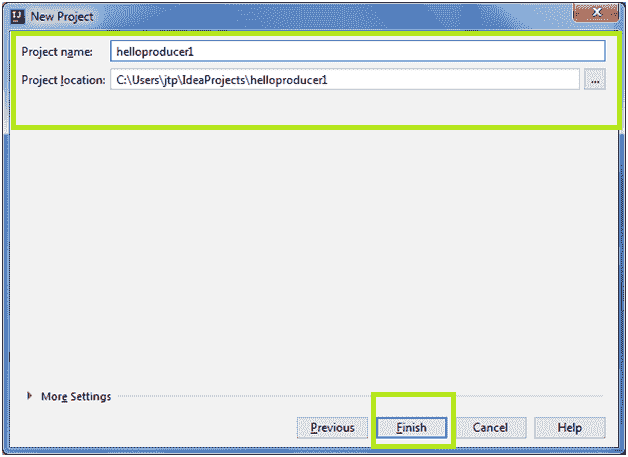

# 安装 IntelliJ IDEA

> 原文：<https://www.javatpoint.com/installing-intellij-idea-in-kafka>

**先决条件:**系统上应该安装了 java8。

按照下面演示的步骤在系统上安装 IntelliJ IDEA:

**第一步:**使用捷脑浆网站或使用以下链接下载 IntelliJ IDEA:

**[' https://www . jetbarks . com/idea/download/'](https://www.jetbrains.com/idea/download/)**

下载社区版，因为它是免费的，也是开源的。

**步骤 2:** 下载完成后，移动到下载位置，启动安装程序。可能会出现安全警告。点击“运行”选项。

**步骤 3:** 安全检查后，设置将开始加载。将出现欢迎屏幕。单击“下一步”并按照安装程序的说明进行操作。

**步骤 4:** 选择合适的安装位置。单击下一步。

**步骤 5:** 选择合适的桌面快捷方式。如果用户在 64 位机器上工作，请相应选择。此外，选择“”。“java”文件。这将自动将 java 文件与 IntelliJ IDEA 相关联。

点击下一步按钮。

**步骤 6:** 选择开始菜单文件夹为“喷气大脑”(默认)。然后，单击安装。

**步骤 7:**IntelliJ IDEA 将开始安装到系统中。

安装安装程序后，单击下一步，然后单击完成。

这样，IntelliJ IDEA 将被安装到系统中。

* * *

## 创造 Kafka 计划

**第一步:**从快捷方式中打开 IntelliJ IDEA。将打开一个对话框，要求从以前的安装中导入设置。选择“不导入设置”单选按钮。单击确定。选择此选项是因为用户可能是第一次安装 IntelliJ。

**第二步:**将出现捷脑浆隐私政策。单击复选框，然后单击“继续”选项。

**步骤 3:** 打开后，安装程序会提供两个 UI 主题选项:

1.  德古拉主题
2.  灯光主题

灯光主题是默认主题。选择任何人后，点击“下一个默认插件”。

在我们的教程中，选择了默认的主题，即灯光主题。用户可以据此选择。

**步骤 4:** 接下来，将要求用户禁用一些默认插件(如果需要)。跳过这一步，点击“下一个特色插件”。

**步骤 5:** 在本节中，安装 Scala 支架。这也将允许用户开发 Scala 项目。点击“开始使用智能创意”。

**步骤 6:** IntelliJ IDEA 欢迎屏幕将打开。单击“创建新项目”选项。

**步骤 7:** 在左侧导航面板中，选择“Maven”或“Gradle”选项。它将显示项目软件开发工具包名称。应该是 java 8(如果安装正确的话)。

在我们的教程中，我们选择了 Maven。

如果没有，请单击“新建”选项，并为 JDK 8 选择相应的主目录。否则，检查 JDK 8 的安装。

#### 注意:一般 JDK 的主目录只会是根目录。

选择后，单击确定，然后单击下一步。

**步骤 8:** 现在，是时候创建一个新项目了。为此，需要一个组标识、一个人工标识以及版本值。提供以下详细信息，然后单击“下一步”。

这里，“firstgroupapp.jtp”是组标识的名称，“helloproducer1”是 ArtifactId，而“2.0.0”被选为版本号。用户可以根据自己的意愿给予。

**步骤 9:** 接下来，用户需要提供项目名称和用户想要保存项目的位置。最后，单击“完成”按钮。

#### 注:项目名称保留就好，和 ArtifactId 一样。

在上面的快照中，项目的名称是“helloproducer1”，项目位置是“本地 c 盘”。

**步骤 10:** 现在，设置将要求在屏幕右下角“启用自动导入”。选择此选项将使 IntelliJ IDEA 能够自动下载所有必要的依赖项，我们将在后面的“pom.xml”文件中定义这些依赖项。

这样，创造 Kafka 项目的第一阶段就完成了。

* * *