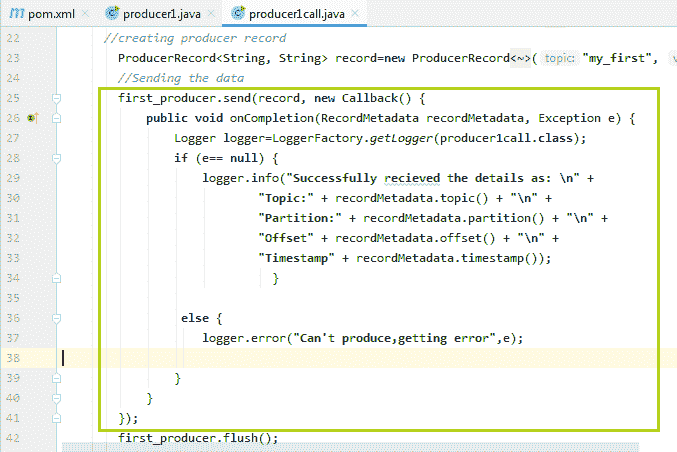
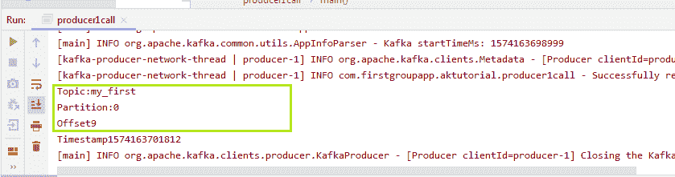
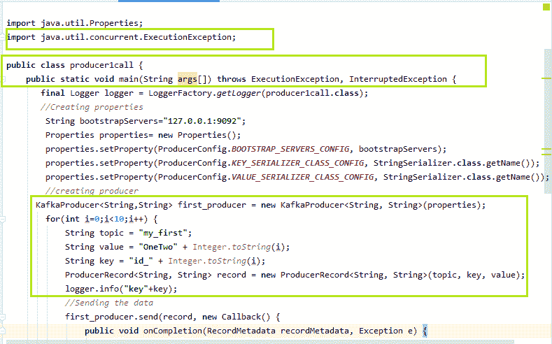
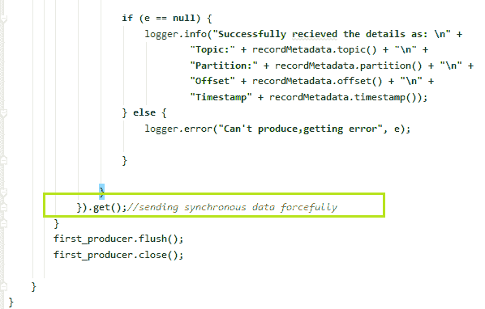
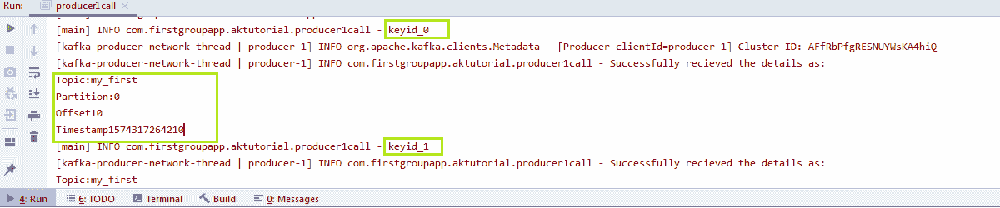

# 卡夫卡制片人回调

> 原文：<https://www.javatpoint.com/kafka-producer-callbacks>

## 没有密钥的生产者

在前一节中，我们看到了生产者如何向卡夫卡发送数据。为了更深入地了解，即数据是否正确产生，在哪里产生，关于其偏移量和分区值等。让我们了解更多。

为了执行回调，用户需要实现回调函数。这个函数是为异步处理请求完成而实现的。这就是为什么它的返回类型将是无效的。该功能将在生产者向卡夫卡发送数据的模块中实现。不需要对其他代码块进行更改。

生产者使用的回调函数是 onCompletion()。基本上，这个方法需要两个参数:

**记录的元数据:**记录的元数据意味着获取关于分区及其偏移量的信息。如果不为空，将引发错误。

**异常:**处理时可以抛出以下异常:

**1)可检索异常:**该异常表示消息可能被发送。

**2)不可检索异常:**该异常抛出永远不会发送消息的错误。

让我们在下面的快照中看看生产者回调的实现:



```

first_producer.send(record, new Callback() {
    public void onCompletion(RecordMetadata recordMetadata, Exception e) {
        Logger logger=LoggerFactory.getLogger(producer1call.class);
        if (e== null) {
            logger.info("Successfully received the details as: \n" +
                    "Topic:" + recordMetadata.topic() + "\n" +
                    "Partition:" + recordMetadata.partition() + "\n" +
                    "Offset" + recordMetadata.offset() + "\n" +
                    "Timestamp" + recordMetadata.timestamp());
                      }

         else {
            logger.error("Can't produce,getting error",e);

        }
    }
});

```

已创建“**记录器**的对象，该对象允许导入“ **slf4j。记录器**和 **slf4j。伐木工厂**。这个记录器对象将记录关于分区、偏移量以及时间戳的信息。如果异常值等于空，记录器将显示信息，否则将显示错误。当执行上述代码时，用户将会知道主题名称、分区号、时间戳、消息发送的偏移值。

输出的快照如下所示:



在上面的输出中，可以看到消息被生成为“my_first”，存储在具有“偏移值 9”的“分区 0”中。

#### 注意:我们到目前为止发送的消息都是没有密钥的，因此没有密钥的消息会被存储在随机分区中，表现为异步。

## 带钥匙的制作人

当用户想要将消息发送到同一个分区时，密钥变得很有用。为了发送数据，用户需要指定一个密钥。该密钥将唯一地从其他分区中识别该分区。用户需要向卡夫卡发送同步消息。

实现密钥的一种方法如下所示:




在上面的快照中，我们指定了主题名称、它的值和密钥。创建产品记录时，其中三个作为参数传递。如果异常“e”等于空值，记录器将获取关于密钥的信息。最后，当数据发送到卡夫卡时，使用 **get()** 函数。该方法同步而有力地发送数据。用户可以尝试自己的方式来实现密钥。

#### 注意:使用 get()，会出现红色下划线。按 alt+enter，它会说“向方法签名添加异常”，选择它。这将向 main()添加两个异常，如上所示。此外，它会将“Java . util . concurrent . executionexception”导入到代码中。

执行上述代码时，输出显示为:



输出中突出显示的部分告诉键值、主题名、分区号、偏移值以及时间戳。消息“一个两个”现在将总是转到指定的分区。

所以，这样一来，制作人可以在有和没有密钥的情况下向卡夫卡发送数据。

* * *