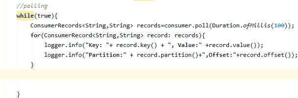

# 用 Java 创建 Kafka 式消费者

> 原文：<https://www.javatpoint.com/creating-kafka-consumer-in-java>

在前一节中，我们学习了用 java 创建一个生产者。在本节中，我们将学习在 java 中实现一个 Kafka 消费者。

创建消费者的步骤如下:

1.  创建记录器
2.  创建消费者属性。
3.  创造一个消费者。
4.  让消费者订阅特定的主题。
5.  调查一些新数据

让我们讨论学习 java 中消费者实现的每一步。

## 创建记录器

记录器被实现为在程序执行期间写入日志消息。用户需要创建一个 Logger 对象，该对象需要导入“ **org.slf4j 类**”。下面的快照显示了记录器的实现:


## 创建消费者属性

与生产者属性类似，ApacheKafka 也为创造消费者提供了各种不同的属性。要了解每个消费者属性，请访问**Apache 卡法>文档>配置>消费者配置**的官方网站。在这里，我们将列出消费者所需的属性，例如:

**键.反序列化器:**是键的反序列化器类，用于实现“**org . Apache . Kafka . common . serialization .反序列化器**接口。

**值.反序列化器:**实现“**org . Apache . Kafka . common . serializer**接口的值的反序列化器类。

**bootstrap.servers:** 这是一个主机/端口对列表，用于建立与 Kafka 集群的初始连接。它不包含客户端所需的全套服务器。只需要引导所需的服务器。

**group.id:** 它是一个唯一的字符串，用于标识消费组的消费者。当消费者通过订阅主题使用基于 Kafka 的偏移管理策略或组管理功能时，需要该属性。

**auto.offset.reset:** 当初始偏移不存在或当前偏移在服务器上不再存在时，需要该属性。有以下值用于重置偏移值:

**最早:**该偏移变量自动将值重置为其最早偏移。

**最新:**该偏移变量将偏移值重置为其最新偏移。

**无:**如果没有为前一个组找到前一个偏移量，则向消费者抛出异常。

**还有什么:**它给消费者抛出了一个例外。

#### 注意:在我们的代码中，我们使用了‘最早’变量来将值重置为其最早值。

这些是实现消费者所需的一些基本属性。让我们使用 IntelliJ IDEA 来实现。

**步骤 1)** 定义一个新的 java 类为“**consumer1.java**”。

**步骤 2)** 描述类中的消费者属性，如下图所示:


在快照中，描述了所有必要的属性。

## 创造消费者

创建一个 KafkaConsumer 的对象来创建消费者，如下所示:


创建使用者时传递上述属性。

## 订阅消费者

要从主题中读取消息，我们需要将消费者连接到指定的主题。消费者可以通过各种订阅应用编程接口进行订阅。这里，我们使用了 Arrays.asList()，因为用户可能想要订阅一个或多个主题。因此，Arrays.asList()允许消费者订阅多个主题。

下面的代码显示了消费者订阅的实现:


用户需要直接或通过字符串变量指定主题名称来读取消息。也可以有多个由逗号分隔的主题。

## 轮询新数据

消费者通过轮询的方式从 Kafka 那里读取数据。



poll 方法返回从当前分区的偏移量获取的数据。指定等待数据的持续时间，否则将向消费者返回一条空的消费记录。此外，记录器将获取记录关键字、分区、记录偏移量及其值。

创建 java 消费者的完整代码如下:

```

package com.firstgroupapp.aktutorial;

import org.apache.kafka.clients.consumer.ConsumerConfig;
import org.apache.kafka.clients.consumer.ConsumerRecord;
import org.apache.kafka.clients.consumer.ConsumerRecords;
import org.apache.kafka.clients.consumer.KafkaConsumer;
import org.apache.kafka.common.serialization.StringDeserializer;
import org.slf4j.Logger;
import org.slf4j.LoggerFactory;

import java.time.Duration;
import java.util.Arrays;
import java.util.Collections;
import java.util.Properties;

public class consumer1 {
    public static void main(String[] args) {
        Logger logger= LoggerFactory.getLogger(consumer1.class.getName());
        String bootstrapServers="127.0.0.1:9092";
        String grp_id="third_app";
        String topic="my_first";
        //Creating consumer properties
        Properties properties=new Properties();
        properties.setProperty(ConsumerConfig.BOOTSTRAP_SERVERS_CONFIG,bootstrapServers);
        properties.setProperty(ConsumerConfig.KEY_DESERIALIZER_CLASS_CONFIG,   StringDeserializer.class.getName());
        properties.setProperty(ConsumerConfig.VALUE_DESERIALIZER_CLASS_CONFIG,StringDeserializer.class.getName());
        properties.setProperty(ConsumerConfig.GROUP_ID_CONFIG,grp_id);
        properties.setProperty(ConsumerConfig.AUTO_OFFSET_RESET_CONFIG,"earliest");
        //creating consumer
        KafkaConsumer<String,String> consumer= new KafkaConsumer<String,String>(properties);
        //Subscribing
                consumer.subscribe(Arrays.asList(topic));
        //polling
        while(true){
            ConsumerRecords<String,String> records=consumer.poll(Duration.ofMillis(100));
            for(ConsumerRecord<String,String> record: records){
                logger.info("Key: "+ record.key() + ", Value:" +record.value());
                logger.info("Partition:" + record.partition()+",Offset:"+record.offset());
            }

        }
    }
}

```

通过这种方式，消费者可以按照顺序阅读每一步的消息。

消费者实现的输出可以在下面的快照中看到:


键值为空。这是因为我们之前没有指定任何键。由于“最早”，显示了从开始的所有消息。

## 读取消费群中的数据

用户可以有多个消费者一起阅读数据。这可以通过一个消费群体来完成。在消费者群体中，一个或多个消费者将能够从 Kafka 那里读取数据。如果用户想从头开始阅读消息，要么重置 group_id，要么更改 group_id。这将重置用户的应用程序，并从一开始就显示消息。

* * *