# Kafka 实时范例

> 原文：<https://www.javatpoint.com/kafka-real-time-example>

到目前为止，我们已经学会了如何读写 ApacheKafka 的数据。在这一节中，我们将学习把真正的数据源放到 Kafka。

在这里，我们将讨论一个实时应用程序，即 **Twitter。**用户将了解如何创建推特制作人以及推特是如何制作的。

推特是一种社交网络服务，允许用户互动和发布信息。这些信息被称为**推文。**推特用户通过发帖进行互动，通过推文对不同的帖子进行评论。

为了处理推特，我们需要获得推特应用的证书。这可以通过创建一个推特开发者账户来实现。为此，请遵循以下步骤:

**步骤 1:** 创建一个推特账户，如果它不存在的话。

**第二步:**在网页浏览器上打开‘developer . Twitter . com’，如下图:

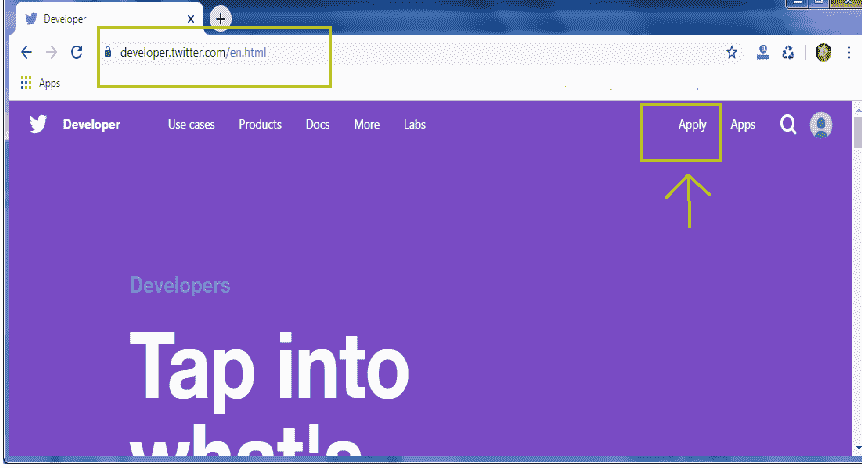

单击应用选项。

**步骤 3:** 将打开新页面。点击“申请开发人员帐户”

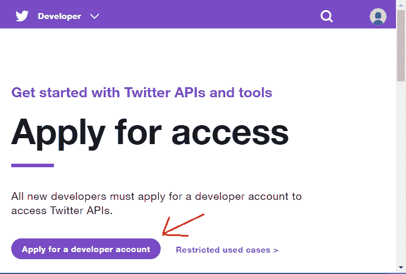

**步骤 4:** 将打开一个新页面，询问预期用途，如‘你将如何使用推特数据？“，等等。快照如下所示:

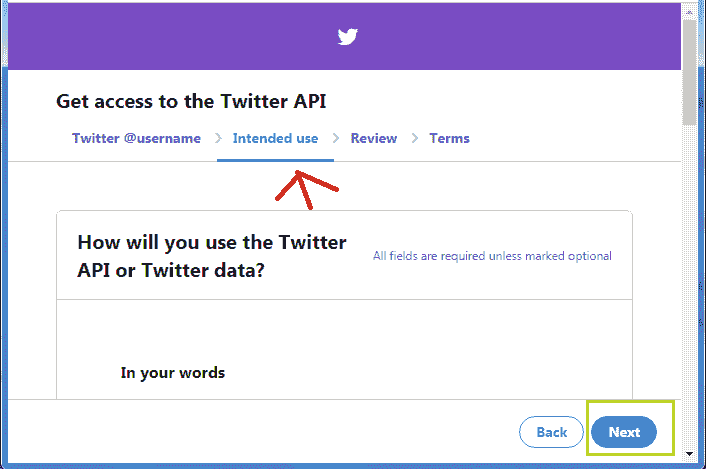

给出适当的答案后，单击下一步。

**第五步:**下一部分是复习部分。在这里，用户解释将由推特审核，如下所示:

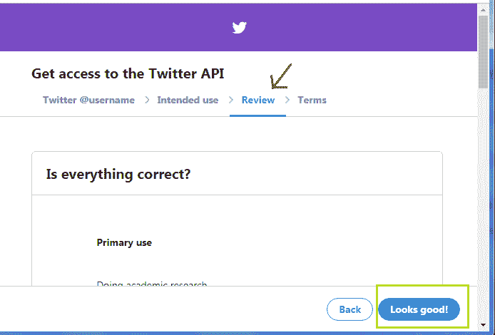

如果推特认为答案合适，“看起来不错”选项将被启用。然后，进入下一部分。

**步骤 6:** 最后，将要求用户审查并接受《开发者协议》。点击复选框接受协议。点击“提交申请”提交申请。

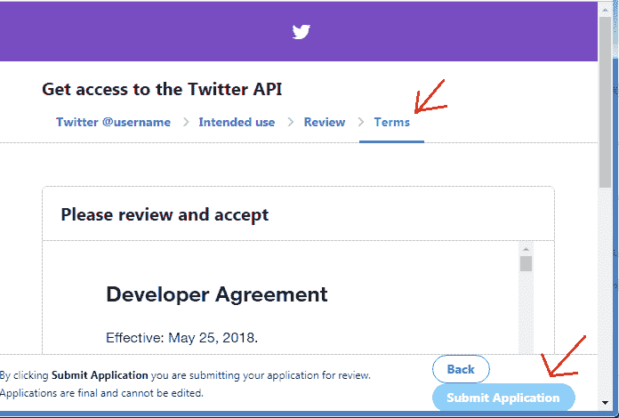

**步骤 7:** 成功完成后，会打开邮件确认页面。使用提供的电子邮件 id 进行确认，然后继续。

**步骤 8:** 确认后，会打开一个新的网页。点击“创建应用”，如下所示:

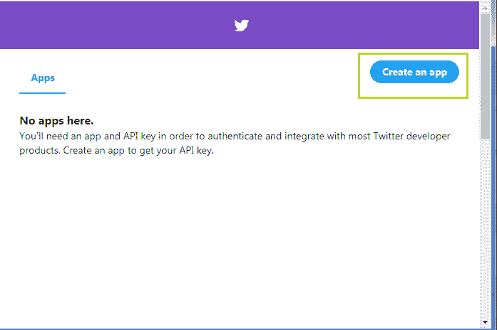

**步骤 9:** 提供 app 详情，如下图快照所示:

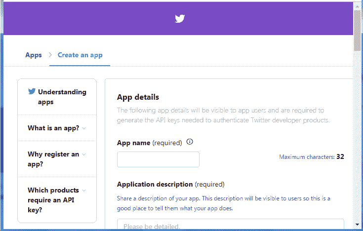

**步骤 10:** 给出应用详情后，点击“创建”选项。将打开一个对话框“查看我们的开发人员条款”。点击“创建”选项。快照如下所示:

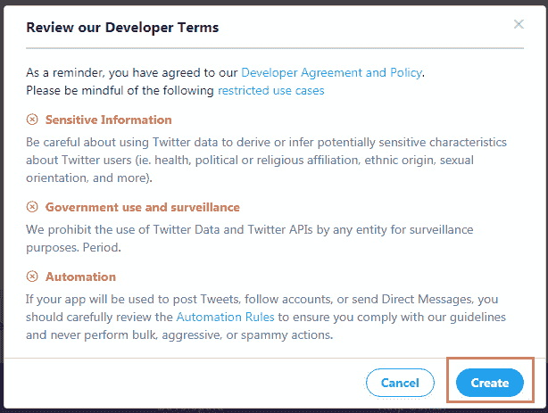

最后，应用程序将以以下方式创建:

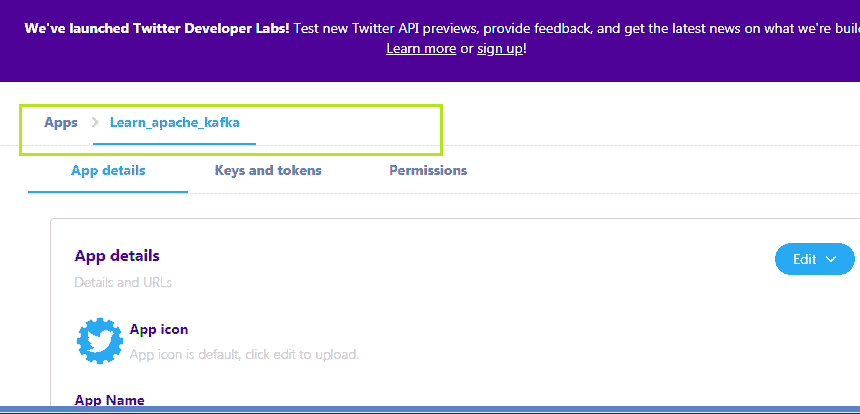

#### 注意:何时创建应用程序。它将生成密钥和令牌。不要透露，因为这些是秘密或敏感信息。如果这样做了，为了安全起见，用户可以再生它们。

**步骤 11:** 在创建一个应用之后，我们需要在‘POM . XML’文件中添加 twitter 依赖。为此，在网络浏览器上打开“github twitter java”。快照如下所示:

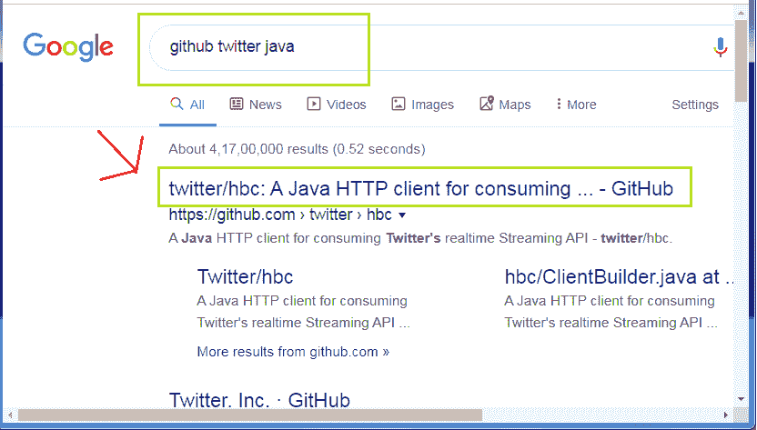

打开高亮显示的链接或访问:[' https://github . com/Twitter/HBc '](https://github.com/twitter/hbc)直接打开。

**步骤 12:** 在那里，用户会找到 twitter 依赖代码。复制代码并将其粘贴到 maven 依赖代码下面的“pom.xml”文件中。

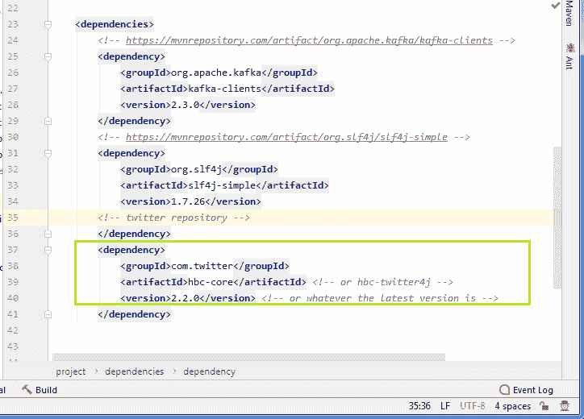

依赖性代码中使用了术语“hbc”。它代表“Hosebird 客户端”，这是一个 java HTTP 客户端。它用于消费推特的标准流媒体应用编程接口。Hosebird 客户端分为两个模块:

1.  **hbc-core:** 它使用一个消息队列。消费者进一步使用该消息队列来轮询原始字符串消息。
2.  **HBc-twiter 4j:**这与 hbc-core 不同，因为它使用了 twiter 4j 监听器。Twitter4j 是一个非官方的 java 库，通过它我们可以轻松地将我们的 java build 应用程序与各种 Twitter 服务集成在一起。

在 twitter 依赖代码中，使用了 hbc-core。用户也可以使用 twitter4j 来代替。

这样，实时示例的第一阶段就完成了。

* * *