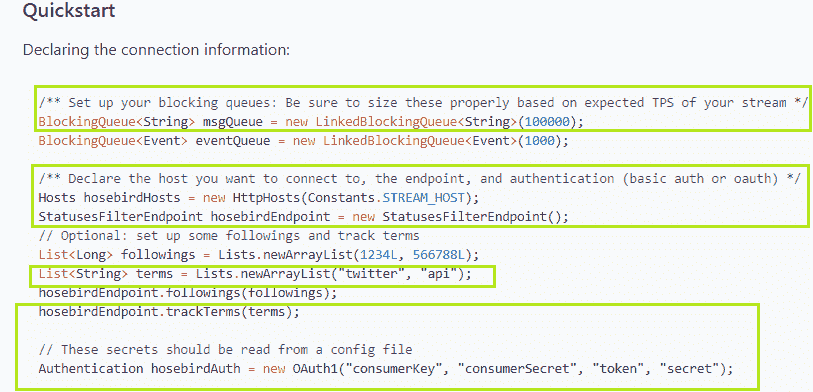
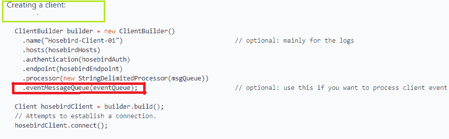
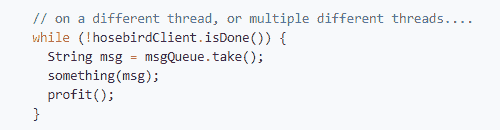
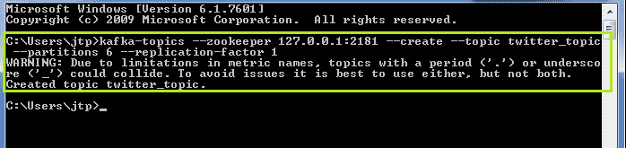
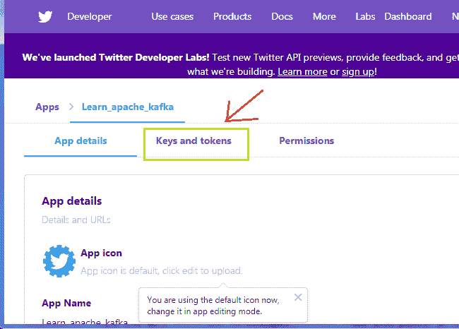
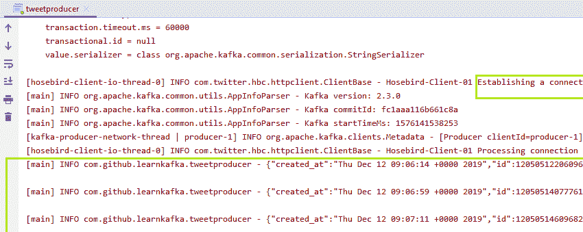
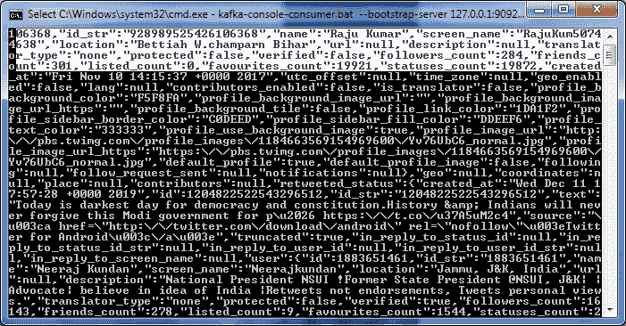

# 创建推特制作人

> 原文：<https://www.javatpoint.com/kafka-creating-twitter-producer>

在这一部分，我们将学习创建一个 twitter 制作人。

创建 twitter 制作人基本上有三个步骤:

1.  创建一个 twitter 客户端。
2.  创建生产者
3.  发送推文

**步骤 1:** 按照包命名约定规则，创建一个新的 java 包。然后，在其中创建一个 java 类，比如说“**tweetproducer.java**”

**步骤 2:** 通过为 twitter 客户端创建一个方法来创建它。现在，将快速启动代码从“ **github twitter java** 复制到 twitter 客户端方法，如下所示:



将其粘贴到新创建的方法中。该代码将在客户端和 hbc 主机之间创建连接。当队列为空或已满时，阻塞队列将停止客户端将消息出列或入队。因为我们使用的是 hbc-core，所以我们只需要 msgQueue。此外，我们将遵循条款，而不是人民。因此，只复制突出显示的代码。

现在，将连接代码下面给出的“**创建客户端**代码复制为:



将代码粘贴到连接代码下方。这段代码将通过客户端构建器创建一个 twitter 客户端。因为我们使用的是 msgQueue，所以不要复制红色突出显示的代码，这是针对 eventMessageQueue 的。这不是必需的。

**步骤 3:** 使用引导服务器连接，按照我们在前面几节中学习的类似方式创建生成器。

**第四步:**创作完Kafka制作人，是时候给Kafka发推了。从“创建客户端”代码下面给出的“github twitter java”中复制 while 循环代码。粘贴到生产者代码下面。



现在，我们已经准备好阅读推特上的推文。虽然，一个Kafka式的制片人阅读了一个话题的信息。因此，使用命令行界面上的“ **-create** ”命令创建指定的主题。另外，指定分区值和复制因子。

例如，



在这里，主题“twitter_topic”是用分区值 6 和复制因子 1 创建的。最后，执行代码并在现实应用程序中体验Kafka。

创建推特客户端的完整代码如下:

```

package com.github.learnkafka;

import com.google.common.collect.Lists;
import com.twitter.hbc.ClientBuilder;
import com.twitter.hbc.core.Client;
import com.twitter.hbc.core.Constants;
import com.twitter.hbc.core.Hosts;
import com.twitter.hbc.core.HttpHosts;
import com.twitter.hbc.core.endpoint.StatusesFilterEndpoint;
import com.twitter.hbc.core.processor.StringDelimitedProcessor;
import com.twitter.hbc.httpclient.auth.Authentication;
import com.twitter.hbc.httpclient.auth.OAuth1;
import org.apache.kafka.clients.producer.*;
import org.apache.kafka.common.serialization.StringSerializer;
import org.slf4j.Logger;
import org.slf4j.LoggerFactory;

import java.util.List;
import java.util.Properties;
import java.util.concurrent.BlockingQueue;
import java.util.concurrent.LinkedBlockingQueue;
import java.util.concurrent.TimeUnit;

public class tweetproducer {
    Logger logger = LoggerFactory.getLogger(tweetproducer.class.getName());
    String consumerKey = "";//specify the consumer key from the twitter app
    String consumerSecret = "";//specify the consumerSecret key from the twitter app
    String token = "";//specify the token key from the twitter app
    String secret = "";//specify the secret key from the twitter app

    public tweetproducer() {}//constructor to invoke the producer function

    public static void main(String[] args) {
        new tweetproducer().run();
    }

    public void run() {
        logger.info("Setup");

        BlockingQueue<String> msgQueue = new         
	LinkedBlockingQueue<String>(1000);//Specify the size accordingly.
        Client client = tweetclient(msgQueue);
        client.connect(); //invokes the connection function
        KafkaProducer<String,String> producer=createKafkaProducer();

        // on a different thread, or multiple different threads....
        while (!client.isDone()) {
            String msg = null;
            try {
                msg = msgQueue.poll(5, TimeUnit.SECONDS);//specify the time
            } catch (InterruptedException e) {
                e.printStackTrace();
                client.stop();
            }
            if (msg != null) {
                logger.info(msg);
                producer.send(new ProducerRecord<>("twitter_topic", null, msg), new Callback() {
                    @Override
                    public void onCompletion(RecordMetadata recordMetadata, Exception e) {
                        if(e!=null){
                            logger.error("Something went wrong",e);
                        }
                    }
                });
            }

        }//Specify the topic name, key value, msg

        logger.info("This is the end");//When the reading is complete, inform logger
    }

    public Client tweetclient(BlockingQueue<String> msgQueue) {

        Hosts hosebirdHosts = new HttpHosts(Constants.STREAM_HOST);
        StatusesFilterEndpoint hosebirdEndpoint = new StatusesFilterEndpoint();
        List<String> terms = Lists.newArrayList("India ");//describe 
//anything for which we want to read the tweets.
        hosebirdEndpoint.trackTerms(terms);
        Authentication hosebirdAuth = new        OAuth1(consumerKey,consumerSecret,token,secret);
        ClientBuilder builder = new ClientBuilder()
                .name("Hosebird-Client-01")     // optional: mainly for the logs
                .hosts(hosebirdHosts)
                .authentication(hosebirdAuth)
                .endpoint(hosebirdEndpoint)
                .processor(new StringDelimitedProcessor(msgQueue));

        Client hosebirdClient = builder.build();
        return hosebirdClient; // Attempts to establish a connection.
 }
    public KafkaProducer<String,String> createKafkaProducer(){
 //creating kafka producer   
//creating producer properties   
        String bootstrapServers="127.0.0.1:9092";
        Properties properties= new Properties();
        properties.setProperty(ProducerConfig.BOOTSTRAP_SERVERS_CONFIG,	   bootstrapServers);
        properties.setProperty(ProducerConfig.KEY_SERIALIZER_CLASS_CONFIG, StringSerializer.class.getName());
        properties.setProperty(ProducerConfig.VALUE_SERIALIZER_CLASS_CONFIG, StringSerializer.class.getName());

        KafkaProducer<String,String> first_producer = new KafkaProducer<String, String>(properties);
        return first_producer;

    }
}

```

在上面的代码中，用户将指定消费者密钥、消费者密钥、令牌密钥以及秘密密钥。由于是敏感信息，因此无法显示。从“developer.twitter.com”复制密钥并粘贴到各自的位置。



从“**密钥和令牌**中复制密钥并粘贴到代码中。

上述代码的输出将显示为:



客户与水鸟建立了联系。在这之后，我们可以看到太多在‘印度’上产生的推文。发布一些关于任何特定主题的推文，并尝试一下。

在 CLI 上尝试一下“**Kafka-控制台-消费者-引导-服务器 127 . 0 . 0 . 1:9092-topic Twitter _ topic**”命令。输出将与 IntelliJ IDEA 终端上的相同:



这样，我们就可以创建一个真正的推特——Kafka——制作人，并向Kafka发送推文。

* * *