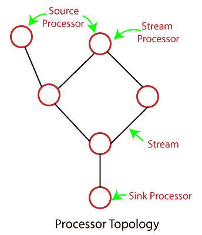

# 卡夫卡流处理

> 原文：<https://www.javatpoint.com/kafka-stream-processing>

到目前为止，我们已经了解了主题、分区、向卡夫卡发送数据以及使用卡夫卡的数据。这可能是较低的抽象级别。因此，需要更高层次的抽象。这就引入了卡夫卡流的概念。

## 卡夫卡溪流

一般来说，流定义了随时间提供的数据元素流。在 Apache Kafka 中，流是事实或记录(键值对)的连续实时流。Kafka Streams 是一个轻量级的内置客户端库，用于构建不同的应用程序和微服务。流的输入和输出数据被存储在卡夫卡集群中。Kafka Streams 集成了编写简单性以及在客户端部署标准 java 和 scala 应用程序。

### 为什么是卡夫卡溪流？

以下属性描述了卡夫卡流的使用:

1.  卡夫卡流在本质上是高度可伸缩的，也是有弹性的。
2.  可部署到集装箱、云、裸机等。
3.  它可用于任何规模的用例，即小型、中型或大型。
4.  它具有容错能力。如果出现任何故障，可以由卡夫卡流处理。
5.  它允许编写标准的 java 和 scala 应用程序。
6.  对于流式传输，它不需要任何单独的处理集群。
7.  在 Mac、Linux 以及 Windows 操作系统中都支持 Kafka Streams。
8.  除了卡夫卡本身，它没有任何外部依赖。

## 流处理

与数据流编程类似，流处理允许少数应用程序更简单、更容易地利用有限形式的并行处理。因此，流处理使得应用程序的并行执行变得简单。业务方使用称为流处理软件/应用程序的软件来实现核心功能。

### 流处理拓扑

阿帕奇卡夫卡提供了流作为最重要的抽象。流是可偿还的、有序的，以及不可变记录的容错序列。

流处理应用程序是一个使用卡夫卡流库的程序。它需要一个或多个处理器拓扑来定义其计算逻辑。处理器拓扑以图形方式表示，其中“流处理器”是它的节点，每个节点通过“流”作为它的边来连接。

流处理器表示将数据转换为流的步骤。它一次从拓扑中的上游处理器接收一条输入记录，应用其操作，最后向其下游处理器产生一条或多条输出记录。

拓扑中有以下两个主要处理器:

1.  **源处理器:**没有任何上游处理器的流处理器类型。该处理器使用来自一个或多个主题的数据，并产生其拓扑的输入流。
2.  **接收处理器:**这是没有下游处理器的流处理器类型。该处理器的工作是将从其上游处理器接收的数据发送到指定的主题。

此外，Kafka Streams 提供了两种表示流处理拓扑的方式:

1.  **卡夫卡流 DSL:** 它建立在流处理器应用编程接口之上。这里，DSL 扩展为“特定领域语言”。大多推荐初学者使用。
2.  **处理器 API:** 这个 API 大部分被开发者用来定义任意的流处理器，一次处理一条接收到的记录。此外，它将这些处理器与它们的状态存储连接起来，以组成处理器拓扑。这种组合的拓扑表示定制的处理逻辑。

* * *