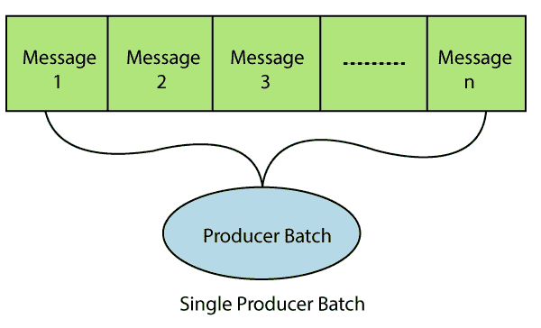
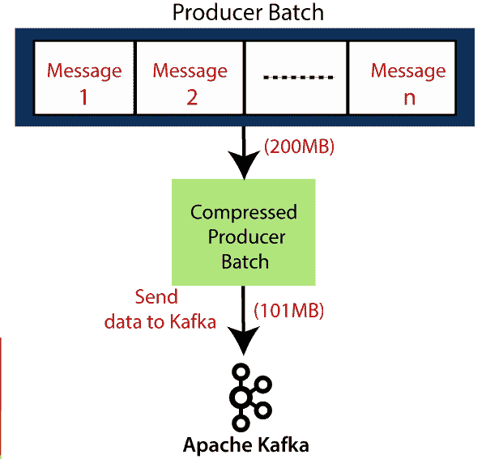

# Kafka的信息压缩

> 原文：<https://www.javatpoint.com/message-compression-in-kafka>

正如我们已经看到的，生产者以文本格式向Kafka发送数据，通常称为 **JSON** 格式。JSON 有一个缺点，即数据以字符串形式存储。这会创建几个重复的记录来存储在Kafka主题中。因此，它占用了大量磁盘空间。因此，需要减少磁盘空间。这可以通过在将数据发送到Kafka之前压缩或延迟数据来实现。

## 对消息压缩的需求

以下原因可以更好地描述减小消息大小的必要性:

1.  它将减少向Kafka发送数据所需的延迟和大小。
2.  这将减少带宽，使用户增加发送到代理的网络消息。
3.  当数据通过云平台存储在Kafka时，它可以导致低成本。因为云服务是付费的。因此，它计算Kafka中存储的数据量。
4.  消息压缩不需要对代理和消费者的配置进行任何更改。
5.  消息压缩不需要对代理和消费者的配置进行任何更改。
6.  磁盘负载的减少将导致快速读写操作。

## 生产者批次/记录批次

一个制作人一个接一个地给Kafka写信息。因此，Kafka玩得很聪明。它等待着向Kafka传递的信息。然后，它创建一个批处理并将消息放入其中，直到它变满。然后，把这批送到Kafka那里。这种批次被称为**生产商批次**。默认批处理大小为 16KB，最大值可以是任何值。批量越大，生产者请求的压缩、吞吐量和效率就越高。

#### 注意:消息大小不应超过批处理大小。否则，邮件将不会被批处理。此外，批处理是按分区分配的，因此不要将其设置为很高的数字。

更大的是生产者批量，有效使用消息压缩技术。

## 消息压缩格式

消息压缩总是在生产者端完成，因此不需要在消费者或代理端更改配置。

在图中，创建了一个 200 MB 的生产者批次。压缩后，减少到 101 MB。

为了压缩数据，使用了“compression.type”。这让用户可以决定压缩的类型。类型可以是“gzip”、“爽快”、“lz4”或“none”(默认)。“gzip”具有最大压缩比。

## 消息压缩的缺点

消息压缩有以下缺点:

1.  生产者承诺压缩一些 CPU 周期。
2.  消费者提交一些 CPU 周期进行解压缩。
3.  这些缺点导致 CPU 使用率增加。

因此，消息压缩是降低磁盘负载的更好选择。

* * *