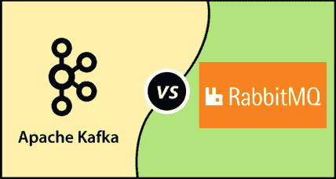

# apache kafka VS rabbitmq

> 哎哎哎:# t0]https://www . javatppoint . com/Apache-Kaka-vs-rabbitq

## 什么是 RabbitMQ？

RabbitMQ 是应用最广泛、通用和开源的消息代理。它于 2007 年发布，是消息传递系统的主要组件。目前，它用于流用例。RabbitMQ 能够处理后台任务，或者充当微服务之间的消息代理。它帮助网络应用程序减少了负载。此外，它还减少了服务器交付耗时任务或资源的时间。

## 什么是 ApacheKafka？

Apache Kafka 也是一个开源的分布式发布/订阅消息系统。它发布于 2011 年，作为两个应用程序之间的中间存储。生产者将消息写入并存储在 Kafka 集群中。另一方面，消费者消费来自集群的消息。它还减少了大量信息的缓慢传递。

## kafka 诉 rabbitmq 案

| 因素 | ApacheKafka | 拉比特 |
| 分配 | Kafka 消费者通过主题分区进行分发。每个使用者一次消费来自特定分区的消息。 | 每个队列实例都有许多使用者。这些消费者被称为竞争性消费者，因为他们相互竞争消费信息。但是，消息只能处理一次。 |
| 高可用性 | 在 zookeeper 的帮助下，它管理 Kafka 集群的状态并支持高可用性。 | 通过集群和高可用队列提供高性能数据复制。因此，它还提供了高可用性。 |
| 表演 | 它可以用更少的硬件在一秒钟内处理数百万条消息。 | 它还可以在一秒钟内处理数百万条消息，但它需要更多的硬件。 |
| 分身术 | Kafka 中有可复制的代理，它在主代理关闭时工作。 | 这里，队列不会自动复制。配置是强制性的。 |
| 多用户 | 多种消费类型可以向 Kafka 订阅多条消息。 | 虽然消息被路由到不同的队列，但是一个队列中只有一个使用者可以处理该消息。 |
| 消息协议 | Apache Kafka 支持 int8、int16 等原语。和二进制消息。 | 这支持任何标准的队列协议，如 STOMP、AMQP、HTTP 等。 |
| 消息排序 | 消息排序仅出现在分区内部。它保证要么全部失败，要么一起通过。 | 它通过单个 AMQP 通道维持流的顺序。此外，它还在其队列逻辑中对重新传输的数据包进行重新排序，这将防止消费者对缓冲区进行重新排序。 |
| 消息生存期 | 它包含一个日志文件，可以随时阻止所有消息。 | 由于它是一个队列，消息一旦被使用就会被删除，并收到确认。 |
| 体系结构 | 高度可扩展的发布/订阅分布式消息系统。它有代理、主题、分区和 Kafka 集群内的主题。 | 通用发布/订阅消息代理。它的架构不同于 Kafka，因为它由队列组成。 |
| 用例 | 它主要用于流式传输数据。 | 网络服务器主要使用它来对请求做出即时响应。 |
| 处理 | 它支持那些展示 a？读-处理-写？向/从 Kafka 主题表演的模式。 | 即使事务只允许一个队列，它也不能保证原子性。 |
| 语言 | Apache Kafka 是用 Scala 用 JVM 写的。 | RabbitMQ 是二郎写的。 |
| 路由支持 | 它支持复杂的路由场景。 | 它不支持复杂的路由场景。 |
| 开发者体验 | 伴随着高成长，带来了很好的体验。但是，它只支持 Java 客户端。 | RabbitMQ 搭载了成熟的客户端库，支持 Java、PHP、Python、Ruby 等等。 |

* * *