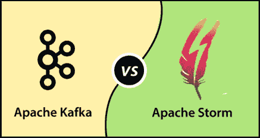

# ApacheKafka VS ApacheStorm

> 原文：<https://www.javatpoint.com/apache-kafka-vs-apache-storm>

## ApacheStorm

它是一个开源的实时流处理系统。ApacheStorm主要用于固定传统工艺。它可靠地处理无界流。它有喷口和螺栓，用于设计拓扑形式的Storm应用。任何编程语言都可以使用它。因此，使用起来很简单。它可以在一秒钟内处理数百万条信息。

## Kafka与Storm

Kafka和《Storm》有以下不同之处:

| 因素 | ApacheKafka | ApacheStorm |
| 开发商 | 最初由 LinkedIn 开发。然后，捐给了Apache基金会。 | 最初由 Nathan Marz (Backtype 团队)创建。后来，被推特收购。更进一步，它成为了 Apache 的顶级项目。 |
| 程序设计语言 | Apache Kafka 是用 Scala 用 JVM 写的。 | Apache Storm 是用 Clojure 和 Java 编写的。 |
| 系统类型 | 这是一个分布式消息传递系统。 | 它是一个实时消息处理系统。 |
| 主要用于 | 它被用作消息代理。但是，它也做小批量加工。 | 它用于微批量流处理。 |
| 数据存储 | 它维护本地文件系统，如 XFS 或 EXT4，用于存储数据。 | 它不存储数据。它将数据从输入流传输到输出流。 |
| 取决于 | Apache Kafka 依靠动物园管理员来运行 Kafka 服务器，并让消费者/生产者向 Kafka 读/写消息。 | ApacheStorm没有外部依赖。 |
| 潜伏 | Kafka的潜伏力是毫秒。 | 它的延迟能力不到 1-2 秒。这是因为它依赖于数据源。 |
| 语言支持 | Java 编程语言最支持。 | 它支持所有编程语言。 |
| 安全 | 数据不太安全。 | 数据高度安全。 |
| 数据源 | 它从 facebook、twitter 等实际数据源获取数据。 | 它从Kafka本身获取数据进行处理。 |
| 容错的 | 由于动物园管理员，它能够容忍错误。 | 它有一个自动重启的内置功能。 |
| 开发者体验 | 它经久耐用，可扩展，并提供高吞吐量的价值。 | 使用起来简单灵活。 |

* * *