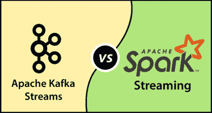

# 卡夫卡流与火花流

> 原文：<https://www.javatpoint.com/kafka-streams-vs-spark-streaming>

## 阿帕奇火花

Apache Spark 是一个分布式的通用处理系统，一次可以处理 1pb 的数据。它主要用于流式传输和处理数据。它分布在数以千计的虚拟服务器中。大型组织使用 Spark 来处理大量数据集。Apache Spark 允许使用大约 80 名高级操作员更快地构建应用程序。它通过查询优化器、物理执行引擎和 DAG 调度器获得了流和批处理数据的高性能。因此，它的速度要快上百倍。

### 火花流

Apache spark 通过 Spark Streaming 支持大型数据集的流式传输。火花流是核心火花应用编程接口的一部分，它允许用户处理实时数据流。它从不同的数据源获取数据，并使用复杂的算法对其进行处理。最后，处理后的数据被推送到实时仪表板、数据库和文件系统。

## 卡夫卡溪流

一个客户端库，用于处理和分析卡夫卡中存储的数据。Kafka 流使用户能够构建应用程序和微服务。此外，将输出存储在卡夫卡集群中。它对卡夫卡以外的系统没有任何外部依赖。它一次只处理一条记录。

## 卡夫卡流与火花流

| 因素 | 阿帕奇卡夫卡 | 阿帕奇火花 |
| 开发商 | 最初由 LinkedIn 开发。后来，捐给了阿帕奇软件基金会。 | 最初是在加州大学开发的。后来捐给了阿帕奇软件基金会。 |
| 基础设施 | 它是一个 Java 客户端库。因此，它可以在任何支持 Java 的地方执行。 | 它在火花堆栈的顶部执行。它可以是独立的火花，纱，或基于容器。 |
| 数据源 | 它通过主题和流处理来自卡夫卡本身的数据。 | Spark 从各种文件、Kafka、Socket 源等摄取数据。 |
| 加工模型 | 它在事件到达时进行处理。因此，它使用一次事件(连续)处理模型。 | 它有一个微批量处理模型。它将输入流分成小批量进行进一步处理。 |
| 潜伏 | 它的延迟比 Apache Spark 低 | 它有更高的延迟。 |
| ETL 转换 | 阿帕奇卡夫卡不支持。 | Spark 支持这种转换。 |
| 容错 | 卡夫卡的容错是复杂的。 | 在 Spark 中容错很容易。 |
| 语言支持 | 它主要支持 Java。 | 它支持 Java、Scala、R、Python 等多种语言。 |
| 用例 | 《纽约时报》、《扎兰多》、《特里瓦戈》等。使用卡夫卡流来存储和分发数据。 | Booking.com，Yelp(广告平台)使用 Spark streams 处理每天数百万的广告请求。 |

* * *