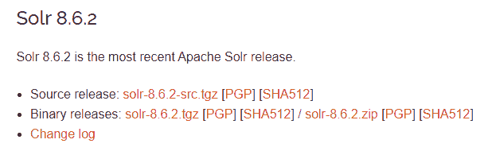
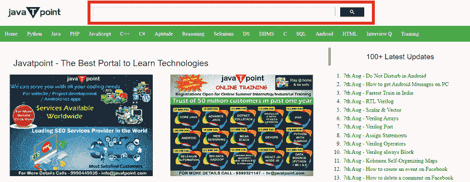
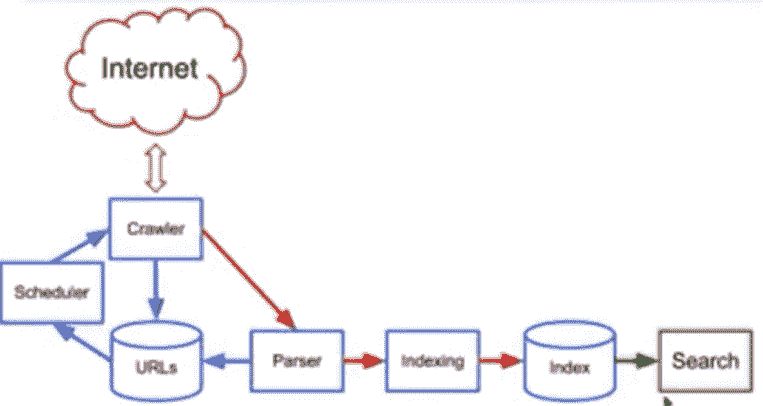

# 开始使用 Apache Solr

> 原文：<https://www.javatpoint.com/getting-started-with-apache-solr>

Solr 是一种特定的 NoSQL 技术，针对一类独特的问题进行了优化。Solr 是一个可扩展的、可随时部署的企业搜索引擎，它被开发用于搜索大量以文本为中心的数据，并返回按相关性排序的结果。

Solr 是由一个名叫 Yonik Seely 的程序员在 2004 年创建的，目的是为 CNET 网络公司的网站增加搜索功能。2006 年 1 月，Apache solr 成为 Apache 软件基金会下的一个开源项目。Apache Solr 的最新版本是 8.6.2。

Apache Solr 正在积极开发中，在当前主要版本上不断发布功能。以前的重要版本会偶尔出现关键的安全或错误修复版本。旧版本被视为停产(寿命终止)，不会进一步更新。因此，获得社区对停产版本的支持可能也是一项挑战。

### 搜索引擎基础

搜索引擎反映了大量的互联网资源数据库，如网页、新闻组、程序、图像等。要在 [WWW](https://www.javatpoint.com/www-full-form) 上定位信息，我们可以使用搜索引擎。

搜索引擎可以通过将查询以键盘或短语的形式传递到搜索框来使用。当您按回车键时，它会搜索数据库并将相关链接返回给用户。

**搜索引擎组件**

搜索引擎由以下三个基本组件组成:

**网络爬虫:**又称蜘蛛或机器人。它是一个搜索网络以收集信息的软件组件。

**数据库:**网络上的每一个信息都存储在数据库中。它包含大量的网络资源。

**搜索界面:**是数据库和用户之间的界面。它帮助用户遍历数据库。

### 搜索引擎的工作

搜索应用程序执行以下部分或全部操作来返回所需结果。

**步骤 1:** 任何搜索应用的第一步都是获取要进行搜索的原始内容。

**第 2 步:**之后，从任何搜索应用程序都可以理解和容易解释的原始内容构建文档。

**步骤 3:** 在开始索引之前，可以开始对文档进行分析。

**第 4 步:**文档创建和分析完成后，下一步是对这些文档进行索引，这样就可以根据某些关键字来检索这些文档，而不是文档的全部内容。

**步骤 5:** 一旦索引的数据库准备好了，然后应用程序就可以执行搜索操作。为了帮助用户进行搜索操作，应用程序必须具有用户界面，用户可以通过输入文本来启动搜索过程。

**步骤 6:** 为文本创建搜索请求后，应用程序应该使用该文本准备一个查询对象。查询对象可以用来查询索引数据库，获取相关的详细信息。

**第七步:**建立查询对象后，可以用来获取相关的详细信息和内容文档。

**步骤 8:** 一旦我们得到了所需的结果，应用程序应该决定向其界面的用户显示结果的方式。

在我们开始使用 solr 开发应用程序之前，我们必须让它在本地计算机上运行。它从从 Apache 下载 Solr 8.6.o 的二进制发行版并提取下载档案开始。关于 Solr 的完整安装过程，请转到下一页。

* * *