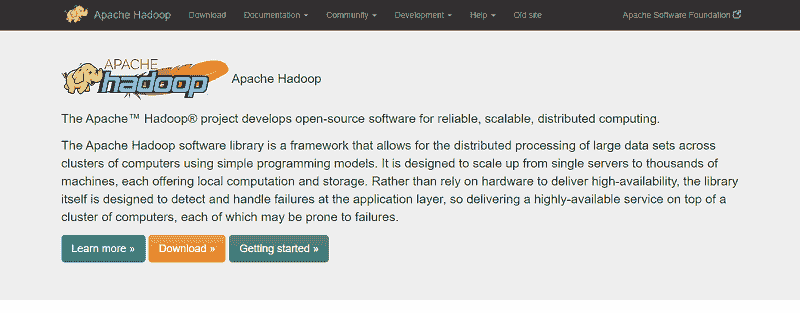
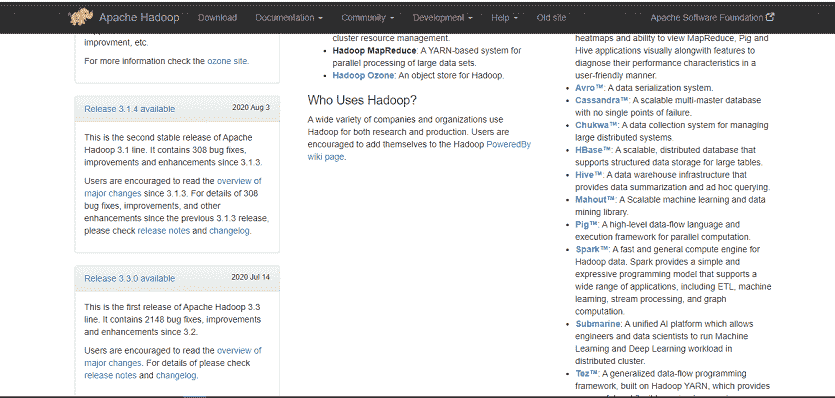
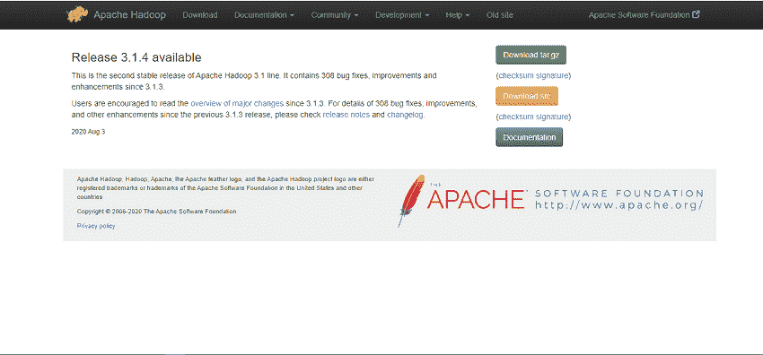
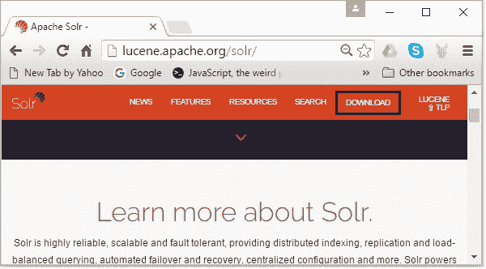
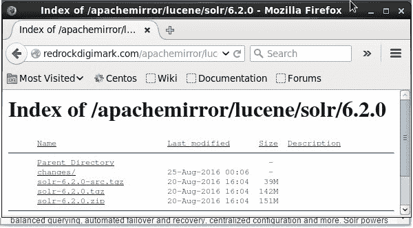

# Hadoop 上的 Apache Solr

> 原文：<https://www.javatpoint.com/apache-solr-on-hadoop>

我们可以将 Solr 与 Hadoop 一起使用。Hadoop 通常处理大量数据，并帮助我们从如此庞大的来源中找到所需的信息。 [solr](https://www.javatpoint.com/apache-solr) 不使用 [Hadoop MapReduce](https://www.javatpoint.com/mapreduce) 处理数据。相反，它只使用 HDFS 文件系统来存储索引和事务日志文件。

### 下载和安装 Hadoop

按照以下步骤在您的 [windows 系统](https://www.javatpoint.com/windows)上下载并安装 Hadoop。

**第一步:**转到 Hadoop 首页。按照链接-www.hadoo.apache.org/重定向到 Hadoop 主页。



**步骤 2:** 在 [Hadoop](https://www.javatpoint.com/hadoop-tutorial) 主页上，单击左侧菜单窗格中的发布。此选项会将您重定向到 Apache Hadoop 发行版页面，该页面包含 Hadoop 不同版本的源文件和二进制文件的可下载镜像链接，如下图所示。



**步骤 3:** 现在，从链接列表中，选择最新和支持的 Hadoop 版本，并单击其二进制链接。它将让您进入 Hadoop 二进制镜像可用的网页。



**第 4 步:**点击其中一个镜像下载 Hadoop。


### 在 Linux 中使用命令提示符下载 Hadoop

**第一步:**启动你的 Linux 操作系统，使用超级用户登录打开 [Linux](https://www.javatpoint.com/linux-tutorial) 终端。

```

$ su 
password:

```

**步骤 2:** 打开需要安装 Hadoop 的目录，并使用之前复制的链接将文件保存在该目录中，如给定代码所示。

```

# cd /usr/local/Hadoop
# wget http://redrockdigimark.com/apachemirror/hadoop/common/hadoop-
2.6.4/hadoop-2.6.4.tar.gz

```

**步骤 3:** 使用以下命令提取下载的文件。

```

# tar zxvf hadoop-2.6.4.tar.gz  
# mkdir hadoop 
# mv hadoop-2.6.4/* to hadoop/ 
# exit

```

### 安装 Hadoop

要以伪分布式模式安装 Hadoop，请执行以下步骤:

**步骤 1:** 通过使用以下给定命令将 Hadoop 环境变量设置为~/，来设置 Hadoop。bashrc 文件。

```

export HADOOP_HOME = /usr/local/hadoop export
HADOOP_MAPRED_HOME = $HADOOP_HOME export
HADOOP_COMMON_HOME = $HADOOP_HOME export 
HADOOP_HDFS_HOME = $HADOOP_HOME export 
YARN_HOME = $HADOOP_HOME 
export HADOOP_COMMON_LIB_NATIVE_DIR = $HADOOP_HOME/lib/native 
export PATH = $PATH:$HADOOP_HOME/sbin:$HADOOP_HOME/bin 
export HADOOP_INSTALL = $HADOOP_HOME

```

**步骤 2:** 您必须将所有更改应用到当前运行的系统。

```

$ source ~/.bashrc

```

**第三步:**配置 Hadoop-我们可以在位置“$HADOOP_HOME/etc/Hadoop”配置所有的 Hadoop 配置文件您必须根据这些配置文件中的 Hadoop 基础架构进行更改。

```

$ cd $HADOOP_HOME/etc/hadoop

```

**第四步:**重置 Hadoop-env.sh 中的 Java 环境变量，用 Java 开发 Hadoop 程序。这可以通过用我们计算机中 JAVA 路径的位置来改变 JAVA_HOME 数据来实现。

```

export JAVA_HOME = /usr/local/jdk1.7.0_71

```

以下是我们需要为 Hadoop 配置编辑的文件列表，如下所示:

*   **core-site.xml:** 它包含用于为文件系统分配内存的端口号、Hadoop 实例、存储数据的内存限制以及读/写缓冲区的大小等信息。打开 core-site.xml 后，<配置>、</配置>标签内的属性如下。

```

<configuration> 
   <property>     
      <name>fs.default.name</name>     
      <value>hdfs://localhost:9000</value>   
   </property> 
</configuration>

```

*   **hdfs-site.xml:** 它包含复制数据的值、数据节点路径和您的区域文件系统的 namenode 路径等信息。它表示您想要保存 Hadoop 基础架构的地方。例如:

```

dfs.replication (data replication value) = 1  

(In the below-given path /Hadoop/ is the user name. 
had infra/hdfs/namenode is the directory created by the hdfs system.) 
namenode path = //home/hadoop/hadinfra/hdfs/nodename  

(hadoopinfra/hdfs/data node is the directory created by the hdfs file system.) 
datanode path = //home/hadoop/hadoopinfra/hdfs/datanode

```

打开文件后，在<configuration>、</configuration>标签内添加以下属性。

```

<configuration> 
   <property>     
      <name>dfs.replication</name>     
      <value>1</value>   
   </property>  

   <property>     
      <name>dfs.name.dir</name>     
      <value>file:///home/hadoop/hadoopinfra/hdfs/namenode</value>   
   </property>  

   <property>     
      <name>dfs.data.dir</name>     
      <value>file:///home/hadoop/hadoopinfra/hdfs/datanode</value>   
   </property> 
</configuration>

```

*   **mapred-site.xml:** 可以用来指定我们使用的是哪个 MapReduce 框架。默认情况下，Hadoop 包含一个 tyre-site . XML 模板。需要在给定命令的帮助下将文件从 mapred-site.xml . template 复制到 mapred-site . XML 文件:

```

$ cp mapred-site.xml.template mapred-site.xml

```

以下是您必须在 mapred-site.xml 文件中的<configuration>、</configuration>标签中添加的属性

```

<configuration> 
   <property>     
      <name>mapreduce.framework.name</name>     
      <value>yarn</value>   
   </property> 
</configuration>

```

*   **纱线-site.xml:** 要将纱线配置到 Hadoop 中，我们可以使用这个文件。打开文件，在该文件中的<配置>、</配置>标签之间添加下面给出的属性。

```

<configuration> 
   <property>     
      <name>yarn.nodemanager.aux-services</name>     
      <value>mapreduce_shuffle</value>   
   </property> 
</configuration>

```

### 验证 Hadoop 安装

按照以下步骤验证 Hadoop 安装。

**步骤 1:** 可以使用命令“hdfs namenode - format”设置名称节点，如下所示:

```

$ cd ~ 
$ hdfs namenode -format

```

上述命令的结果如下:

```

10/24/14 21:30:55 INFO namenode.NameNode: STARTUP_MSG: 
/************************************************************ 
STARTUP_MSG: Starting NameNode 
STARTUP_MSG:   host = localhost/192.168.1.11 
STARTUP_MSG:   args = [-format] STARTUP_MSG:   version = 2.6.4 
... 
... 
10/24/14 21:30:56 INFO common.Storage: Storage directory 
/home/hadoop/hadoopinfra/hdfs/namenode has been successfully formatted. 
10/24/14 21:30:56 INFO namenode.NNStorageRetentionManager: Going to retain 1 
images with txid >= 0 
10/24/14 21:30:56 INFO util.ExitUtil: Exiting with status 0 
10/24/14 21:30:56 INFO namenode.NameNode: SHUTDOWN_MSG: 
/************************************************************ 
SHUTDOWN_MSG: Shutting down NameNode at localhost/192.168.1.11 
************************************************************/

```

**步骤 2:** 通过启动您的 Hadoop 文件系统，可以使用以下命令完成 Hadoop dfs 验证。

```

$ start-dfs.sh

```

**输出:**

```
10/24/14 21:37:56 
Starting namenodes on [localhost] 
localhost: starting namenode, logging to /home/hadoop/hadoop-2.6.4/logs/hadoop-
hadoop-namenode-localhost.out 
localhost: starting datanode, logging to /home/hadoop/hadoop-2.6.4/logs/hadoop-
hadoop-datanode-localhost.out 
Starting secondary namenodes [0.0.0.0]

```

**第三步:**之后，通过启动你的纱魔，使用下面的命令验证纱脚本。

```

$ start-yarn.sh

```

**输出:**

```
starting yarn daemons 
starting resourcemanager, logging to /home/hadoop/hadoop-2.6.4/logs/yarn-
hadoop-resourcemanager-localhost.out 
localhost: starting nodemanager, logging to /home/hadoop/hadoop-
2.6.4/logs/yarn-Hadoop-node manager-localhost.out

```

**第 4 步:**现在，我们必须在默认端口号 50070 上访问浏览器上的 Hadoop。使用下面给出的网址在浏览器上获取 Hadoop 服务。http://localhost: 50070/

### 在 Hadoop 上安装 Solr

以下是帮助您在 Hadoop 上安装 Solr 的步骤。

**第一步:**打开浏览器，点击此链接[https://lucene.apache.org/solr/](https://lucene.apache.org/solr/)进入 Apache Solr 首页



**第二步:**在下一个网页上，点击下载按钮。您现在被重定向到页面，在那里您可以看到 Apache Solr 的各种镜像。



**第三步:**选择一个适合你的操作系统的镜像，点击它。它会将您发送到网页，在那里您可以下载二进制文件和另一个 Apache solr 源。

**步骤 4:** 现在，solr 文件将被下载到您系统的下载文件夹中。

**步骤 5:** 在 Hadoop 主目录中创建一个文件夹并将其命名为 Solr，并将提取文件夹的所有文件移动到其中，如下所示:

```

$ mkdir Solr 
$ cd Downloads 
$ mv Solr-6.2.0 /home/Hadoop/

```

### Hadoop 的验证

**步骤 1:** 转到 Solr 主目录的 bin 文件夹，并使用下面给出的版本命令验证安装:

```

$ cd bin/ 
$ ./Solr version 
6.2.0

```

### 设置 Hadoop 的主页和路径

**第一步:**打开。使用下面给出的命令。

```

[Hadoop@localhost ~]$ source ~/.bashrc

```

**第 2 步:**之后，如下所示设置 Apache Solr 的主目录和路径目录

```

export SOLR_HOME = /home/Hadoop/Solr  
export PATH = $PATH:/$SOLR_HOME/bin/

```

**第三步:**点击开始菜单，打开命令提示符，执行给定命令。

```

[Hadoop@localhost Solr]$ source ~/.bashrc

```

**第 4 步:**现在可以从任意目录执行 Solr 的命令。

* * *