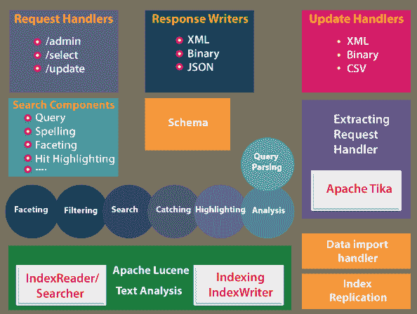

# ApacheSolr 建筑公司

> 原文：<https://www.javatpoint.com/apache-solr-architecture>

Apache Solr 是一个基于 J2EE 的应用程序，它在内部使用 Apache Lucene 的库来生成索引，并提供用户友好的搜索。借助下面的框图，已经描述了 Apache Solr 的体系结构。

Apache Solr 是一个基于 J2EE 的应用程序，它在内部使用 Apache Lucene 的库来生成索引，并提供用户友好的搜索。借助下面的框图，已经描述了 Apache Solr 的体系结构。

[Apache Solr](https://www.javatpoint.com/apache-solr) 的实例可以作为单核或多核应用程序运行，并且基于客户端-服务器模型。以前，apache solr 只有一个内核，这就限制了一个应用程序的使用者通过一个配置文件和模式来运行 solr。在开发后期，可以支持多核的创建。您可以使用统一管理为多个模式和配置运行一个 Solr 实例。Apache solr 在分布式模型中运行，以实现高可用性和可扩展性。

solr 的整体架构在逻辑上可以分为四层。存储层负责管理索引和配置元数据。它位于实例将在其上运行的 J2EE 容器内部，solr 引擎是在容器顶部运行的应用程序包。最后，交互表示客户端/ Apache Solr 服务器如何与[网络浏览器](https://www.javatpoint.com/browsers)交互。让我们在接下来的章节中详细了解每个组件。

### 仓库

Apache Solr 存储可以主要用于存储元数据和必要的索引信息。它通常是在 Apache Solr 的配置文件中本地配置的文件存储。安装包默认自带 Jetty servlet 和 [HTTP](https://www.javatpoint.com/http) 服务器，与包相关的配置可以在$solr 中找到。Solr 安装中的 Home/conf 文件夹。索引包含文档的顺序，可以在 Apache Solr 中配置外部存储设备。例如，数据库或大数据存储系统。

存储组件

*   字段的集合称为文档。
*   字段被命名为一系列术语。
*   字符串与术语相关。

### Apache Solr 的构建模块

以下是 Apache Solr 的基本构件和组件？

**请求处理程序？**这些请求由我们发送到 Apache Solr 服务器的请求处理程序处理。例如索引更新请求或查询请求。根据我们的要求，我们必须选择请求处理程序。我们将处理程序映射到一个特定的 URI 端点，一般来说，将一个请求传递给 Solr，指定的请求将由它来处理。

**搜索组件？**这是 Apache Solr 提供的搜索功能。可以是拼写检查、人脸识别、查询、点击高亮等。所有组件都注册为搜索处理程序。您可以向搜索处理程序注册多个组件。

**查询解析器？**Apache Solr 中的查询解析器解析我们传递给 Solr 服务器的查询，并验证查询是否有语法错误。它将它们翻译成 Lucene 应用程序在解析查询后能够理解的格式。

**回应作家？**在 Apache Solr 中，响应编写器是为用户的查询生成格式化输出的组件。Apache Solr 支持 [XML](https://www.javatpoint.com/xml-tutorial) 、 [JSON](https://www.javatpoint.com/json-tutorial) 、CSV 等响应格式。对于每种类型的响应，我们都有不同的响应编写器。

**分析器/令牌器-** Apache Solr 识别令牌形式的数据。它分析将它分成令牌的内容，并将所有令牌传递给 Lucene。Apache Solr 中的分析器可用于检查字段的文本并创建令牌流。分析器准备的令牌流可以分解成令牌。

**更新请求处理器-** 当我们从 Apache Solr 获取更新请求时，更新请求将通过一组插件(即签名、日志、索引)运行，统称为更新请求处理器。该更新请求处理器负责修改，例如添加字段、删除字段等。

* * *