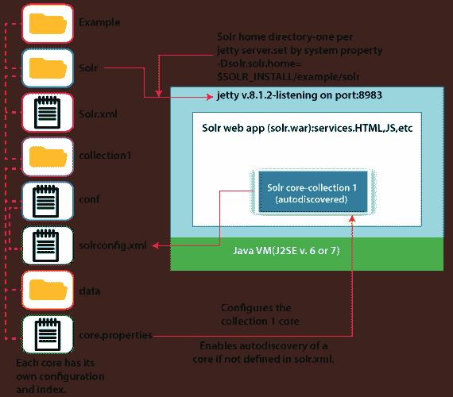

# 阿帕奇索尔通用术语

> 原文：<https://www.javatpoint.com/apache-solr-general-terminology>

在 Apache solr 中，以下是我们在使用 Apache Solr 时将使用的通用术语。所以，有必要简单了解一下这些术语。

***实例:***Solr 中的实例类似于 Tomcat 实例或 jetty 实例，指的是运行在 Java Virtual Machine 内部的应用服务器。每个 Solr 实例都由主目录提供引用，其中一个或多个内核可以配置为在每个实例内部运行。

***Core:*** 当我们在应用程序中运行多个索引时，我们可以在每个实例中有多个内核，而不是多个实例，每个实例都有一个内核。

***Home:*** 术语$SOLR_HOME 指的是主目录，其中包含了所有关于内核及其配置、索引和依赖关系的信息。

***分片:*** 数据在不同 Solr 实例之间的分布式环境中进行分区，每个数据块都可以称为一个分片。碎片包含整个索引的子集。

### SolrCloud 术语

我们可以以主从模式安装的分布式模式(即云环境)安装 solr。在云环境中，索引是在主服务器上创建的，并被复制到一个或多个从服务器上。

以下是与 Solr 云相关的关键术语:

***节点:***Solr 的每个实例都被视为 Solr 云中的一个节点。

***集群:*** 环境的所有节点组合在一起，就形成了一个集群。

***Collection:***Collection 是通过聚类得到的逻辑索引。

***碎片:*** 它是集合的一部分，具有一个或多个索引副本。

***副本:*** 在 Solr 核心的一个节点中运行的分片的副本称为副本。

***Leader:*** 也是碎片的副本，将 Solr Cloud 的请求分发给剩余的副本。

***Zookeeper:*** 这是一个 Apache 项目，Solr 云可以用它来集中配置和协调集群的管理，并选出一个领导者。

### Solr 的配置

Solr 开箱即用，无需修复任何配置更改。但是在某些时候，我们需要针对我们特定的搜索应用程序需求优化 Solr。以下是 [Apache Solr](https://www.javatpoint.com/apache-solr) 中的主要配置文件。

***Solr.xml:*** 该文件出现在包含与 Solr 云相关的信息的$SOLR_HOME 目录中。给定的文件将用于加载有助于识别它们的内核。

***Solrconfig.xml:*** 该文件包含与请求处理和响应格式化相关的核心特定配置和定义，以及索引、配置、管理内存和提交。

***Schema.xml:*** 它包含整个模式以及字段和字段类型。

***Core.properties:*** 该文件包含核心特有的配置。它被称为核心发现，因为它包含核心的名称和数据目录的路径。它可以用于任何被认为是核心目录的目录。

对于使用 core.properties 自动发现的内核，以下是配置属性。

| 参数 | 描述 |
| **名称** | 它提供了内核所需的名称。 |
| **配置** | 它可用于将配置文件默认指定为 solrconfig.xml。 |
| **数据目录** | 它指定包含索引文件的目录的路径，并更新实例目录下数据的默认日志。 |
| **博主** | 它指定包含更新日志的目录的路径。 |
| **模式** | 它设置默认为 schema.xml 的模式文档的名称。 |
| **碎片** | 它为当前核心设置碎片标识。 |
| **收藏** | 这是这个核心所属的 SolrCloud 集合的名称。 |
| **【load on startup】** | 如果该标志设置为真，则在 Solr 初始化过程中加载内核时，会为其打开一个新的搜索器。 |
| **瞬态** | 它表明，如果达到 Solr 的 transientCacheSize 阈值，该内核可以自动卸载。 |

下面显示的 ER 图使用 core.properties 显示 collection1 core，并在服务器初始化期间使用 solrconfig.xml 对其进行配置。



### Solrconfig.xml 概述

在命令行中使用下面的命令启动服务器。

```

cd $SOLR_INSTALL/example
Java -jar start.jar

```

服务器启动后，转到 Solr 管理控制台，网址为 http://localhost:8983/ solr。单击左侧集合 1 选项，然后单击文件链接。它会将您重定向到 collection1 core 的配置文件作为目录结构。要显示 collection1 核心的活动配置设置，请单击 solrconfig.xml。

```

<config>
<luceneMatchVersion>4.7</luceneMatchVersion>
<lib dir="../../../contrib/extraction/lib" regex=".*\.jar" />
<dataDir>${solr.data.dir:}</dataDir>
<directoryFactory name="DirectoryFactory? class="..."/>
<indexConfig> ... </indexConfig>
<jmx />
<updateHandler class="solr.DirectUpdateHandler2">
<updateLog> ... </updateLog>
<autoCommit> ... </autoCommit>
</updateHandler>
<query>
<filterCache ... />
<queryResultCache ... />
<documentCache ... />
<listener event="new_Searcher" class="solr.QuerySenderListener">
<arr name="queries"> ... </arr>
</listener>
<listener event="1stSearcher" class="solr.QuerySenderListener">
<arr name="queries"> ... </arr>
</listener>
</query>
<requestDispatcher handleSelect="false" >
<requestParsers ... />
<httpCaching never304="true" />
</requestDispatcher>
<requestHandler name="/select" class="solr.SearchHandler">
<lst name="defaults"> ... </lst>
<lst name="appends"> ... </lst>
<lst name="invariants"> ... </lst>
<arr name="components"> ... </arr>
<arr name="last-components"> ... </arr>
</requestHandler>
<searchComponent name="spellcheck"
class="solr.SpellCheckComponent"> ... </searchComponent>
<updateRequestProcessorChain name="langid"> ...
</updateRequestProcessorChain>
<queryResponseWriter name="json"
class="solr.JSONResponseWriter"> ... </queryResponseWriter>
<valueSourceParser name="myfunc" ... />
<transformer name="db"
class="com.javatpoint.LoadFromDatabaseTransformer">
...
</transformer>
</config>

```

常见的 XML 数据结构和类型元素

| 元素 | 描述 | 例子 |
| **< arr >** | 命名的有序对象数组 | 

```
<arr name="last-components">
<str>spellcheck</str>
</arr>
<lst> Named, ordered list of name/
value pairs
<lst name
```

 |
| **<是>** | 名称/
值对的命名有序列表 | 

```
<lst name="defaults">
<str name="omitHeader">true</str>
<str name="wt">json</str>
</lst>
```

 |
| **< bool >** | 布尔值-真或假 | 

```
<bool>true</bool>
```

 |
| **< str >** | 字符串值 | 

```
<str>spellcheck</str>
or
<str name="wt">json</str>
```

 |
| **< int >** | 整数值 | 

```
<int>512</int>
```

 |
| **<长>** | 长值 | 

```
<long>1359936000000</long>
```

 |
| **<飘>** | 浮点值 | 

```
<float>3.14</float>
```

 |
| **<双>** | 赔偿损失时的加倍付给 | 

```
<double>3.14159265359</double>
```

 |

* * *