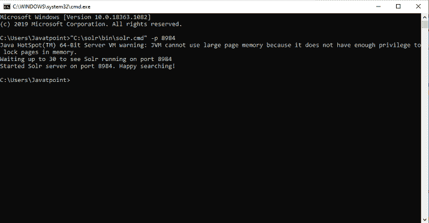
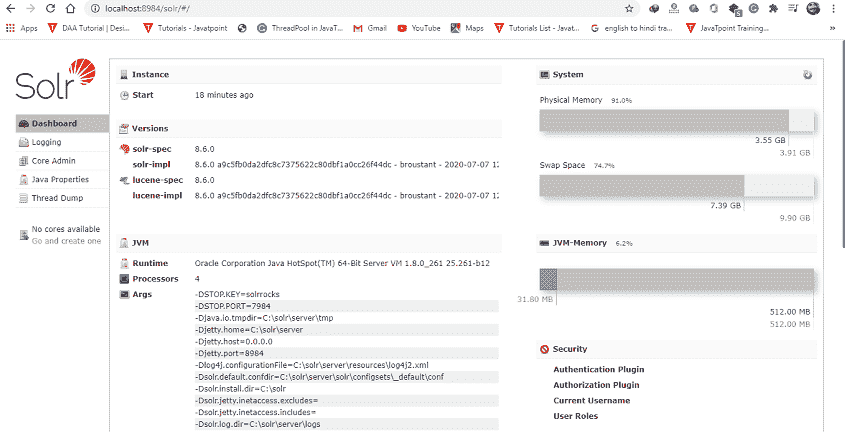
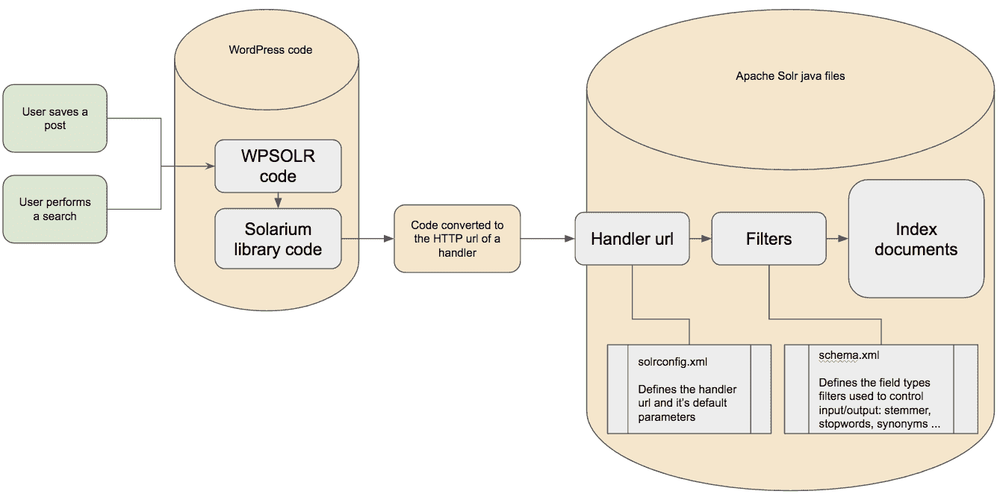

# ApacheSolr的基本命令

> 原文：<https://www.javatpoint.com/basic-commands-of-apache-solr>

完成 Solr 安装后，打开文件资源管理器，转到 Solr 主目录中的/bin 文件夹，并使用以下命令启动 Solr。

```

[Hadoop@localhost ~]$ cd   
[Hadoop@localhost ~]$ cd Solr/ 
[Hadoop@localhost Solr]$ cd bin/ 
[Hadoop@localhost bin]$ ./Solr start

```

上面的命令在后台启动 Solr，Solr 在端口 8983 上进行确认，并显示下面给定的消息。

```

Waiting up to 30 seconds to see Solr running on port 8983 [\]   
Started Solr server on port 8983 (pid = 6035). Happy searching!

```

### 在前台启动 Solr

如果 Solr 开始使用 start 命令，Solr 将在后台启动。但是使用–f 选项，您可以在前台启动 Solr。

```

[Hadoop@localhost bin]$ ./Solr start -f  

5823 INFO  (coreLoadExecutor-6-thread-2) [   ] o.a.s.c.SolrResourceLoader 
Adding 'file:/home/Hadoop/Solr/contrib/extraction/lib/xmlbeans-2.6.0.jar' to 
classloader 
5823 INFO  (coreLoadExecutor-6-thread-2) [   ] o.a.s.c.SolrResourceLoader 
Adding 'file:/home/Hadoop/Solr/dist/Solr-cell-6.2.0.jar' to classloader 
5823 INFO  (coreLoadExecutor-6-thread-2) [   ] o.a.s.c.SolrResourceLoader 
Adding 'file:/home/Hadoop/Solr/contrib/clustering/lib/carrot2-guava-18.0.jar' 
to classloader 
5823 INFO  (coreLoadExecutor-6-thread-2) [   ] o.a.s.c.SolrResourceLoader 
Adding 'file:/home/Hadoop/Solr/contrib/clustering/lib/attributes-binder1.3.1.jar' 
to classloader 
5823 INFO  (coreLoadExecutor-6-thread-2) [   ] o.a.s.c.SolrResourceLoader 
Adding 'file:/home/Hadoop/Solr/contrib/clustering/lib/simple-xml-2.7.1.jar' 
to classloader 
…………………………………………………………………………………………………………………………………… 
…………………………………………………………………………………………………………………………………… 
12901 INFO  (coreLoadExecutor-6-thread-1) [   x:Solr_sample] o.a.s.u.UpdateLog 
Took 24.0ms to seed version buckets with highest version 1546058939881226240 12902 
INFO  (coreLoadExecutor-6-thread-1) [   x:Solr_sample] 
o.a.s.c.CoreContainer registering core: Solr_sample 
12904 INFO  (coreLoadExecutor-6-thread-2) [   x:my_core] o.a.s.u.UpdateLog Took 
16.0ms to seed version buckets with highest version 1546058939894857728 
12904 INFO  (coreLoadExecutor-6-thread-2) [   x:my_core] o.a.s.c.CoreContainer 
registering core: my_core

```

### 如果您想在另一个端口启动 solr

使用 start 命令的–p 选项，我们可以在另一个端口启动 Solr，如下面的代码块所示。

```

$ ./Solr.cmd  -p 8984

Waiting up to 30 seconds to see Solr running on port 8984
Started Solr server on port 8984\. Happy searching!

```



### 停止ApacheSolr的命令

使用 stop 命令，我们可以停止使用 Solr

```

 $ ./Solr stop

```

上述命令停止 Solr，显示以下消息。

```

Sending the stop command to Solr running on port 8984 ... waiting 5 seconds to 
allow Jetty process 6035 to stop gracefully.

```

### 重启Apache Solr 的命令

我们可以使用 Solr 的重启命令，让 Solr 停止 5 秒，然后重新启动。我们可以使用以下命令重新启动 Solr:

```

./Solr restart

```

重启 Solr 时，它将显示以下消息

```

Sending the stop command to Solr running on port 8984 ... waiting 5 seconds to 
allow Jetty process 6671 to stop gracefully. 
Waiting for 30 seconds to see Solr running on port 8984   
Started Solr server on port 8984\. Happy searching!

```

### ApacheSolr帮助命令

solr 中的 help 命令可用于检查 Apache Solr 提示符及其相关选项的使用情况。

```

[Hadoop@localhost bin]$ .\bin\Solr -help 

Usage: Solr COMMAND OPTIONS
where COMMAND is one of start, stop, restart, status, health check, 
create, create_core, create_collection, delete, version, zk  
Standalone server example (start Solr running in the background on port 8984):  
   ./Solr start -p 8984  
SolrCloud example (start Solr running in SolrCloud mode using localhost:2181 
to connect to Zookeeper, with 1g max heap size and remote Java debug options enabled):  
   ./Solr start -c -m 1g -z localhost:2181 -a "-Xdebug -
   Xrunjdwp:transport = dt_socket,server = y,suspend = n,address = 1044"  
Pass -help after any COMMAND to see command-specific usage information,   
such as: ./Solr start -help or ./Solr stop -help

```

### ApacheSolr状态命令

Solr 中的状态命令可用于搜索操作，并在我们的电脑上找到正在运行的 Solr 实例。它会通知您一个 Solr 实例，比如它的版本、内存使用等。

要检查 Solr 实例的状态，您必须使用下面给出的状态命令:

```

[Hadoop@localhost bin]$ ./Solr status

```

执行上述命令后，它显示 Solr 的状态如下:

```

Found 1 Solr nodes:   

Solr process 6906 running on port 8984 {
   "Solr_home":"/home/Solr/server/Solr",   
   "version":"6.2.0 764d0f19151dbff6f5fcd9fc4b2682cf934590c5 - 
   mike - 2020-08-20 06:15:50",   
   "startTime":"2020-09-20T06:00:02.877Z",   
   "uptime":"0 days, 0 hours, 10 minutes, 19 seconds",   
   "memory":"15.6 MB of 400.7 MB"
}

```

### Solr 管理员

当我们运行 Apache Solr 时，我们将被重定向到 Solr 网络界面的主页，网址如下。

```

Localhost:8984/Solr/

```

以下是 Solr 管理面板的图像:



### Solr的模式文件

关于字段类型和字段的所有细节都存储在 Apache Solr 中。文件名和文件位置可能会有所不同，这取决于我们最初如何配置 Solr 或后来如何修改它。



***托管模式*** 是 Solr 默认使用的模式文件，支持在运行时借助模式应用编程接口或使用无模式功能对模式进行更改。要么我们显式地配置托管模式特性以使用替代文件名，要么我们选择仍然由 Solr 自动更新的文件内容。

***schema.xml*** 是一个传统命名的模式文件，可以由古典索引文档库的用户手动编辑。

当我们使用 SolrCloud 时，我们可能在本地主机的文件系统上找不到任何具有这些名称的文件。我们只能借助模式应用编程接口或使用 Solr 管理用户界面的云屏幕来查看模式。

无论我们在安装中使用什么文件名，文件的结构都是一样的。但是，我们与文件交互的方式将会改变。如果我们使用的是托管模式，那么我们应该只使用模式应用编程接口与文件进行交互，而不能进行手动编辑。如果我们不使用托管模式，我们只能对文件进行手动编辑，模式应用编程接口不支持任何修改。

* * *