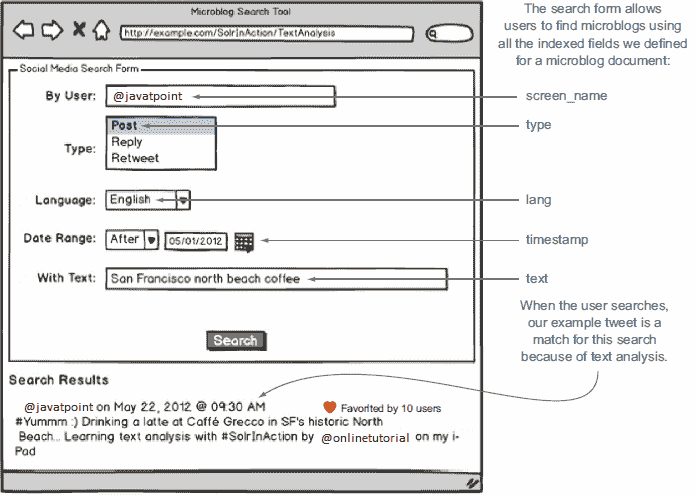

# Apache索尔文本分析

> 原文：<https://www.javatpoint.com/apache-solr-text-analysis>

Apache Solr 文本分析可用于消除术语之间的表面差异，以解决更复杂的问题，从而提供良好的用户体验，如特定语言的解析、词条化和词性标注。我们将在后面更详细地讨论所有这些术语。 [Apache Solr](https://www.javatpoint.com/apache-solr) 有一个广泛的框架来执行基本的文本分析，例如-移除被称为停止词的常见单词并执行额外的复杂分析。说起来，索勒的文本分析框架如此强大和灵活，对新用户来说似乎过于复杂和令人生畏。我们可以说，Solr 让复杂的文本分析变得如此容易，但这样做，会让简单的任务变得有些难以管理。这就是为什么 Solr 在其示例“schema.xml”中内置了这么多预配置的字段类型，以确保新用户在开箱即用地使用 Solr 时有一个很好的地方开始文本分析。学习完本教程后，您将能够处理这个健壮的结构来分析我们将面临的大部分内容。

我们演示了文本分析的方法，并为我们的文件构建了分析解决方案。为此，我们将解决一个复杂的文本分析问题，以获得成功所需的策略和机制。具体来说，我们将使用 Solr 理解给定的文本分析基本元素:

*   Solr 的基本文本分析元素，包括分析器、标记器和标记过滤器链。
*   用于在索引、查询处理和在 schema.xml 中定义自定义字段类型的过程中分析文本。
*   标准文本分析技术，如降级、删除终止词、词干、同义词扩展和删除重音。

具体来说，我们将看到如何分析来自 Twitter 等网站的微博内容。推文提出了独特的挑战，需要我们努力思考有多少用户会使用我们的搜索结果。具体来说，我们将了解如何:

*   根据保留#标签和@提及，将重复的字符折叠到最多两个
*   使用自定义令牌过滤器来解析缩短的位式网址

### 分析微博文本

让我们继续我们在这个页面上介绍的示例微博搜索应用。在这里，我们将设计并实现从推特、脸书等不同社交媒体网站搜索微博的解决方案。因为本教程的基本重点是文本分析，所以让我们仔细看看示例微博文档中的文本字段。



**下面是我们要分析的文字:**

```

#Yummm :) Drinking a latte at Caffé Grecco in SF's historic North Beach... Learning text analysis with #SolrInAction by @onlinetutorial on my iPad

```

正如我们在介绍中所讨论的，文本分析的一个主要目标是允许您的用户使用自然语言进行搜索，而不用担心他们的搜索词的所有可能形式。在上图中，用户通过文本字段搜索旧金山北滩咖啡，考虑到北滩所有伟大的咖啡馆，这是一个自然的查询；也许我们的用户是想通过搜索社交媒体内容，在北海滩找到一个喝咖啡的好地方。

我们声明，即使在我们的示例推文中没有出现北海滩、旧金山和咖啡的精确文本匹配，我们的示例推文也应该是该查询的强匹配。是的，北海滩在我们的文件中，但是在搜索中大小写很重要，除非您采取特定的措施使您的搜索索引不区分大小写。我们断言，由于用户搜索查询中使用的术语和表中所示文档中的术语之间的关系，我们的示例文档应该与该查询非常匹配。

| 用户搜索文本 | 文档中的文本 |
| 旧金山 | 旧金山 |
| 北海滩 | 北海滩 |
| 咖啡 | 牛奶，咖啡 |

### 基本文本分析

正如我们之前了解到的，schema.xml 中的<types>部分定义了文档中所有可能字段的<fieldtype>元素，其中每个<fieldtype>定义了被分析用于查询和索引的字段的格式和工作方式。示例模式提供了适用于 Solr 大量搜索应用程序的字段类型的广泛列表。如果任何预定义的 Solr 字段类型不能满足我们的需求，我们可以在 Solr 插件框架的帮助下构建自己的字段类型。</fieldtype></fieldtype></types>

假设包含的所有字段都像时间戳和语言代码一样组织数据。在这种情况下，我们可能不需要使用 Solr，因为关系数据库在搜索和索引结构化数据方面是系统的。对非结构化文本的操作是 Solr 真正展示其能力的地方。因此，示例 Solr 模式预先定义了一些用于分析文本的强大字段类型。它为 text_general(一种更简单的字段类型)提供了 XML 定义，作为分析我们的推文文本的起点。本教程中的示例依赖于 Solr 示例附带的 schema.xml 的一些小的定制。我们建议将 Solr 示例附带的 schema.xml 文件替换为$ SOLR _ IN _ ACTION/example-docs/ch6/schema . XML 中的自定义版本。具体来说，您需要通过执行以下操作来覆盖$ SOLR _ INSTALL/example/Solr/collection 1/conf/schema . XML:

```

cp $SOLR_IN_ACTION/example-docs/ch6/schema.xml
➥ $SOLR_INSTALL/example/solr/collection1/conf/

```

此外，您需要将 wdfftypes.txt 文件复制到 conf 目录:

```

cp $SOLR_IN_ACTION/example-docs/ch6/wdfftypes.txt
➥ $SOLR_INSTALL/example/solr/collection1/conf/

```

最后，为了从头开始(因为我们已经在前面的章节中索引了一些测试文档)，您应该删除数据目录中的所有内容，以一个空的搜索索引开始:

```

rm -rf $SOLR_INSTALL/example/solr/collection1/data/*

```

复制自定义 schema.xml 和 wdfftypes.txt 后，您需要从 Solr 管理控制台的 core 管理页面重新加载 collection1 core，或者重新启动 Solr。

### 分析者

在<fieldtype>元素中，您应该至少定义一个<analyzer>，它将决定如何分析文本。在实践中通常定义两个独立的<analyzer>元素:一个用于分析文本，另一个用于索引，用户在执行搜索操作时将输入这两个元素。“text_general”字段将此方法用于此操作。</analyzer></analyzer></fieldtype>

想一想，为什么我们可能会使用不同的分析器进行索引和查询。如果您经常有额外的分析来处理超出文档索引所需的查询，这将会很有帮助。例如:如果同义词通常是在查询文本分析过程中添加的，以避免仅仅扩大索引的大小，从而更容易控制同义词。

然而，我们可以定义两个不同的分析器。应用于查询词的分析必须与索引期间文本的分析方式兼容。考虑到分析器在索引时配置的术语太小的情况，它不会降低查询术语。搜索北海滩的 Solr 用户不会找到我们的示例推文，因为索引包含“北”和“海滩”的小字母形式

### Tokenizer

在 Solr 中，每个<analyzer>将文本分析过程分为两个阶段:</analyzer>

*   标记化(解析)
*   令牌过滤

还有第三个阶段，允许在标记化的同时进行预处理，您可以在其中应用字符过滤器。在标记化阶段，文本将通过解析被分割成一个标记流。最基本的标记器是 WhitespaceTokenizer，它只能用于在空白上拆分文本。另一个是 StandardTokenizer，它执行智能解析以在空白、标点符号上拆分术语，并正确处理 URL、首字母缩写和电子邮件地址。我们需要为标记器指定工厂的 Java 实现类来定义标记器。要使用通用标准标记器，您需要指定标准标记器工厂

在 Solr 中，我们可以指定工厂类，而不是底层的 Tokenizer 类(实现)，因为许多 Tokenizer 不提供默认的无参数构造函数。如果我们使用工厂方法，Solr 为我们提供了一种标准的方法来定义 XML 中的任何标记器。所有工厂类都知道如何翻译 [XML](https://www.javatpoint.com/xml-tutorial) 配置属性，以创建特定标记器实现类的实例。所有这些都产生一个令牌流，可以由零个或多个过滤器处理来转换令牌。

* * *