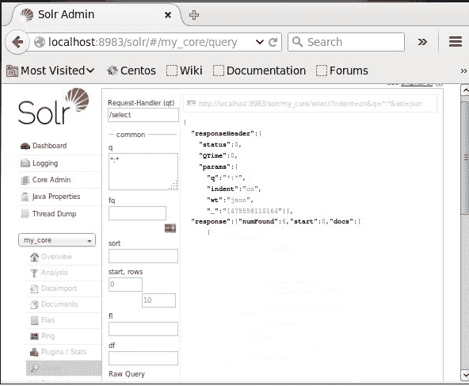

# 阿帕奇 Solr -添加文档

> 原文：<https://www.javatpoint.com/apache-solr-adding-document>

在 Apache Solr Core 中，我们看到了将数据添加到 Solr 中的方法，该方法的文件格式为 [JSON](https://www.javatpoint.com/json-tutorial) 和. CSV，本页将说明如何使用 [XML](https://www.javatpoint.com/xml-tutorial) 文件格式将数据添加到 [Apache Solr](https://www.javatpoint.com/apache-solr) 索引中。

### 样本文件

让我们使用 XML 文件格式将以下数据添加到 Solr 索引中。

| 学生证 | 西方人名的第一个字 | 电话 | 城市 |
| **001** | 奥利维亚 | +148022337 | 加利福尼亚 |
| **002** | 女子名 | +148022338 | 夏威夷 |
| **003** | 索菲娅 | +148022339 | 佛罗里达州 |
| **004** | 埃米莉 | +148022330 | 得克萨斯州 |
| **005** | 弹竖琴者 | +148022336 | 堪萨斯州 |
| **006** | 斯卡利特 | +148022335 | 肯塔基 |

### 使用 XML 添加文档

为了将上述数据添加到 Solr 索引中，我们应该准备一个 XML 文档，如下所示。将以下文档保存在名为 sample.xml 的文件中。

```

<add> 
   <doc> 
      <field name = "id">001</field> 
      <field name = "first name">Olivia</field> 
            <field name = "phone">+148022337</field> 
      <field name = "city">California</field> 
   </doc>  
   <doc> 
      <field name = "id">002</field> 
      <field name = "first name">Emma</field> 
      <field name = "phone">+148022338</field> 
      <field name = "city">Hawai</field> 
   </doc>  
   <doc> 
      <field name = "id">003</field> 
      <field name = "first name">Sophia</field> 
            <field name = "phone">+148022339</field> 
      <field name = "city">Florida</field> 
   </doc>  
   <doc> 
      <field name = "id">004</field> 
      <field name = "first name">Emily</field> 
      <field name = "phone">+148022330</field> 
      <field name = "city">Texas</field> 
   </doc>  
   <doc> 
      <field name = "id">005</field> 
      <field name = "first name">Harper</field> 
      <field name = "phone">+148022336</field> 
      <field name = "city">Kansas</field> 
   </doc> 
   <doc> 
      <field name = "id">006</field> 
      <field name = "first name">Scarlett</field> 
      <field name = "phone">+148022335</field> 
      <field name = "city">Kentucky</field> 
   </doc> 
</add>

```

正如我们所看到的，为向索引文件添加数据而创建的 XML 文件包含给定的三个重要标签，分别命名为:<add>文本</add>、<doc>文本</doc>和< field >文本< /field >。

*   **<添加> -** 添加标签是添加要索引的文档的根标签。它获取一个或多个将被添加到索引中的文档。
*   **< doc > -** 我们添加的数据应该包装在这里< doc >文本< /doc >标签下。给定的文档包含字段形式的数据。
*   **<字段> -** 这个标签保存我们添加的数据的字段的名称和值。

创建文档后，我们可以使用索引中讨论的方法将创建的文档添加到索引中。

假设 XML 文件存在于 Solr 的 bin 目录中，并且它将在 my_core 文件中被索引，那么我们可以使用 post 工具将它添加到 Solr 的索引中，如下所示-

```

[Hadoop@localhost bin]$ ./post -c my_core sample.xml

```

当我们运行上面给出的命令时，我们将得到下面的结果。

```
/home/Hadoop/java/bin/java -classpath /home/Hadoop/Solr/dist/Solr-
Core8.2.0.jar -Dauto = yes -Dc = my_core -Ddata = files 
org.apache.Solr.util.SimplePostTool sample.xml 
SimplePostTool version 5.0.0 
Posting files to [base] url http://localhost:8983/Solr/my_core/update... 
Entering auto mode. File endings considered are xml,json,jsonl,csv,pdf,doc,docx,ppt,pptx,
xls,xlsx,odt,odp,ods,ott,otp,ots,rtf,htm,html,txt,log 
POSTing file sample.xml (application/xml) to [base] 
1 files indexed. 
COMMITting Solr index changes to http://localhost:8983/Solr/my_core/update... 
Time spent: 0:00:00.201

```

### 确认

转到 Apache Solr 网络用户界面的主页，选择 my_core 文件。尝试绕过查询“:”获取文本区域 q 内的所有文档并运行查询。执行后，我们可以观察到所需的数据被添加到 Solr 索引中。



* * *