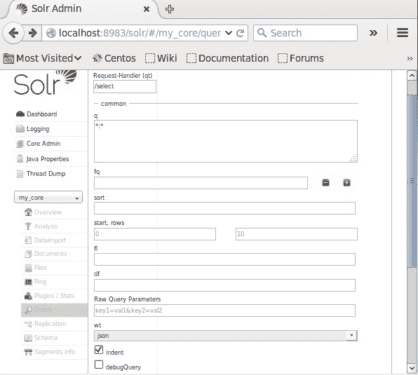
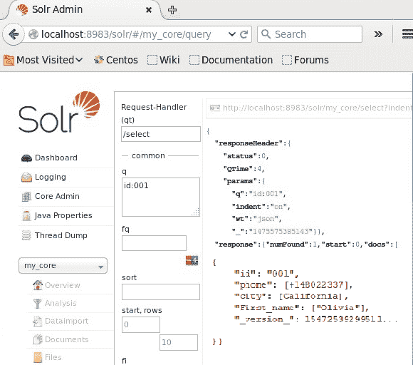
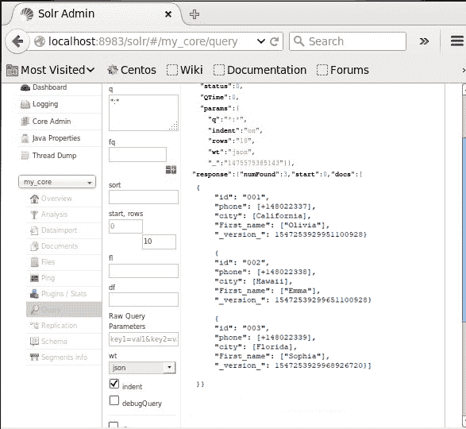
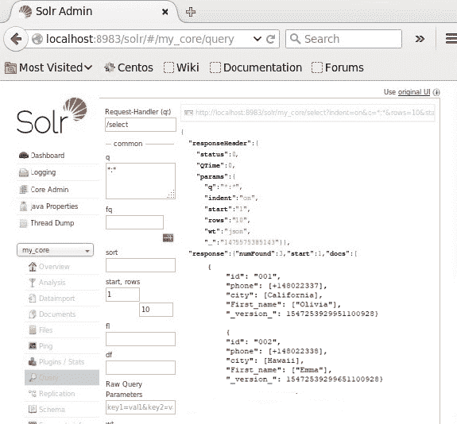
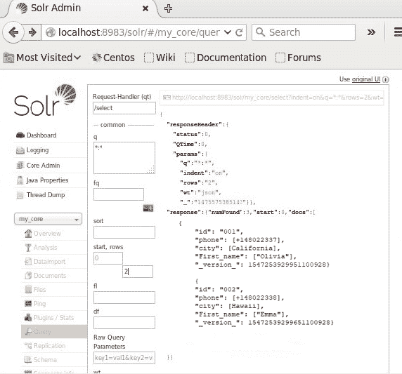
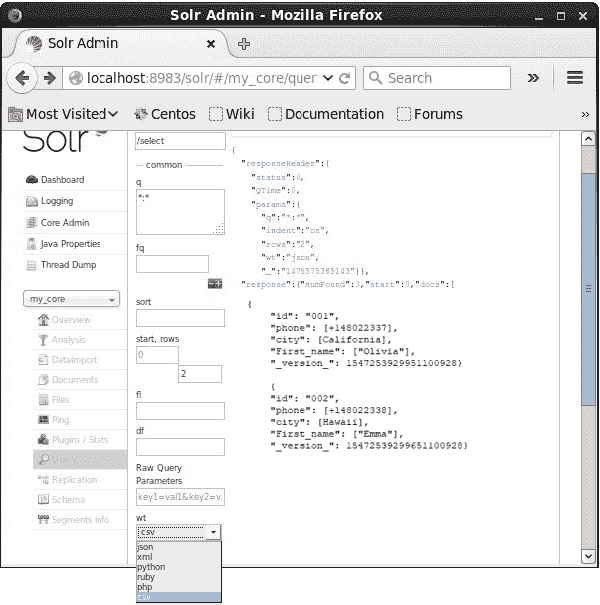
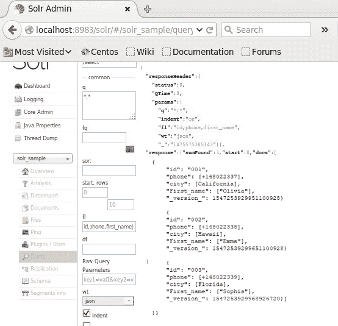

# 在 Apache Solr 中查询数据

> 原文：<https://www.javatpoint.com/querying-data-in-apache-solr>

除了存储数据之外，Apache Solr 还提供了查询数据的功能。Solr 给出了一个特定的参数，用户可以使用它来查询存储在其中的数据。

在下面给出的表格中，我们列出了 [Apache Solr](https://www.javatpoint.com/apache-solr) 中可用的各种查询参数。

| 参数 | 描述 |
| **q** | 它是 Apache Solr 的主要查询参数。它们的相似性根据该参数中的术语对文档进行评分。 |
| **fq** 的缩写形式 | 它表示 Solr 的过滤器查询，该查询将结果集限制为与该过滤器匹配的文档。 |
| **启动** | 它表示页面结果的初始偏移量，默认值为 0。 |
| **行** | rows 参数表示每页需要检索的文件数。默认情况下，此参数的值为 10。 |
| **排序** | 它指定以逗号分隔的字段列表，查询结果将基于该列表进行排序。 |
| **fl** | 它为结果集中的所有文档指定要返回的字段列表。 |
| **重量** | 此参数表示我们想要查看结果的响应编写器的类型。 |

我们可以将上述所有参数视为查询 Solr 文档的选项。进入 Apache Solr 首页，在页面左侧点击 ***【查询】*** 。我们将被重定向到查询参数的字段。



### 检索记录

假设核心中有三条不同的记录，分别命名为***【my _ core】***。为了从选定的核心获取详细的数据，我们必须传递 soecified 文档的字段的名称-值对。例如，如果我们想要获得具有字段 id 值的记录，我们必须将字段 as - Id:001 的名称和值对作为值传递给 ***q*** 参数并运行查询命令。



同样，我们可以通过将*:*作为值传递给 q，从索引中获取所有记录，如下图所示。



我们可以通过将 ***两个*** 作为值传递给 ***开始*** 参数，从二级记录中获取记录，如下图所示。



### 限制记录数量

我们可以通过在参数 ***行*** 中定义一个值来限制记录的数量。例如，我们可以将查询中的记录总数限制为 2，绕过参数行中的值 2，如下图所示。



### 响应编写器类型

我们可以从 ***wt*** 参数提供的数据中选择一个来获取所需的文档类型响应。



我们选择了。csv 格式，以获取上图中来自 Apache Solr 的响应。

### 字段列表

如果我们想要输出文档中的特定字段，我们需要将由逗号分隔的必需字段列表作为一个值传递给属性 fl。

在下面的例子中，我们检索字段- id、电话和名字。



### 拼写检查

我们将使用 Solr 的拼写检查搜索组件。自动拼写检查是一个核心搜索功能，大多数用户都希望不用思考就能工作。说到拼写检查，您需要考虑四种一般情况:

*   显示的查询包含一个或多个拼写错误的术语，导致没有相关的点击。如果有建议，我们的搜索客户端应该自动执行建议的术语，并向用户显示一条信息消息。例如，我们搜索了 ***大气*** 而不是 ***大气*** 。
*   它包含一个罕见的术语，导致一些点击；建议是可用的并且有更多的点击，所以你可能想要提示用户你的意思是…？
*   它包含拼写正确的术语，但它们的数据少于或与查询术语中提供的数据大致相同。我们的搜索解决方案不应该提示用户另做决定。
*   查询包含索引中不存在的术语；建议不可用。

从上面给出的场景中，我们可以得到拼写检查解决方案的两个关键要求:

*   我们需要为我们的查询中的每个术语识别建议的术语，即一些字典来查找与用户输入的术语相似的术语。
*   其次，我们需要知道有多少文档与所有建议的术语相匹配。

### 拼写检查示例

我们可以使用运行代码清单的 http 命令行实用程序来查询拼写错误的术语大气的 Apache Solr，如清单所示。

使用拼写错误的查询术语“atmosphear”查询 Solr。

***查询***

```

http://localhost:8983/solr/solrpedia/select?q=atmosphear

```

***回应***

```

<response>
<lst name="responseHeader">...</lst>
<result name="response" numFound="0" start="0"></result>
<lst name="spellcheck">
<lst name="suggestions">
<lst name="atmosphear">
<int name="numFound">1</int>
...
<arr name="suggestion">
<str>atmosphere</str>
</arr>
</lst>
<lst name="collation">
<str name="collationQuery">atmosphere</str>
<int name="hits">86</int>
<lst name="misspellingsAndCorrections">
<str name="atmosphear">atmosphere</str>
</lst>
</lst>
</lst>
</lst>
</response>

```

* * *