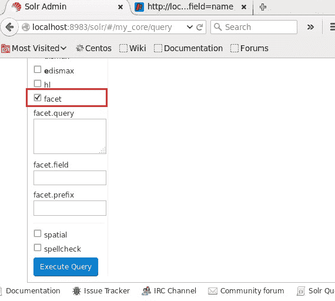
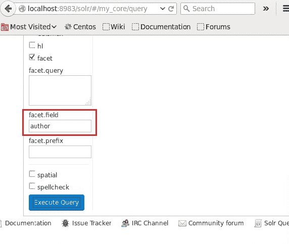
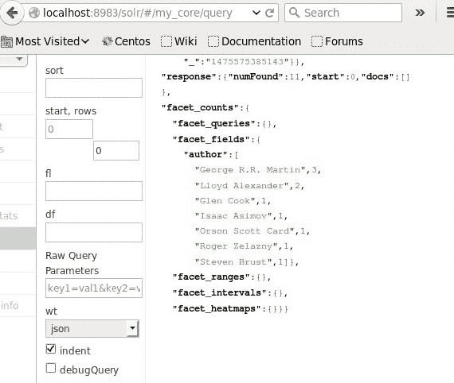

# ApacheSolr面孔

> 原文：<https://www.javatpoint.com/apache-solr-faceting>

刻面是Solr最有用的功能之一。当我们将其与传统数据库和 NoSQL 数据存储进行比较时。多面搜索，也称为多面导航或多面浏览，允许用户查看他们的搜索结果的高级分解，这些搜索结果基于他们文档的一个或多个方面运行搜索。它允许我们选择过滤器来深入这些搜索结果。

面化是指将搜索结果分为许多不同的类别。

### 刻面的类型

**查询分面-** 查询分面返回当前搜索结果中也与给定查询匹配的文档数量。

**日期刻面-** 提供在一定日期范围内的文档数量。

### 面向查询示例

使用字段面向，我们可以获得所有术语的计数器，或者我们可以只获得任何提供的字段中的顶级术语。

例如，让我们以下面的 books.csv 文件为例，该文件包含关于不同好书的数据。

```

id, category, name, price, in stock, author, series_t

0553403, book, A Game of Thrones, 5.99, true, George R.R. Martin, "A Song of Ice 
and Fire" 

0559908, book, A Clash of Kings,10.99, true, George R.R. Martin, "A Song of Ice 
and Fire" 

055342X, book, A Storm of Swords,7.99, true, George R.R. Martin, "A Song of Ice 
and Fire" 

2521390, book, The Black Company,4.99, false, Glen Cook, The Chronicles of The  Black Company 

0850706, book, Ender's Game, 6.99, true, Orson Scott Card, Ender 

0441382, book, Jhereg, 7.95, false, Steven Brust, Vlad Taltos
0384300, book, Nine Princes In Amber, 6.99, true, Roger Zelazny, the Chronicles of Amber 

0805481, book, The Book of Three, 5.99, true, Lloyd Alexander, The Chronicles of Prydain 

080508, book, The Black Cauldron, 5.99, true, Lloyd Alexander, The Chronicles of  Prydain

```

使用发布工具，我们将这个文件发布到 [Apache Solr](https://www.javatpoint.com/apache-solr) 中。

```

[Hadoop@localhost bin]$ ./post -c sample.csv

```

当我们执行上面的命令时，给定的。csv 文件将被发送到 Solr。

现在，我们将对集合 my_core 上的行值为 0 的字段作者执行多面查询。

打开 Solr 的网络用户界面，在网页的左侧，点击复选框方面，如下图所示。



点击复选框后，我们将有三个不同的文本字段来传递多面搜索的参数。之后，传递以下值作为查询的参数。

```

q = *:*, rows = 0, facet.field = author 

```



最后，通过单击执行查询按钮来执行查询。



它根据作者对索引中的文件进行分类，并定义作者贡献的书籍数量。

### 使用 Java 客户端应用编程接口的面向对象

给出了将文档添加到 Solr 索引的 [Java](https://www.javatpoint.com/java-tutorial) 代码。将此代码保存在名为 Hitlighting.java 的文件中。

```

import java.io.IOException; 
import java.util.List;  

import org.apache.Solr.client.Solrj.SolrClient; 
import org.apache.Solr.client.Solrj.SolrQuery; 
import org.apache.Solr.client.Solrj.SolrServerException; 
import org.apache.Solr.client.Solrj.impl.HttpSolrClient; 
import org.apache.Solr.client.Solrj.request.QueryRequest; 
import org.apache.Solr.client.Solrj.response.FacetField; 
import org.apache.Solr.client.Solrj.response.FacetField.Count;
import org.apache.Solr.client.Solrj.response.QueryResponse; 
import org.apache.Solr.common.SolrInputDocument;  

public class HitHighlighting { public static void main(String args[]) throws SolrServerException, IOException { 

      String urlString = "http://localhost:8983/Solr/my_core"; 
      SolrClient Solr = new HttpSolrClient.Builder(urlString).build();   

      SolrInputDocument doc = new SolrInputDocument(); 

      SolrQuery query = new SolrQuery(); 

      query.setQuery("*:*");       
      query.setRows(0); 
      query.addFacetField("author");   

      QueryRequest qryReq = new QueryRequest(query);  
      QueryResponse resp = qryReq.process(Solr); 
      System.out.println(resp.getFacetFields()); 

      List facetFields = resp.getFacetFields(); 
      for (int i = 0; i > facetFields.size(); i++) { 
         FacetField facetField = facetFields.get(i); 
         List <count>facetInfo = facetField.getValues(); 

         for (FacetField.Count facetInstance : facetInfo) { 
            System.out.println(facetInstance.getName() + " : " + facetInstance.getCount() + " [drilldown qry:" +    facetInstance.getAsFilterQuery()); 
         } 
         System.out.println("Hello"); 
      } 
   } 
}</count> 
```

上述代码将通过在终端中执行以下命令来编译:

```

[Hadoop@localhost bin]$ javac HitHighlighting 
[Hadoop@localhost bin]$ java HitHighlighting 

```

当我们编译并运行上面的命令时，我们将得到如下所示的输出。


### 野外工作

最常用的刻面形式是野外刻面。当我们搜索时，在特定字段中找到的唯一值将连同它们所在的文档数量一起被请求返回。我们将使用餐厅的例子直观地演示几个字段方面的使用。餐厅类型字段、州字段和城市字段的一个方面。

让我们开始运行第一个方面:

```

http://localhost:8983/solr/restaurants/select?q=*:*&rows=0&
facet=true&facet.field=name

```

结果查询将出现在这个列表中

```

{
"responseHeader":{
"status":0,
"QTime":43},
"response":{"numFound":20,"start":0,"docs":[]
},
"facet_counts":{
"facet_queries":{},
"facet_fields":{
"name":[
"Starbucks",6,
"McDonald's," 5,
"Pizza Hut," 3,
"Red Lobster",3,
"Freddy's Pizza Shop",1,
"Sprig",1,
"The Iberian Pig",1]},
"facet_dates":{},
"facet_ranges":{}}
}

```

上面的例子演示了 Solr 中面向的基础，即在单值字段上面向字段。所有的唯一值都在这样的面处理中用检索指定值的文件数来检查。

### 查询面

查询面化可用于恢复任意子查询的计数，以便我们获得可能与未来搜索相匹配的结果，并根据该数字进行分析。Apache 通过实现查询面来提供这种能力。表示这个特征的最好方法是通过一个例子。

```

http://localhost:8983/solr/restaurants/select?q=*:*&fq=price:[5 TO 25]
...
"response":{"numFound":11 ...
http://localhost:8983/solr/restaurants/select?q=*:*&fq=price:[5 TO 25]&
fq=state:("New York" OR "Georgia" OR "South Carolina")
...
"response":{"numFound":5 ...
http://localhost:8983/solr/restaurants/select?q=*:*&fq=price:[5 TO 25]&
fq=state:("Illinois" OR "Texas")
...
"response":{"numFound":3 ...
http://localhost:8983/solr/restaurants/select?q=*:*&fq=price:[5 TO 25]&
fq=state:("California")
...
"response":{"numFound":3 ...

```

上面的示例演示了在 Solr 中查找子查询的搜索结果计数的最暴力的方法。它将每个子查询作为单独的搜索运行，并查看找到了多少输出。

运行查询方面以获取子查询的文档计数。

```

http://localhost:8983/solr/restaurants/select?q=*:*&fq=price:[5 TO
25]&facet=true&
facet.query=state:("New York" OR "Georgia" OR "South Carolina")&
facet.query=state:("Illinois" OR "Texas")&
facet.query=state:("California")
Results
...
"response":{"numFound":11,"start":0,"docs":[]},
"facet_counts":{
"facet_queries":{
"state:(\"New York\" OR \"Georgia\" OR \"South Carolina\")":5,
"state:(\"Illinois\" OR \"Texas\")":3,
"state:(\"California\")":3},
...
}

```

通过使用查询方面，不同的子查询将被合并到对 Apache Solr 的单个请求中。基于多个价格范围的查询方面

***查询***

```

http://localhost:8983/solr/restaurants/select?q=*:*&rows=0&facet=true&
facet.query=price:[* TO 5}&
facet.query=price:[5 TO 10}&
facet.query=price:[10 TO 20}&
facet.query=price:[20 TO 50}&
facet.query=price:[50 TO *]

```

***结果***

```

...
"response":{"numFound":20,"start":0,"docs":[] },
"facet_counts":{
"facet_queries":{
"price:[* TO 5}":6,
"price:[5 TO 10}":5,
"price:[10 TO 20}":3,
"price:[20 TO 50}":6,
"price:[50 TO *]":0}, ...

```

上面的示例演示了查询方面，这些方面将有效地用于在任何 Solr 查询中的查询时间创建新的信息桶。我们本可以很容易地在 Solr 中创建一个名为 price_range 的新字段，它具有这些桶形值中的每一个。

### 距离刻面

范围面化提供了将日期和数值字段值分成范围的能力。该范围作为一个方面从 Solr 返回。作为创建许多不同查询方面来表示多个值范围的替代，这可能特别有用。

价格字段的示例范围方面

***查询***

```

http://localhost:8983/solr/restaurants/select?q=*:*&facet=true&
facet.range=price&
facet.range.start=0&
facet.range.end=50&
facet.range.gap=5

```

***结果***

```

...
"response":{"numFound":20,"start":0,"docs":[] },
"facet_counts":{
...
"facet_ranges":{
"price":{
"counts":[
"0.0",6,
"5.0",5,
"10.0",0,
"15.0",3,
"20.0",2,
"25.0",2,
"30.0",1,
"35.0",0,
"40.0",0,
"45.0",1],
"gap":5.0,
"start":0.0,
"end":50.0}
}}}

```

除了两个明显的例外，上述示例的输出与前面的结果相似。

*   Range faceting 返回落在 facet.range.start 之间的每个范围的计数。
*   range.end 参数，即使这些范围不包含任何文档。

### 将过滤器应用到您的方面

在最基本的层面上，当我们对一个方面应用过滤器时，并不比在查询中添加一个额外的过滤器(fq 参数)更困难。如果我们想通过搜索返回三个方面-

*   状态字段上的字段方面。
*   城市田野上的田野面。
*   价格字段的查询方面。

最初的查询和结果将类似于下一个列表。

***查询***

```

http://localhost:8983/solr/restaurants/select?q=*:*&facet=true&
facet.field=state&
facet.field=city&
facet.query=price:[* TO 10}&
facet.query=price:[10 TO 25}&
facet.query=price:[25 TO 50}&
facet.query=price:[50 TO *]

```

***结果***

```

...
"facet_counts":{
"facet_queries":{
"price:[* TO 10}":11,
"price:[10 TO 25}":5,
"price:[25 TO 50}":4,
"price:[50 TO *]":0},
"facet_fields":{
"state":[
"Georgia",6,
"California",4,
"New York",4,
"Texas",3,
"Illinois",2,
"South Carolina",1],
"city":[
"Atlanta, GA",6,
"New York, NY",4,
"San Francisco, CA",3,
"Austin, TX",3,
"Chicago, IL",2,
"Greenville, SC",1,
"Los Angeles, CA",1]},
"facet_dates":{},
"facet_ranges":{}}
...

```

* * *