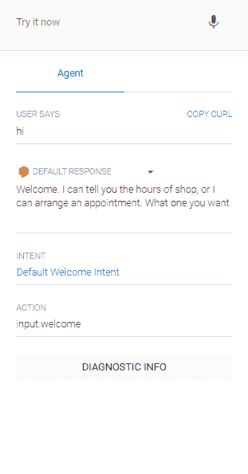
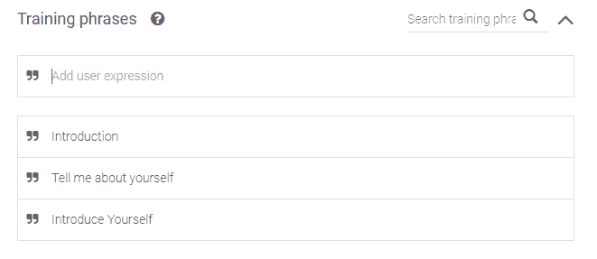
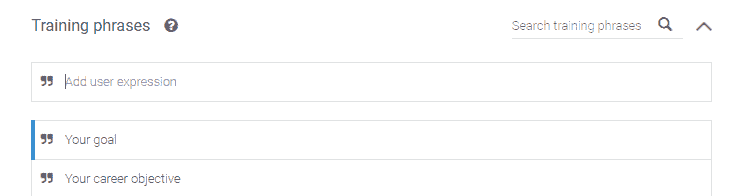
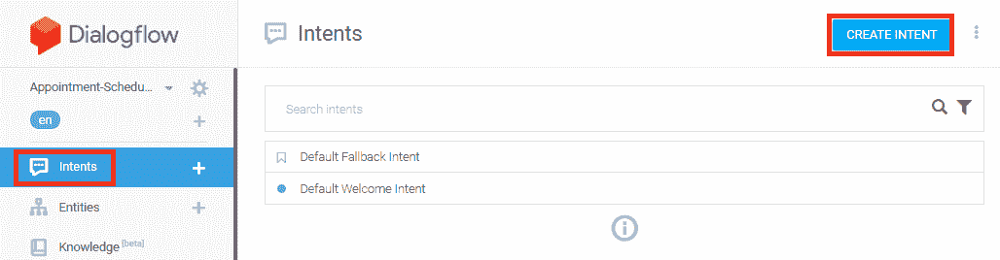
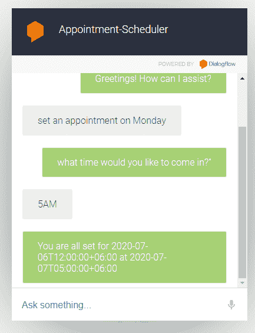
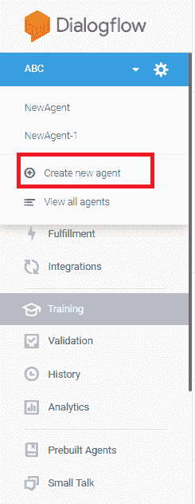
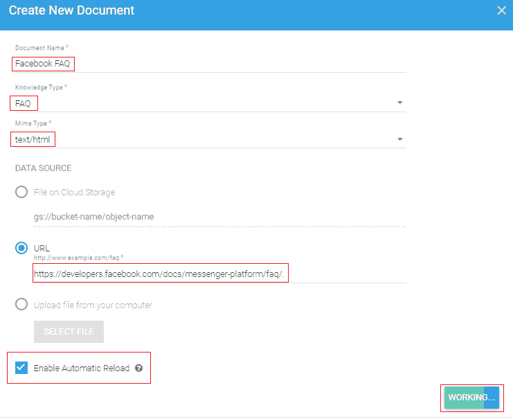

# 静默教程

> 噻:[https://www . javatpoint . com/dialog low](https://www.javatpoint.com/dialogflow)

*   Dialogflow 是一项在谷歌云平台上运行的谷歌服务。
*   Dialogflow 是一个直观且用户友好的工具，包括 ***谷歌的机器学习专长*** 和一些 ***谷歌产品*** 如谷歌云语音转文本。
*   Dialogflow 是一个自然语言处理(NLP)平台，用于在众多平台上为公司客户开发一个与不同语言的对话和体验相关的应用程序。
*   对话流主要用于为大多数谷歌助手设备构建动作。

在我们的对话流教程中，我们将讨论以下主题-

*   [什么是对话流](#Whatis)
*   [对话流的特征](#Features)
*   [对话流的用例](#UseCases)
*   [对话流的优势](#Advantages)
*   [为什么选择对话流？](#WhyChoose)
*   [对话流基础知识](#Basics)
*   [对话流的组成部分](#Components)
*   [如何创建您的第一个对话流代理](#Create-your-first-Dialogflow-Agent)
*   [如何将示例文件导入您的代理](#Import-Example-File)
*   [如何创建新意图](#Create-New-Intent)
*   [如何在对话流中创建参数](#Create-Parameter)
*   [如何创建自己的实体](#Create-Own-Entities)
*   [如何使用你的新实体](#USE-New-Entity)
*   [上下文](#Contexts)
*   [如何自定义默认欢迎意图](#Default-Welcome-Intent)
*   [如何创建自定义意图](#Custom-Intent)
*   [如何自定义回退意图](#Fallback-Intent)
*   [使用参数创建意图](#Intent-with-Parameters)
*   [对话流中的知识库](#Knowledge-Base)
*   [对话流训练](#Training)
*   [与随访意向的意向匹配](#Intent-Matching-with-Follow-up-Intent)
*   [与集成的集成](#Integratio-with-an-Integration)
*   [如何为谷歌助手建立简历聊天机器人](#Build-Resume-Chatbot)
*   [如何用 Dialogflow 建立预约日程安排](#Build-an-Appointment-Scheduler)
*   [如何用对话流为常见问题建立聊天机器人](#Build-a-Chatbot)

* * *

## 什么是对话流

对话流被定义为在谷歌云平台上运行的谷歌服务。Dialogflow 是一个直观且用户友好的工具，包括一些*谷歌产品，如谷歌云语音转文本和 ***谷歌的机器学习专长*** 。它主要用于为大多数谷歌助手设备构建动作。*

 *换句话说，Dialogflow 被定义为一个 [NLP(自然语言处理)](https://www.javatpoint.com/nlp)平台，用于在众多平台上为公司客户开发与不同语言的对话和体验相关的应用。通过使用谷歌提供的功能，产品开发人员可以设计基于文本和语音对话的界面，以便用各种语言回答客户的查询。 ***例如-*** 各家公司利用 Dialogflow 制作回复不同平台客户查询的消息机器人，如 ***谷歌助手、Slack、Facebook Messenger、Alexa 语音搜索(AVS)等。***

* * *

## 对话流的特征

对话流有多种特征:

1.  轻松开发无服务器应用
2.  提供自动化电话服务
3.  专为声音至上的世界而设计
4.  关于自动拼写纠正的回复
5.  通过内置分析改善体验
6.  了解用户情绪
7.  跨平台和语言部署
8.  带来您的企业知识
9.  由谷歌机器学习提供动力

**轻松开发无服务器应用**

谷歌对话流提供了一个统一的代码编辑器，通过它，我们可以轻松地开发本地无服务器应用程序，这些应用程序通过 firebase 云功能连接到我们的对话界面。

**提供自动电话服务**

在 Dialogflow 电话网关的帮助下，我们可以在一分钟内轻松地将专用电话号码添加到我们的 Dialogflow 代理中，使用新电话号码呼叫代理的用户将直接联系您的 Dialogflow 代理。电话网关是基于谷歌在语音识别、电话连接、语音合成、自然语言处理等各种事物上投入的成本。

**专为声音至上的世界设计**

通过一个简单的[应用编程接口](https://www.javatpoint.com/api-full-form)请求，我们能够扩展我们的对话界面来识别语音通信并产生语音回复。Dialogflow 支持同步模式和实时流，由谷歌云文本到语音和云文本到语音提供支持。

**自动拼写纠正回复**

在聊天环境中，大多数用户都在匆忙地进行交互，有时可能会出现用户在聊天中不强调准确拼写或语法的情况。因此，在这种情况下，Dialogflow 提供了一个名为自动拼写纠正的功能，它有助于在谷歌搜索技术的帮助下自动纠正拼写错误。

**通过内置分析改善体验**

在对话流中，集成的分析仪表板为您提供了对话式沟通的愿景。因此，您可以定制您的机器人，以更好地理解和回复用户的意图。

**了解用户情绪**

对于每个用户的查询，Dialogflow 进行情感分析，由 ***云自然语言提供动力。*** 情感分析的得分用于将未实现的用户分发给实时代理，或者获得关于哪些尝试导致最高客户感受的良好知识。

**跨平台跨语言部署**

它支持 14 个不同平台的 20 多种语言。

**带上你的企业知识**

借助 Dialogflow 知识连接器，我们可以轻松地将大量数据从企业扩充到包含基于知识的文章和常见问题解答的代理。为了从数据语料库中提取正确答案，对话流的知识连接器使用谷歌助手和谷歌搜索使用的技术。

**由谷歌机器学习提供动力**

对话流工具由谷歌[机器学习](https://www.javatpoint.com/machine-learning)提供动力。在对话流中，对自然语言的理解确定了用户的意图，并有助于提取那些预先构建的实体，如数字、日期和时间。通过提供一个小数据集，我们还可以训练代理轻松识别客户实体类型。

* * *

## 对话流的用例

对话流有多种使用案例:

1.  贸易
2.  企业生产力
3.  物联网设备
4.  客户服务

**1。商业:-** 对话流用于商业。通过使用 Dialogflow，在任何时候，都可以在用户喜欢的任何平台上与用户进行交易。如果您想从您的用户那里购买商品或安排送货，Dialogflow 为那些需要丰富和个性化回复的用户提供了自助服务体验。

**2。企业生产力:-** 我们可以使用对话流来提高企业生产力。通过在工作场所应用程序中使用对话技巧，员工可以方便地访问与业务相关的重要信息并提高生产率，例如:提供具有与本地机会相关的知识的销售。

**3。物联网设备:-** 对话流也用于[物联网](https://www.javatpoint.com/iot-internet-of-things)设备。借助对话界面，我们可以让我们的[物联网设备](https://www.javatpoint.com/iot-devices)更智能。对话流为智能设备增加了一个智能层，使设备能够准确理解和响应用户交互的上下文。

**4。客户服务:-** 在对话流的帮助下，我们可以创建对话界面，该界面能够执行不同的任务，例如安排约会、回复一般查询、跟进以前的订单等。

* * *

## 对话流的优势

对话流有许多优点:

1.  情感分析
2.  用户友好的
3.  融入谷歌功能
4.  快速高效的编码
5.  可以通过自然的对话来表达自己
6.  能处理小对话
7.  由谷歌的机器学习提供动力。

**1。情感分析:-** 对话流可以对用户的查询进行情感分析。

**2。用户友好:-**Dialogflow 是一个用户友好的工具，它是用无服务器应用程序结构和集成的代码编辑器构建的。

**3。融入谷歌功能:-** 对话流包括谷歌的各种功能，如语音到文本和机器学习。

**4。快速高效的编码:-** 通过简化编码过程，Dialogflow 帮助我们节省开发人员的时间。开发人员可以高效地执行与编码相关的所有任务，因为系统包含一个内置的内联代码编辑器。通过使用这种方法，他们的代理可以通过云功能或内部链接到他们的应用程序。

**5。可以通过自然对话来表达自己:-** 借助对话流，我们可以创建一个聊天机器人。聊天机器人可以自然地进行对话。这仅仅意味着，尽管客户对应用程序或计算机说话，通常是寻求帮助或协助，但他们将获得上下文中的回复。当你在聊天机器人中交流时，你不会觉得你在和机器人或机械说话。

**6。在谷歌机器学习的支持下:-** 在对话流中，机器学习技术被使用，它增加了对话流的能力。

* * *

## 为什么选择对话流

选择对话流有多种原因:

1.  多通道轻松集成
2.  价格
3.  自然语言处理

**1。多渠道轻松集成:-**Dialogflow 为您提供各种类型的最受欢迎的消息应用程序的单击集成，如***【Twitter】、Skype、Kik、Viber、Facebook Messenger、Telegram、Slack、Twilio、*** 以及多个语音助手，如 ***微软 Cortana、亚马逊 Alexa*** 和 ***谷歌助手*** 。

**2。价格:-** 如果你只学习如何创建聊天机器人，也可以获得对话流的免费版本。

**3。自然语言处理:-**Dialogflow 使用了 NLP(自然语言处理)的概念，因此 Dialogflow 提供了良好的用户体验。对话流的代理更擅长自然语言处理。

* * *

## 对话流基础

在使用对话流之前，您应该了解关于对话流的各种信息。

### 帮助用户与技术互动

传统的计算机系统需要可预测和结构化的输入来适当地执行功能，有时它会使界面的使用变得困难和不自然。有时可能会出现最终用户无法掌握这种结构输入的情况，在这种情况下，最终用户很难找到该做什么。理想情况下，界面能够根据最终用户使用的自然语言，准确地推断出最终用户想要什么。

***例如:*** 假设用户的请求是 ***“今天天气怎么样”？*** 其他用户也可以问:

*   现在天气怎么样？
*   伦敦的温度怎么样？
*   3 月 23 日天气如何？

如你所知，对于这些简单的问题，对话体验是很难实现的。自然语言处理和解释需要一个非常健壮的语言解析器。Dialogflow 为您提供了这种类型的解析器，因此您可以为最终用户提供高质量的会话体验。

### 代理人

***对话流代理被定义为虚拟代理，其任务是管理最终用户对话*** 。代理是一个能够理解人类语言复杂性的模块。在对话过程中，对话流将最终用户的文本或音频转换为结构化数据，以便您的应用程序能够理解这一点。对话流代理旨在管理您的系统所需的对话类型。

对话流代理与人工呼叫中心中的代理相同。两人都接受过处理对话场景的培训，不需要在培训中过于明确，

### 意图

意图对最终用户的一个对话回合的意图进行分类。对于每个代理，我们必须定义不同的用户，我们的组合代理能够处理整个对话。此时，当最终用户说或写一些表示为最终用户表达的东西时，Dialogflow 会检查并匹配最终用户表达与您的代理的最佳意图。意图匹配也称为 ***意图分类。*T3】**

***例如:*** 如果需要做天气代理，有能力识别并响应终端用户与天气相关的查询。然后你必须定义天气预报问题的意图。当最终用户问“预测是什么？”然后，Dialogflow 检查并匹配最终用户表达与预测的意图。如果我们想根据自己的愿望从最终用户的表达中获得天气预报的位置、时间等基本信息，那么我们就必须定义自己的意图。获得的信息对于系统执行与系统相关的查询是必不可少的。

基本意图包括以下内容:

1.  训练短语
2.  行动
3.  因素
4.  反应

**1。训练短语:-** 训练短语是指终端用户可以说的示例短语。如果这些短语中的一个类似于最终用户的表达，那么对话流与意图相匹配。没有必要定义每一个可能的例子，因为对话流的内置机器学习随着列表中其他相关短语的扩展而扩展。

**2。动作:-** 对于代理，我们可以定义一个动作。同时，当我们匹配一个意图时，Dialogflow 将动作交给系统，该动作可以用来触发系统中已经定义的各种动作。

**3。参数:-** 在运行时，如果我们想要推进一个意图，那么作为一个参数，Dialogflow 从最终用户的表达式中给出值。每个参数都包含一个称为实体类型的类型，实体类型确切地规定了如何检索数据。这些参数不像最终用户的原始输入。参数意味着结构化数据，用于执行逻辑或产生响应。

**4。回复:-** 我们可以定义语音、视觉或文本回复来返回给最终用户。它们能够给最终用户答案，也能向最终用户询问更多信息，还能终止对话。

下图显示了意图匹配和响应最终用户的基本流程。

### 实体

每个意图参数都有一种类型，称为 ***实体*** 类型。最终用户执行的任务是解释如何从最终用户表达式中提取数据。对话流为您提供了预定义的各种系统实体，能够匹配各种类型的公共数据。例如，有各种类型的系统实体用于匹配电子邮件地址、颜色、时间、日期等。为了匹配自定义数据，我们还可以创建自定义实体。例如:我们可以定义一个水果实体，它与杂货店代理可以购买的水果种类相匹配。

### 安静主控台

对话流控制台被定义为由对话流提供的网络用户界面。Dialogflow 控制台用于构建、测试和创建代理。Dialogflow 控制台和谷歌云平台控制台互不相同。对话流的主要任务是控制对话流代理，谷歌云平台控制台(GCP)的主要任务是处理谷歌云平台(GCP)对话流的设置，如计费和谷歌云平台(GCP)的一些其他资源。

借助 Dialogflow 控制台，我们还可以创建一个代理。

### 语境

对话流的语境与自然语言语境相同。当一个人告诉你“他们是蓝色的”时，你必须抓住上下文才能知道他们指的是哪个。同样，对于对话流，为了处理最终用户表达式，必须提供对话流上下文来适当匹配意图。

为了处理对话的流程，使用了上下文。通过设置由字符串名称识别的输入和输出上下文，我们可以为意图配置上下文。如果意图匹配，那么对于该意图，任何配置的输出上下文都将是活动的。当上下文处于活动状态时，对话流尝试将配置的意图与输入上下文相匹配，该输入上下文对应于当前活动的上下文。

下图显示了一个为银行代理使用上下文的示例:

*   最终用户询问他们的支票账户详情。
*   然后对话流尝试将该最终用户的表达与意图匹配。有一个 ***检查该意图的*** 输出上下文，这使得该引用处于活动状态。
*   代理向最终用户询问他们想要哪种与支票账户相关的信息。
*   然后，最终用户通过“我的余额”提供回复
*   这个最终用户表达式与检查平衡的意图相匹配。有一个 ***检查*** 输入该意图的上下文，该上下文应该是活动的，以便可以匹配该意图。以类似的方式，如果 ***储蓄*** 上下文是活动的，则有另一个名为 ***储蓄余额*** 的意图匹配终端用户的类似表达。
*   如果我们的系统查询到需要的数据库，那么在账户余额检查的帮助下，代理会回复。

### 后续意图

***后续意向*** 可用于自动为意向对创建上下文。后续意图是指其关联父代意图的子代。当后续意图被创建时，输出上下文将被自动添加到父意图，并且在后续意图中，具有相似名称的输入上下文将被添加。后续意图仅在一种情况下匹配，并且这种情况是，如果父意图在先前会话的回合中。也可以在对话流中创建多层嵌套的后续意向。

在对话流中，对于普通最终用户的回复，有各种类型的预定义跟进意图，如取消、是、否等。为了管理客户的回应，我们还可以创建自己的跟进意图。

### 用户与集成的交互

对话流可以集成各种类型的对话平台，如脸书、Slack、谷歌助手等。要为任何平台创建代理，您可以使用各种集成选项中的一个选项。在对话流中，有一个处理直接终端用户交互的工具，因此您更关注的是创建代理。

### 用户与应用编程接口的交互

如果您没有使用任何集成选项，那么您必须编写一个可以直接与最终用户交互的代码。对于每个会话回合，你都必须直接与 Dialogflow 的 API 交互，这样你就可以发送最终用户的表达，并获得意图匹配。

下图显示了与应用编程接口交互时的处理流程。

1.  最终用户正在说话或键入短语。
2.  在检测意图请求消息中，您的服务将最终用户表达式发送到对话流。
3.  然后，对话流向您的服务发送一条意图检测答案的消息。消息中包含的信息与参数、操作、响应和为意图声明的匹配意图相关。
4.  您的服务执行那些需要的操作，例如外部应用编程接口调用或数据库查询。
5.  您的服务将回复发送给最终用户。
6.  最终用户可以听到或看到回复。

### 集成的实现

默认情况下，代理将对匹配的意图做出静态响应。如果您使用其中一个 ***整合*** 选项，您可以在履行的帮助下获得更动态的响应。对于启用了实现的意图，对话流通过调用您定义的服务来响应该意图。例如:如果最终用户希望在星期一安排购物，那么您的服务将搜索您的数据库，并向最终用户提供有关星期一可用性的详细信息。

为了实现，每个意图都包含一个设置选项。当意图需要系统的动态响应或动作时，那么对于意图，您必须启用实现。如果在没有实现的情况下，匹配了一个意图，这意味着对话流使用您为该意图定义的静态响应。

如果在实现被启用的情况下，一个意图被匹配，那么对话流发送带有关于匹配的意图的信息的请求。您的系统能够执行任何需要的操作，并对对话流提供响应和继续进行的信息。

下图显示了实现的处理流程:

1.  表达式由最终用户键入或说出。
2.  有了意图，对话流匹配最终用户的表达式并提取参数。
3.  Dialogflow 向您的网络钩子服务发送一条消息，请求一个网络钩子。该消息包括几个信息，例如匹配的意图、为该意图定义的响应、参数和动作。
4.  您的服务执行各种操作，例如外部应用编程接口调用或数据库查询。
5.  您的服务向 Dialogflow 发送一条 ***网络挂钩响应*** 消息，该消息包括发送给最终用户的响应。
6.  然后，响应被发送给最终用户。
7.  最终用户可以听到和看到响应。

* * *

## 对话流的组成部分

对话流有不同的组成部分:

1.  实体
2.  祈祷
3.  履行请求
4.  意图
5.  反应
6.  语境
7.  用户说

**1。实体:-** 实体被定义为代理用来回答用户问题的知识库。有各种类型的系统实体，如天气、位置、日期等。

**2。引语:-** 引语就像和朋友打招呼。

**3。实现请求:-** 对话流发送请求以检索必要的数据，(发送到网络钩子)网络钩子执行诸如确定如何响应以及如何发送回对话流的任务。

**4。意图:-** 意图包括解析用户信息的逻辑和元素。这有助于将用户所说的与响应对应起来。意图中有各种各样的组成部分，例如事件、响应、用户说的话、上下文和动作。

**5。响应:-** 后端系统将产生一组响应，包括用户调用、网络钩子、意图、实体等。

**6。上下文:-** 上下文用于存储几种意图的参数值。借助上下文，中断的对话也可以修复。

**7。用户说:-** 用户说是指同一问题有多种形式可以被用户提问。我们可以添加更多的变体，以便代理可以更好地理解。

* * *

## 如何创建您的第一个对话流代理

创建第一个对话流代理有不同的步骤:

1.首先，我们必须登录对话流。我们可以使用链接[https://dialogflow.com/](https://dialogflow.com/)登录对话流。登录成功后，我们要点击**免费报名。**

然后我们必须连接谷歌账户。如果你想使用对话流，那么你必须有一个谷歌帐户。

2.接下来，我们要点击**创建代理**来创建新的代理。为此，首先选择三件事:语言、默认时区和新机器人的名称。

3.然后，创建机器人打招呼。机器人目前不知道如何响应用户输入。教它如何做人的旅程才刚刚开始。首先，你要稍微模仿一下机器人的性格，向他/她问好，然后展示自己。

4.点击名为**默认欢迎意图**的选项。

5.接下来，我们必须在培训阶段添加“你好”和“你好”，这些将以文本形式出现，然后单击输入按钮。

6.接下来，我们必须进入名为**响应**的选项，并移除或删除现有的响应。

7.然后，点击**添加响应，**然后我们要点击**文本响应**然后输入你想要的响应。

8.当你适当地发送回复时，你必须点击**保存**按钮保存回复。

* * *

## 如何将示例文件导入您的代理

将示例文件导入您的代理有不同的步骤:

1.首先，您必须下载 new-agent.zip 文件。

2.然后转到对话流控制台。

3.然后，选择一个代理。

4.接下来，单击代理名称旁边的设置图标。

5.然后，选择**导出和导入**

6.最后，选择名为“从 Zip 恢复”的选项，然后要恢复您下载的文件，您必须按照每一步中的一些说明进行操作。

* * *

## 如何创建新意图

在这一部分中，我们创建了一个能够回答诸如“你叫什么名字”之类问题的代理。对于每个意图，我们必须定义不同的训练短语。一个训练短语也被称为最终用户表达。这是最终用户可以向代理提出或键入的可能问题的示例。我们可以定义任意数量的训练短语来提供对话流，一种必须与意图相匹配的不同类型的表达。

创建新意图有以下步骤:

1.首先，我们必须点击意图旁边左侧边栏菜单上的添加意图+按钮。

2.接下来，点击**意向名称**中的**代理名称**

3.然后，点击**训练短语**中的**添加训练短语**选项

4.接下来，我们根据意图的要求输入训练短语。然后我们必须在每个条目后点击回车。

*   ***你叫什么名字？*T3】**
*   ***告诉我你的名字？*T3】**
*   ***你有名字吗？*T3】**

#### 注意:在大多数情况下，我们必须输入至少 10-20 个训练短语，这样意图匹配才是可靠的。

5.然后在**回复区**我们要输入回复，比如**文字回复区“我叫 ABC”。**

6.点击保存按钮。

7.然后，我们要等到 Agent Training 的对话框显示**训练完成**。

在模拟器中输入你的名字？单击输入。

您的代理会对该表达式给出正确的回答，无论该表达式是否与您提供的训练短语有所不同。

对于机器学习模型，Dialogflow 使用训练短语(例如)来匹配最终用户的表达和意图。针对每个意图，在代理中，模型测试表达式，然后为每个意图提供分数，然后匹配包含最高分数的意图。

当得分最高的意图得分很低时，则匹配回退意图。

* * *

## 如何在对话流中创建参数

只要在运行时匹配了意图，那么作为一个参数，Dialogflow 就会给出从最终用户表达式中提取的值。每个参数都有一个类型，称为实体类型。实体的类型决定了如何提取数据。

创建参数有以下步骤:

(使用参数创建新意图)

1.首先，我们必须点击意图旁边左侧边栏菜单上的添加意图+按钮。

2.然后，我们必须给意图起一个名字，这个名字就是**集合语言，**出现在意图表单的顶部。

3.现在，我们必须添加以下培训短语:

*   我会说英语
*   我知道如何用西班牙语写作
*   我懂法语

4.现在，我们点击**保存**按钮，然后我们要等待**特工训练**对话框指示**特工训练完成**。

在训练短语中，对话流自动识别被称为系统实体的参数。这些是 Dialogflow 为各种常见数据类型(如日期、颜色和位置)提供的实体。

#### 注意:如果我们的训练短语没有自动注释，我们可以手动注释训练短语。

在**动作和参数**表中，对话流创建一行，位于**训练短语下方。**

*   **必需:-** 必需参数是可选的，因为该复选框未被选中。
*   **参数名称:-** 参数名称是语言，因为它将参数识别为语言。
*   **实体:-** 实体是实体的一种类型。该实体被识别为@ **语言**系统实体。
*   **值:-** 值是您在引用该参数的值时使用的标识符。
*   **为列表:-****为列表**复选框未勾选。因此，参数不是列表。

#### 注意:如果没有自动检测到，我们也可以手动注释训练短语中的实体。

### 测试您的参数

如果你想测试你的参数，首先你必须输入“我懂法语”，然后按回车键。

我们可以很容易地发现，对话框适当地提取了**语言**参数，并且在响应中使用参数引用的地方适当地插入了值“西班牙语”。

* * *

## 如何创建自己的实体

Dialogflow 为您提供了创建实体的工具，因为在某些情况下，您可能希望从用户那里收集系统实体没有提供的特定数据。因此，为了处理这个问题，您可以创建一个**自定义实体。**

**创建自己的实体有各种步骤:**

1.首先，你要点击按钮添加实体+，在左侧边栏菜单中进入**实体**

2.然后对于实体名称，必须输入**语言编程**。

3.现在，添加以下实体条目:

4.然后点击**保存**按钮，等待**特工训练**对话框显示**特工训练完成**。

Dialogflow 可以轻松处理一些事情，例如大写和复数，但是对于条目，您必须添加所有可能的同义词。如果添加更多的同义词，那么代理可以快速确定实体。

* * *

## 如何使用您的新实体

如果你想使用新的实体，那么你必须把训练短语添加到集合语言中。

使用新实体有不同的步骤:

1.首先，点击左侧边栏菜单中名为“意图”的选项。

2.然后，点击意图**设置-语言。**

3.接下来，您必须添加各种培训短语:

*   **我知道 JavaScript。**
*   **我知道怎么用 Java 编码。**

4.请注意，这些训练短语中的编程语言会被自动注释并添加到**动作和参数部分。**

5.接下来，您必须添加另一个测试响应，即$language-programming 是一种更好的编程语言。

6.然后点击**保存**按钮，然后你要等到**特工训练**对话框显示**特工训练完成**。

### 测试您的新实体

如果你想测试你的新实体，那么输入*我知道如何在 py* 中编码，然后按回车键。我们很容易看到 Dialogflow 从参数**语言编程**中提取 **py** ，将 py 识别为 **Python** 实体，然后在响应中插入值。

* * *

## 内容

我们可以使用上下文来管理对话的流程。

### 如何添加跟进意向

跟进意图用于处理对话。在这种情况下，为了处理对话，不需要手动创建上下文。

当后续意图被自动创建时，输出上下文将被添加到父意图中。在后续意图中，将添加具有相似名称的输入上下文。只有在一种情况下，后续的意图会被匹配，而这种情况是如果前一个会话回合中的父意图被匹配。

将后续意图添加到集合语言意图有多种步骤:

1.首先，选择先前创建的意图**设置语言**。

2.然后，我们必须在**响应**中更新测试响应

哇哦！哇哦！我不知道你懂$语言。

3.然后点击**保存**按钮，等待**特工训练**对话框显示**特工训练完成**。

4.现在，点击侧边栏菜单左侧的**意图**选项。

5.将鼠标悬停在命名为设置语言的意图上，然后点击**添加后续意图**。

6.然后，在显示的列表中，点击**自定义**

7.最后，点击**保存**按钮，等待**特工训练**对话框显示**特工训练完成**。

对话流自动为后续意图命名，命名为**设置-语言-自定义**。

* * *

## 如何自定义默认欢迎意图

如果你想定制默认的欢迎意图，关于你的问候，有一些事情你必须记住，这些事情是设定的期望，让用户控制，并欢迎用户。

自定义默认欢迎意图有多种步骤:

1.首先，点击**默认欢迎意向**。

2.接下来，导航至**响应**部分。

3.现在，删除**文本响应中的所有默认响应。**

4.然后，在**测试响应**中，键入“欢迎”等响应。我可以告诉你商店的营业时间，或者我可以安排一个约会。你想要哪一个？”。点击**保存**按钮。

5.现在，在模拟器的帮助下测试定制默认欢迎意图。

### 如何创建响应变量

创建新问候语的短语后，下一步是创建一些其他变体。我们在默认欢迎意向中包含了各种不同的回应:

*   你好。我可以帮你告诉你商店的营业时间，我还可以安排预约。我今天能帮你什么吗？
*   我会告诉你商店的营业时间，或者我可以帮你预约。我怎么帮你？

如果您为意图添加了许多响应，那么对话流会以随机方式从列表中选择一个响应。

* * *

## 如何创建自定义意图

这里我们拿一个车店代理来说，我们要从车店代理执行两个任务:

*   我们想为顾客安排约会。
*   我们想通知顾客营业时间。

首先，我们为客户建立一个意向，帮助用户通知汽车商店的营业时间。

我们可以通过编写一个如下所述的对话流示例来做到这一点:

**用户:**你什么时候开门。

**代理人:**我们每天上午 10 点到晚上 8 点有空。还有什么我应该为你做的吗？

我们必须执行以下步骤，以形成能够处理此对话流的意图:

1.首先，我们必须创建一个新的意图，并将新的意图命名为“小时”。

2.现在，我们在小时意图训练短语部分输入各种训练短语。*你什么时候开门。*

3.接下来，在**回复**部分，我们必须在**文本回复** : *的表格中键入回复，我们每天上午 10 点到晚上 8 点都有空。还有什么我应该为你做的吗？*

4.然后，我们必须点击保存按钮。

### 添加更多培训短语

以前，我们在“一小时”的意图中只添加了一个训练短语。那就是“你什么时候开门”。这种意图不包含足够或足够的知识来帮助识别其他具有相似含义的相同单词。因此，我们必须给意图更多的训练短语，以便代理可以匹配能够表达类似意图的不同类型的用户单词。

在自然语言中，有很多方法可以组成具有相同意思的短语。我们建议每个意图从至少 10-20 个训练短语开始，这取决于意图的复杂性。当我们开始测试一个代理，然后使用 Dialogflow 的训练工具，添加更多的训练短语。

用训练用语“你什么时候开门？”，我们可以添加各种变体，用户可以说:

*   *营业时间*
*   *你什么时候关门*
*   *你现在营业吗？*
*   *明天营业吗？*
*   *什么时候打烊？*
*   *明天几点开门？*
*   我能多晚进来？
*   *今天营业吗？*
*   *请告诉我营业时间？*

执行以下步骤来添加上述变化:

1.首先，点击我们已经创建为“小时”的意图。

2.然后在**训练短语**中输入上述短语

3.现在，点击**保存**

4.然后，我们在 Dialogflow 控制台中借助模拟器测试意图。

* * *

## 如何自定义回退意图

在对话流中，有一个回退意图，当用户的话语与另一个意图不匹配时，该回退意图被匹配。作为默认欢迎意图，回退意图名称的名称是默认回退意图。

回退意图是一种提示用户的意图，用户的话语以代理能够容易理解的方式形成。

自定义回退意图有不同的步骤:

1.首先，我们要点击**默认回退意图**。

2.然后，转到**响应**

3.现在，删除测试响应部分中的所有默认响应。

4.接下来，我们必须在文本响应部分添加以下培训短语:
抱歉，您想听听关于小时的信息，还是想预约？

5.点击保存按钮。

* * *

## 使用参数创建意图

现在我们将建立一个意向，它能够为汽车商店安排预约。这不像我们之前创造的意图。这种意图有助于执行更复杂的任务。

让我们讨论下面的用户代理交互:

**用户:**嗨。

**代理人:**欢迎光临。我会告诉你商店的营业时间，或者我可以预约。你喜欢哪一个？

**用户:**我想预约今天下午 5 点。

**代理人:**好的，我把您的预约时间安排在 7 月 1 日星期一下午 5 点。再见了。

对话流中的用户话语“我想安排今天下午 5 点的约会”包括一些基本信息，即“下午 5 点”和“今天”。它有助于识别用户需要在哪一天和什么时间去自行车商店。代理的响应包括关于用户话语中提到的日期和时间的信息，即“好的，我将您的约会安排在 7 月 1 日星期一下午 5 点。再见。”

识别基本信息对人类来说非常容易，但对机器来说，这不是一件容易的事情。因此，我们必须提供从用户话语中提取基本信息和参数的能力。

### 使用实体和参数提取信息

在对话流中，有一个实体和参数的概念。实体和参数用于从用户的话语中提取信息，然后将提取的信息转换成一组参数，然后它可以被系统或功能处理以执行几个任务。

使用参数创建新意图有不同的步骤:

1.首先，我们创建一个新的意图，要创建一个新的意图，点击创建意图选项并为该意图提供一个名称作为**预约。**

2.然后，在**训练短语**部分添加以下训练短语:
“我想预约今天下午 5 点”。

3.接下来，我们验证系统的实体@sys.time 和@sys.date 已经出现在**动作和参数**中

4.然后，我们在 Test 响应部分添加以下响应短语:
“好的，我把您的约会安排在 7 月 1 日星期一下午 5 点。再见。”

5.然后，点击**保存**

通过使用该设置，**预约**意图验证用户语句，捕获映射到 Dialogflow 内置系统实体的单词，即@sys.time 和@sys.date。然后，将所有捕获的值放入$date 和$time 参数中。因此，我们使用$time 和$date 系统实体来响应从用户声明或话语中获得的时间和日期值。“好的，我把你的约会安排在 7 月 1 日星期一下午 5 点。再见。”

在 Dialogflow 中，我们还可以创建自定义实体来提取未分类或不常见的参数。然而，在我们的例子中，系统实体足以捕获通常的参数，如日期和时间。

### 使用槽填充获得所需参数

除了当前的培训短语之外，现在我们还需要包括一些更多的培训短语，遵循前一部分的最佳实践，即“我想安排今天下午 5 点的约会”。

现在我们添加各种培训短语:

*   我能预约明天下午 6 点吗？
*   我可以安排星期一中午的约会吗？

到目前为止，每个训练短语都包括日期和时间等信息，分别是明天下午 6 点，今天下午 5 点，星期一中午。但是在现实世界中，用户的话语并不一定包含所有需要的参数。

现在添加以下培训短语:

*   我想在这个星期一修理我的汽车。
*   我的车坏了。
*   我想在这个星期一预约。
*   你能修理我的汽车吗？

我们上面使用的短语表明用户需要预约或安排预约。因此，新的意图是能够匹配这样的短语来管理约会安排的工作。然而，关于时间和日期的信息不包括在短语中。这些类型的短语会产生问题，因为如果没有时间和日期的信息，意图就不能预约。

因此，为了解决这个问题，对话流提供了一个槽填充的特性，它确保用户从用户那里获得所有需要的信息。如果我们想启用插槽填充功能，那么我们必须标记所需的参数。

假设一个意图包含必要的参数，但是它与用户的话语一致，而用户的话语缺少任何必要的参数。在这种情况下，意图会立即询问用户以获取所有需要的参数。

让我们来看看以下内容:

**用户:**嗨。

**代理人:**欢迎光临。我可以告诉你商店的营业时间，或者我可以预约。你喜欢哪一个？

**用户:**我想修车。

**特工:**好吧，我来帮你。你想哪天来？

**用户:**周一

**代理人:**你什么时候上班？

**用户:**下午 5 点

**特工:**好的，我知道了。我已经把你的约会安排在 7 月 14 日星期一下午 5 点。早点见。拜拜。

我们必须遵循以下步骤来使$time 和$date 参数可用，并包括关于这些参数的提示问题:

1.首先，我们必须点击名为预约的意向。

2.然后我们检查参数所需的框，在**动作和参数**中是$time 和$date，然后创建一个名为 PROMPTS 的列。

3.接下来，我们检查参数$date 是否位于参数$time 下面的表中，然后我们拖动参数$time 上面的$date 参数行。(提示问题的提问顺序由表中的位置决定。)

5.对于参数$date，我们必须点击名为**定义提示**的链接，该链接出现在**提示**列中，然后我们添加下面提到的提示:

*   好的，你哪一天来？
*   当然，我会帮你的。你想哪天来？
*   好的，哪一天最适合你。

5.然后，对于参数$time，我们必须点击 **PROMPTS** 列中出现的名为**定义提示**的链接，然后我们添加下面提到的提示:

*   好的，哪一天最适合你？
*   什么时候？
*   现在，你想安排你的约会时间。

6.点击保存按钮。

7.现在，在模拟器的帮助下，我们测试 Dialogflow 控制台中插槽填充的设置。

现在，我们有一个意图，确保检索日期和时间信息，直到用户声明他们需要预约。

然而，目前，意图只能对模型响应做出响应；无法安排实际约会。现在需要一个后端流程实现，它能够在谷歌日历上执行约会安排的工作。

* * *

## 对话流中的知识库

在对话流中，有一个知识库的概念。我们可以将知识库定义为我们提供给对话流的一组知识文档。知识文档包含在最终用户对话中有用的信息。在搜索最终用户的表达反应时，对话流的特征很少使用知识库的概念。

### 如何创建知识库

创建知识库有不同的步骤:

1.首先，进入**对话框控制台**。

2.然后选择代理。

3.现在，点击菜单栏左侧的**知识**选项。

4.接下来，点击**创建知识库**

5.然后输入知识库的名称，然后单击保存按钮。

### 如何将文档添加到知识库

目前，新知识库中没有包含任何文档。因此，我们必须根据需要在知识库中添加文档。

将文档添加到知识库有不同的步骤:

1.  首先，转到 Dialogflow 控制台。
2.  然后，选择代理。
3.  接下来，单击菜单栏左侧名为“知识”的选项。
4.  然后，单击要在其中添加文档的知识库名称。
5.  点击名为**的选项，创建第一个**或**新文档**。
    
6.  然后，输入文档的名称。
7.  现在，选择**默剧类型，**即**文本/html** 。
8.  接下来，对于**知识类型，**我们必须选择选项**常见问题解答**。
9.  然后，对于**数据源，**选择
10.  现在，在网址字段，我们必须输入的网址是[https://cloud.google.com/storage/docs/faq](https://cloud.google.com/storage/docs/faq)。
11.  然后点击**创建**按钮。

### 管理知识文档

管理知识文档包含两个要点。

1.  更新知识文档内容
2.  删除知识文档
3.  列出知识文档

**1。更新知识文档内容:-** 如果要更新知识文档的内容，则不能自动刷新知识文档。

您必须在**文档**类型上调用名为 Reload 的方法来刷新公共 URI 文档或云存储的内容。

如果要刷新上传的原始内容，请使用文档类型上的删除和创建方法重建文档。

**2。删除知识文档:-** 如果要删除知识文档，那么必须调用**文档**上名为**删除**的方法

**3。列出知识文档:-** 如果您想要创建所有知识文档的列表，那么在**文档**类型上，使用应用编程接口并调用方法列表。

**支持的内容**

支持多种知识文档类型:

1.  **常见问题解答:-** 常见问题解答文档是问答集包含的文档类型，如 CSV 或 HTML。
2.  **抽取 QA: -** 抽取 QA 是抽取非结构化测试并用于答题的文档。

下表按来源和知识类型显示了支持的 MIME 类型:

| 知识类型\来源 | 上传的文件(文档.原始内容)(推荐) | 上传的文件(文档.原始内容) (不推荐)来自公共网址的文件(文档.内容 Uri) | 来自云存储的文件 |
| 常见问题解答文本/csv | 测试/csv | 文本/html | 文本/csv |
| 提取质量保证 | 文本/纯文本、文本/html、应用程序/pdf | 测试/普通，测试/html | n/AText/纯文本，text/html。申请/pdf。 |

* * *

## 对话流培训

在训练代理主要为代理开发机器学习模型之后，Dialogflow 使用训练数据。如果我们想直接提供训练数据，那么对话流为您提供了训练短语的特征，通过它我们可以直接输入训练数据。在对话流中，有一个培训工具，我们也可以使用它来改进、导出和导入实际的对话数据，并分析我们的培训数据。

### 如何实施培训

在对话流中，每当我们保存代理时，就会自动执行训练。每当您保存代理时，Dialogflow 都会提供培训状态，该状态以弹出通知的形式出现。在测试代理之前，我们必须等到培训结束。

当我们的代理包含超过 780 个意向，或者自动培训状态设置被禁用时，我们可以手动执行培训。

执行培训有不同的步骤:

1.首先，转到**对话流控制台。**

2.然后，选择代理。

3.现在，单击代理名称旁边的设置按钮。

4.然后，单击毫升设置选项卡。

5.点击页面底部的列车按钮。

如果我们想通过使用 API 来执行训练，那么我们必须在代理类型上调用名为 train 的方法。

### 培训工具

借助训练工具，我们可以改进训练数据。它用于查看您的代理与最终用户的对话。

借助培训工具，我们可以做以下事情:

*   我们可以从您计划或录制的真实对话中导入对话数据。
*   借助该培训工具，我们可以分析真实的对话以及每个对话回合匹配的意图。
*   我们可以将对话中最终用户的表达附加到以前匹配的意图、后备意图或不同意图的训练短语中。

如果要使用培训工具，则必须启用日志记录，因为培训工具使用代理数据的历史记录来加载对话。训练工具只显示最终用户的表情。借助更完整的代理历史记录，我们可以查看两个代理以及最终用户的对话数据。

打开培训工具有不同的步骤。

1.  首先，转到对话流控制台。
2.  现在，选择代理。
3.  然后，单击菜单栏左侧的培训选项。

### 对话列表

当我们打开培训工具时，它会向您显示对话列表。该列表包含所有最近的对话，但时间顺序相反。在列表中，每一行都为您提供了对话摘要。

下表描述了用户界面的每个元素。

| 用户界面元素 | 描述 |
| 会话 | 这是最终用户在对话中的第一个表达。 |
| 要求 | 它是对话中的对话数量。 |
| 不匹配 | 这是没有匹配意图的对话回合数。 |
| 日期 | 导入或发生对话的日期 |
|  | 当我们使用对话更新培训数据时，对于该行，状态指示器显示绿色勾号。 |

* * *

## 与后续意向的意向匹配

在父母意图匹配之后，匹配随访意图。因此，只有在匹配了**设定语言**意图之后，才会匹配意图**语言自定义**。假设用户刚刚问了一个问题，你认识$language 多久了？现在，我们可以将训练短语添加到问题中，以获得可能的用户答案:

意图匹配后续意图有不同的步骤:

1.首先，点击左侧边栏菜单中的**意图**选项。

2.然后，点击名为**设置-语言-自定义**的意向。

3.接下来，添加各种培训短语:

*   **5 年**
*   **约 6 天**
*   **7 年**

4.最后，点击**保存**按钮，等待**特工训练**对话框显示**特工训练完成**。

### 测试您的跟进意图

如果你想测试你的后续意图，那么，在模拟器中，输入，**我懂西班牙语，**然后回答问题**你跟**认识西班牙语**多久了大概 4 周**。

如我们所知，对于表达**大约 4 周，**没有反应，我们可以很容易地看到该表达与准确的意图**设置-语言-自定义**相匹配。持续时间的参数被精确解析( **4 周)。**

### 上下文和参数

在上下文中，存储参数的值。我们可以访问参数值，当集合语言意图的输出上下文处于活动状态时，这些参数值在意图集合语言中定义。

在 set-language-custom 中，我们只能问一件事，那就是用户知道的语言的时长。

我们必须执行以下步骤来引用响应中的语言:

1.首先，更新意向**设置-语言-自定义**发送回复，回复为**我不敢相信你知道#设置-语言-后续.语言**持续时间$美元！

2.然后点击**保存**按钮，等待**特工训练**对话框显示**特工训练完成**。

# set-language-follow . language 引用被称为活动上下文的参数引用。

### 测试上下文参数

如果要测试上下文参数，那么在模拟器中输入**我懂法语**。然后回答问题“一周”。请注意，参数的值是从上下文中接收的。

* * *

## 与集成的交互

对话流可以集成各种类型的对话平台，如脸书、Slack、谷歌助手等。要为任何平台创建代理，您可以使用各种集成选项中的一个选项。在对话流中，有一个处理直接终端用户交互的工具，因此您更关注的是创建代理。

### 如何实现集成

实现集成有多种步骤:

1.首先，转到对话流控制台。

2.然后，选择一个代理。

3.接下来，点击左侧边栏菜单上名为“集成”的选项。

4.然后，启用**网络演示**集成。

当 web 演示启用该对话框时，该窗口会为您提供以下内容:

*   它为您提供了托管集成的网页的 URL。
*   它提供 HTML 代码，以便可以嵌入您网站中的代理。
*   它还为代理设置提供了一个链接，用于自定义网页方面。

### 如何与您的代理互动

如果您想与代理互动，请使用上面提供的链接，打开代理的网页。这个网页给你一个文字聊天界面。你必须键入你的名字，然后点击输入。然后，代理会用您在之前的快速启动中设置的响应来提供响应。

* * *

## 如何为谷歌助手构建简历聊天机器人

为谷歌助手构建简历聊天机器人有多种步骤:

### 1.谷歌注册

首先，登录对话流。我们可以使用链接[https://dialogflow.com/](https://dialogflow.com/)登录对话流。登录成功后，我们要点击**免费报名。**

然后我们必须连接谷歌账户。如果我们想使用一个对话流，那么拥有一个谷歌帐户是必须的。

### 2.代理创建

如果我们想在对话流中开发一个新的聊天机器人，那么我们必须创建一个代理。要创建代理，首先单击选项名称“创建代理”，然后为我们的代理命名，然后我们必须根据需要选择各种选项，如默认时区和默认语言。

### 3.创建新意图

接下来，我们必须创造一个新的意图。我们可以通过点击“意图”选项旁边的符号+，或者通过点击出现在对话流窗口顶部的按钮**创建意图，**来创建新的意图。

键入目的名称(简介)，然后单击保存按钮。

然后，在训练短语部分，有一个文本框。因此，在文本框中添加用户表达式，输入后，点击保存按钮。

根据意图，我们需要输入训练短语。我们必须决定哪种类型的用户输入将调用这个意图。比如对于**介绍**的意图，我们增加了“自我介绍”和“说说你自己”。

然后我们转到**响应**部分。每个意图至少需要一个响应。因此，我们必须在**文本响应**框中键入响应，然后按回车键。进入后，文字回复，点击**保存**按钮。也可以在响应部分添加多个响应。意图从我们输入响应的列表中随机使用响应。

### 4.丰富的响应

对话流中有不同类型的响应。我们可以将每一个用于不同的目的，以便我们的信息以良好的方式显示。例如:有时我们可能需要显示一些图像、外部链接或项目列表。这些案例导致了丰富的反应。

根据谷歌、Telegram、Slack、Facebook Messenger 等聊天平台显示。，丰富的响应有各种选项，但各种聊天平台不支持所有类型。

现在我们必须点击符号+，它在响应部分的默认选项附近，然后从列表中选择谷歌助手选项。

然后点击“添加响应”按钮，我们可以看到各种各样的响应。

### 5.欢迎意向中的建议筹码

建议芯片被用作更多对话的指南。建议芯片有助于指示下一步要做什么，如介绍、经验、项目、联系。

### 6.创建介绍意图

对于介绍意图，我们可以添加各种培训短语，例如:

*   自我介绍
*   介绍
*   说说你自己

我们可以使用各种类型的响应，例如简单响应/基本卡/列表/转盘。但是我们使用简单响应来达到这个目的。

### 7.创造体验意图

我们可以为体验目的添加各种培训短语，例如:

*   说说你的经历吧。
*   经验

我们可以用表格卡片和简单的回应进行回应。

如果我们想用数据形式表示我们的数据，那么就使用表格卡，它也提供静态数据。

#### 注意:如果我们想要使用一个表格卡片响应，那么它需要至少一个简单的响应。

### 8.创建项目意图

对于项目意图，我们可以使用各种短语，例如:

*   你的学术项目
*   告诉我你的项目

我们可以使用简单响应或浏览器转盘卡作为响应。

我们可以水平滚动浏览器转盘卡。我们在浏览器中使用此卡打开网站的选定外部链接。

### 9.创建职业目标意图

对于职业目标意图，我们可以使用各种培训短语，例如:

*   你的职业目标
*   你的目标

我们可以使用建议芯片/简单响应作为响应。

### 10.创建感兴趣的领域

对于感兴趣的领域，我们可以添加各种培训短语，例如:

*   你的兴趣是什么
*   告诉我你的兴趣

我们可以用建议的筹码或者简单的回应作为回应。

### 11.创建教育资格意向

对于教育资格意图，我们可以使用各种培训短语，例如:

*   告诉我你的资历
*   教育
*   学历

对于回应，我们有建议筹码、简单回应、基本卡等多种选择。

对于显示图片、文字描述、标题、副标题我们可以使用基本的卡片响应。

### 12.创造优势和劣势意图

对于优势和劣势意图，我们可以使用各种训练短语，例如:

*   说说你的优点和缺点。
*   你的优势是什么？

我们可以使用列表和简单响应作为响应。借助列表响应，我们可以像列表一样显示各种项目。

我们可以在下图中看到，在响应中，我们添加了所需的值。这意味着如果用户点击特定的项目，下一个用户输入将是该项目的键。

### 13.创建联系意图

对于联系意图，我们可以使用各种培训短语，例如:

*   我怎么联系你？
*   您的联系方式

对于响应，我们有不同种类的选项，如文本响应/简单响应/浏览转盘卡。

### 14.创建引用意图

对于参考目的，我们可以使用培训短语，例如:

你的推荐信是什么

对于响应，我们可以使用基本卡、简单响应、链接出建议和建议芯片。我们已经使用链接出建议，我们想链接外部网站的网址。锚文本将是链接的标题。

### 15.创建退出意图

对于退出意图，我们可以使用各种训练短语，例如:

*   告别
*   拜拜
*   迷路
*   再见
*   再见

我们可以使用文本响应/简单响应作为响应。

我们可以在下图中看到，对于结束这个意图的对话，我们选择/打开“将这个意图设置为对话结束:开关/按钮/选项。

如果用户输入或键入再见、拜拜或再见，那么将出现简单的响应。当我们将意图设为“对话结束”时，我们的对话将结束，用户将退出应用程序。现在我们的简历聊天机器人已经创建。

* * *

## 如何使用对话流构建约会计划程序

使用对话流构建约会计划程序有多种步骤:

1.  创建对话流代理
2.  创建意图
3.  测试聊天机器人
4.  启用网络集成

### 1.创建对话流代理

如果我们想用对话流构建一个约会计划程序，那么首先我们必须创建一个对话流代理:

创建对话流代理有不同的步骤:

1.  首先，转到 **Dialogflow 控制台**。
2.  接下来，像第一次使用 Dialogflow 一样，使用电子邮件登录；否则，它不是必需的。
3.  然后接受条款和条件，接受条款和条件后，我们就可以使用 Dialogflow 控制台了。
4.  现在，我们可以通过点击左侧边栏菜单上的**创建新代理**选项来创建代理。
    T3】
5.  然后，将代理的名称命名为“约会计划程序”，并单击“创建”按钮。
    

在对话流中，作为代理的一部分，有两种默认意图:

1.默认回退意图:-它有助于捕捉机器人不理解的问题。

2.默认欢迎意图:-每当最终用户开始与您的代理对话时，都会匹配默认欢迎意图。

### 测试代理

Dialogflow 控制台中有一个测试面板，用于测试代理。测试面板出现在 Dialogflow 控制台窗口的右侧。

键入“Hi”测试代理。然后，代理将使用默认问候语进行响应，该问候语在默认欢迎意图中定义。它会说:“你好！”你好！我怎么帮你？“我们可以更新回应。

如果我们键入“设置约会”，那么代理将无法对此给出响应，因为代理不知道该做什么，所以它提供响应，这是在默认回退意图中定义的。因为我们没有创造任何抓住这个特定问题的意图。

### 2.创建意图

创建代理后，我们必须创建意图。

创建意图有不同的步骤:

(a)首先，点击对话流窗口左侧的**意向**选项，然后点击**创建意向**

(b)然后，点击**训练短语**并输入各种短语:

*   我需要预约周六下午 4 点。
*   安排在周一下午 5 点见面。
*   我想在星期三下午 2 点安排一个约会。

当我们输入以上短语时，我们会看到日期和时间被自动识别为系统实体，分别是 *@sys.date* 和 *@sys.time.*

**(c)** 接下来，转到**回复，**并在文本回复部分输入“你们都准备好了，到时见！我们也可以用另一种方式来写这个，比如“你们都被安排在$time 的$date。“如果我们添加一个美元($)符号，系统可以轻松访问实体值并点击**添加回复。**

然后，点击保存按钮。然后，我们将测试代理。

### 插槽填充

现在，“预约”将接受测试。这不是很清楚，你不需要处理这种情况。因此，默认的回退意图处理这一点，我们可以为此使用槽填充。

槽填充使您能够在单个意图中构建参数-值-集合对话流。如果没有一组参数值，我们就不能完成一个动作，那么槽填充是有帮助的。

设置插槽填充有不同的步骤:

1.首先，点击“动作和参数”选项。制作所需的实体，并在回答之前在对话流中询问日期和时间。

2.对于日期，我们输入或键入“什么日期？”

3.对于时间，我们输入或键入“您想什么时候进来？”

4.然后，我们点击“保存”按钮。

### 4.测试你的聊天机器人

现在我们的聊天机器人预约时间表已经准备好了，现在我们测试聊天机器人。为了测试聊天机器人，我们必须在 Dialogflow 控制台的测试面板中输入各种对话。

*   用户:“嗨”
*   聊天机器人:“你好！我该如何协助？

*   用户:“设置约会”
*   聊天机器人:“什么日期？”

*   用户:“7 月 25 日”
*   聊天机器人:“你想什么时候进来？”

*   用户:“9AM”
*   Chatbot:“你们都定在 2020-07-25 09:00:00。到时见！”

现在我们可以在上面的截图中看到，我们开发的 chatbot 工作正常。

### 5.启用一键式网络集成

如果我们想与其他人共享时间表，请使用名为一键式 we integration 的选项。在对话流中，聊天机器人有各种类型的集成。看一个 chatbot 网络用户界面的例子。

使用一键式 web 集成有多种步骤:

1.在对话流中，单击

2.然后启用网络演示。

3.接下来启动网络演示，点击网址。

完成上述步骤后，我们就可以使用聊天界面了。我们可以使用聊天界面，在上面写着“问点什么”的地方输入一些东西。

通过使用下面的对话，我们可以开始使用聊天界面。

1.输入“你好”当你输入“你好”或什么的时候，聊天机器人会回应你。

2.然后，输入“约好明天下午 6 点”，聊天机器人就会回应。

* * *

## 如何用对话流构建常见问题聊天机器人

使用 Dialogflow 为常见问题构建聊天机器人有不同的步骤:

1.  创建代理
2.  启用测试版功能和应用编程接口
3.  创建知识库
4.  处理响应
5.  测试你的聊天机器人

### 创建代理

如果我们想用 Dialogflow 为常见问题建立一个聊天机器人，创建一个代理，要创建一个代理，我们必须遵循不同的步骤:

1.  首先，我们要去 **Dialogflow 控制台。**
2.  接下来，如果是第一次使用 Dialogflow，请使用电子邮件登录；否则，它不是必需的。
3.  然后接受条款和条件，接受条款和条件后，我们就可以使用 Dialogflow 控制台了。

现在，我们可以通过点击左侧边栏菜单上的**创建新代理**选项来创建代理。

(二)接下来，说出代理人的姓名。我们正在为常见问题建立一个代理。所以，我们给这个相关的名字叫做 **FAQ_agent** 。点击“创建”按钮。

### 启用测试版功能和应用编程接口

我们启用测试版功能和应用编程接口。启用测试版功能和应用编程接口后，我们能够创建一个知识连接器。

### 创建知识库

创建知识库有不同的步骤:

首先，单击名为“创建知识库”的选项

(b)然后，为知识库命名，然后通过单击“保存”按钮将其保存。

(三)接下来，我们需要一份知识文件，用来自动生成常见问题的聊天机器人。我们使用这个常见问题作为示例。为此，我们也可以使用我们的文档。

(d)现在，进一步回到 Dialogflow 代理，然后构建我们的第一个知识连接器。

*   为知识连接器命名。在这个例子中，我们给出了“常见问题聊天机器人”这个名字
*   接下来，选择知识类型，这就是常见问题。
*   然后，选择 Mimi 类型，在这种情况下，选择文本/html 文件作为 Mimi 类型。
*   现在，向文档[添加一个网址 https://developer . Facebook . com/docs/messenger-platform/FAQ/](https://developers.facebook.com/docs/messenger-platform/faq/)。
*   执行上述步骤后，点击**创建**

现在，脸书常见问题聊天机器人是由知识连接器创建的，点击脸书常见问题。

我们可以看到问题被解析成请求和答案。

现在，要启用自动回复，我们必须点击**添加回复**，然后点击**保存**。

在开始测试我们的代理之前，首先启用聊天机器人。要启用聊天机器人，请单击常见问题名称旁边的复选框，然后按“启用”。

### 处理响应

创建知识库并添加常见问题后，我们的下一步是在响应部分下添加一些变体，以检查聊天机器人必须如何呈现知识库的响应。

响应部分添加了以下响应:

*   我为你找到了一些信息:$知识。回答[1]。
*   $知识。回答[1]。
*   给你。$知识。回答[1]。

### 测试你的聊天机器人

现在，在模拟器的帮助下，我们可以测试聊天机器人。要测试聊天机器人，请在模拟器中键入与常见问题相关的内容。在这个例子中，我们为脸书创建了一个常见问题聊天机器人。为了测试聊天机器人，我们必须键入与常见问题脸书聊天相关的问题，例如“我的应用程序可以同时使用标准消息和消息标签来发送消息吗？”输入这个问题后，我们会得到机器人的回应。然后，我们还可以尝试一些更多的例子，比如“如果我的机器人在 24 小时标准消息窗口之外不止一次地给一个人发消息，会发生什么”。我们会注意到，即使我们没有从常见问题中键入特定的问题，正确的意图仍然被映射。这就是知识连接器的特长。

* * **