# PySpark 安装

> 原文：<https://www.javatpoint.com/pyspark-installation>

在本教程中，我们将讨论各种操作系统上的 PySpark 安装。

*   **在窗户上安装 PySpark】**

PySpark 需要 Java 1 . 8 . 0 或以上版本和 Python 3.6 或以上版本。在您的系统中安装 PySpark 之前，首先，确保这两个已经安装。如果没有，那么安装它们，并确保 PySpark 可以使用这两个组件。

### 爪哇

在终端中键入以下命令，检查系统中的 Java 版本。它将显示 Java 的版本。

```

java --version

```

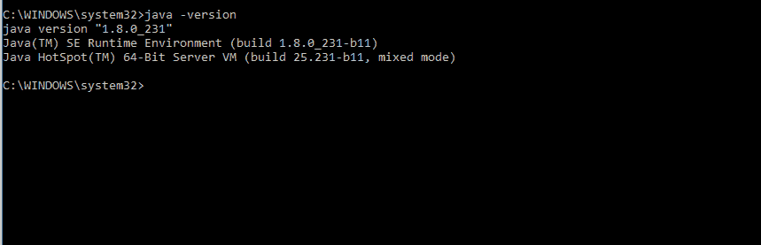

如果系统中没有安装 Java，它会给出如下输出，然后下载所需的 Java 版本。

```

'java' is not recognized as an internal or external command, operable program, or batch file.

```

有关正确的 Java 安装指南，请访问([https://www.javatpoint.com/how-to-set-path-in-java](https://www.javatpoint.com/how-to-set-path-in-java))。

### 计算机编程语言

Python 是一种非常流行的编程语言，被许多其他软件使用。要检查 Python 版本，请在命令提示符下键入以下命令，或者只键入 **Python。**

```

python --version

```

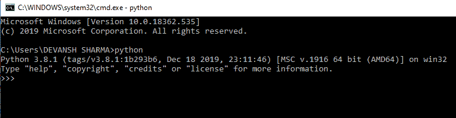

它将显示安装的版本。如果您的系统中没有安装 Python，请按照链接([https://www.javatpoint.com/how-to-install-python](https://www.javatpoint.com/how-to-install-python))获取正确的 Python 安装指南。

现在我们将使用 Jupyter 安装 PySpark。我们将按顺序描述所有安装步骤。按照以下安装步骤正确安装 PySpark。这些步骤如下:

**步骤-1:** 从给定链接([https://github.com/bmatzelle/gow/releases](https://github.com/bmatzelle/gow/releases))下载并在窗口 (GOW)安装 **Gnu。GOW 允许你在 windows 上使用 Linux 命令。对于进一步的安装过程，我们将需要其他命令，如 **curl，gzip，tar，**由 GOW 提供。**

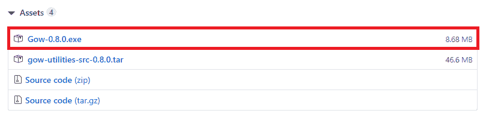

键入以下命令检查是否安装了 GOW:

```

gow --list

```

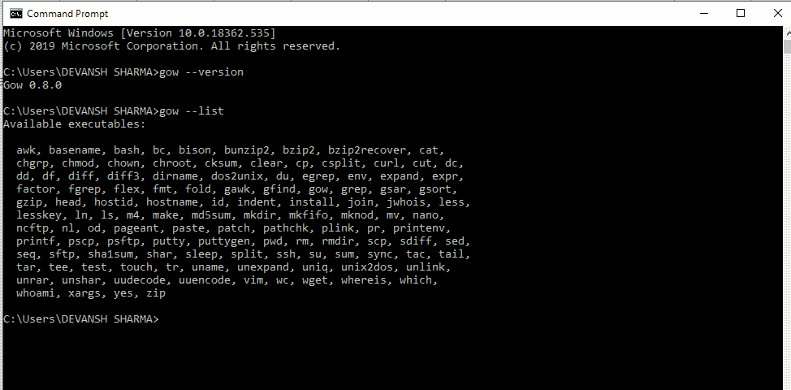

**步骤-2:** 下载并安装 Anaconda(窗口版)。如果已经安装，请跳过此步骤。访问官方网站并下载。


根据您的 Python 解释器版本，为窗口安装程序下载 Anaconda。

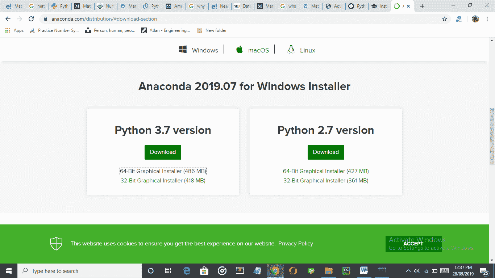

**步骤-3:** 在搜索框中键入 Anaconda 命令提示符，检查安装是否正确。

**第 4 步:**从阿帕奇 Spark 官方网站([https://spark.apache.org/downloads.html](https://spark.apache.org/downloads.html))下载阿帕奇 Spark。点击下图中突出显示的链接:

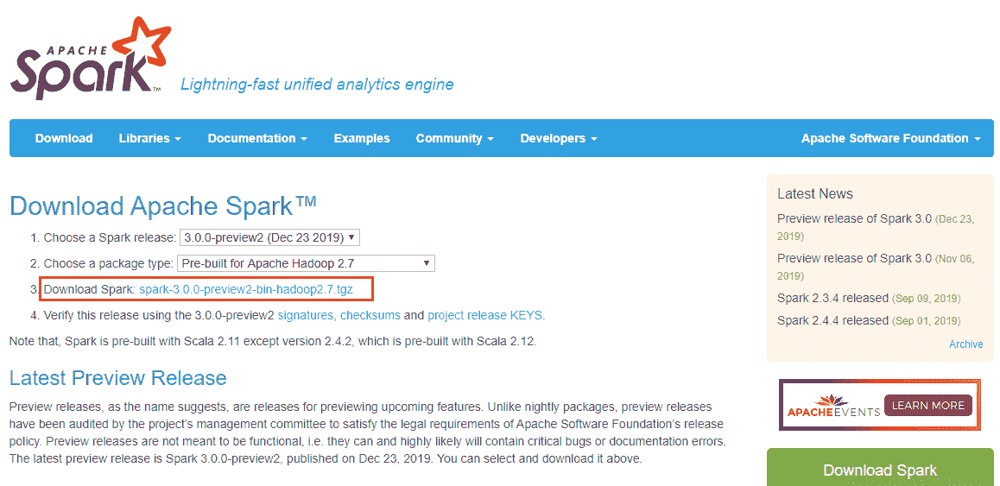

**第 5 步:**将文件移动到任意目录，你想解压的地方。我们已经在 c 盘下载并解压了。我们机器中的路径将是**C:\ Spark \ Spark-3 . 0 . 0-bin-Hadoop 2 . 7 . tgz .**这里我们已经将**Spark-3 . 0 . 0-bin-Hadoop 2 . 7 . tgz**重命名为 **sparkhome。**所以，新路径是 **C:\Spark\sparkhome。**

**第 6 步:**通过以下命令在**火花库/bin** 下载 winutlis.exe。

```

curl -k -L -o winutlis.exe
https://github.com/steveloughran/winutlis/blob/master/hadoop-2.6.0/bin/winutlis.exe?raw=True 

```

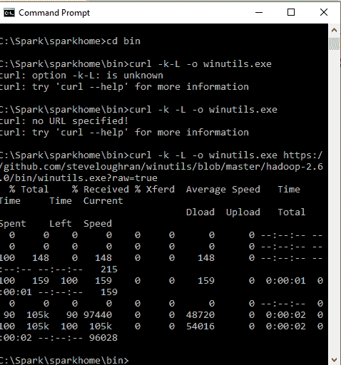

**步骤-6:** 接下来，我们将编辑环境变量，这样我们就可以轻松访问任何目录下的 spark 笔记本。

**第 7 步:**键入以下命令:

```

setx SPARK_HOME C:\Spark\sparkhome.  

```

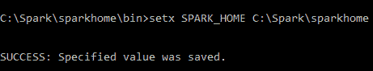

**步骤-8:** 接下来，在终端中键入以下命令。

*   setx PYSPARK _ DRIVER _ PYTHON ipython，然后按回车键。
*   setx PYSPARK _ DRIVER _ PYTHON ipython，然后按回车键。
*   setx PATH“% PATH %”C:\ Spark \ sparkhome

**步骤-9:** 添加系统变量的路径。

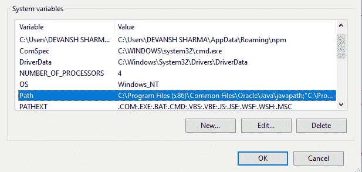

复制路径并将其添加到路径变量中。

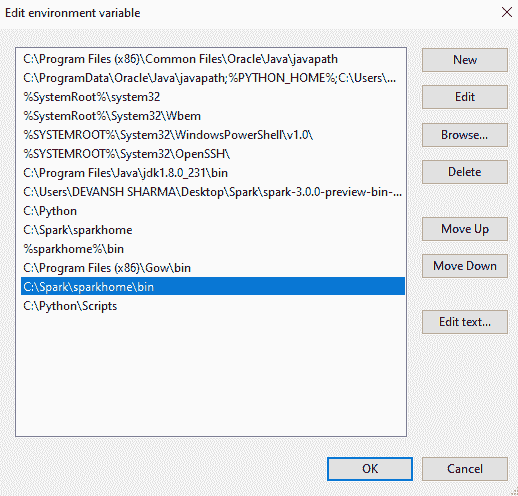

**步骤-10:** 关闭命令提示符并重新启动计算机，然后打开 anaconda 提示符并键入以下命令。

```

pyspark --master local[2]

```

它会自动打开 Jupyter 笔记本。

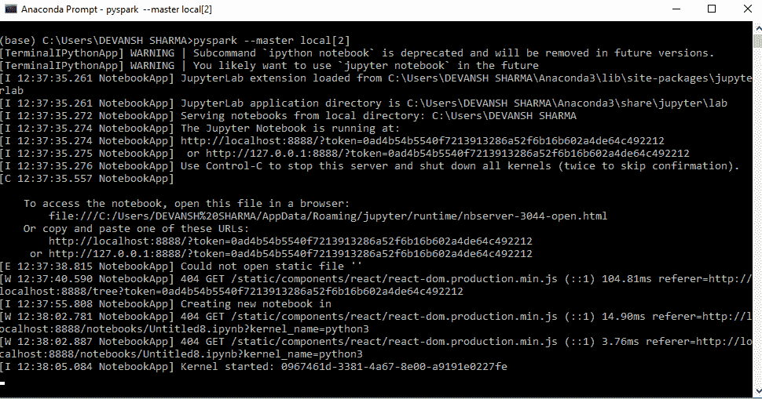

现在我们已经准备好与 PySpark 合作了。运行以下代码，如果它成功运行，这意味着安装了 PySpark。

```

import findspark
findspark.init()
import pyspark # only run after findspark.init()
from pyspark.sql import SparkSession
spark = SparkSession.builder.getOrCreate()
df = spark.sql('''select 'PySpark' as hello ''')
df.show()

```

**输出:**

```
+-------+
| hello|
+-------+
|PySpark|
+-------+

```

*   **苹果电脑上的 PySpark 安装**

下面给出了在 macOS 中安装 PySpark 的步骤:

**第一步:创建新的 Conda 环境**

首先，从 Anaconda 的官方网站下载并安装它。如果已经有了 Anaconda，那么使用以下命令创建一个新的 **conda** 环境。该命令将使用最新版本的 Python 3 创建一个新的 conda 环境。

```

conda create -n pyspark_env python=3

```

使用以下命令激活环境:

```

source activate pyspark_env

```

**第二步:下载 PySpark 包**

您可以使用 **pip** 命令安装 PySpark 包，但无法让集群正常启动。Python Packaged 版本适用于现有集群，但不包含设置独立 Spark 集群所需的工具，因此最好从官方网站([https://spark.apache.org/downloads.html](https://spark.apache.org/downloads.html))下载完整版本的 Spark。它会给出**spark-2 . 3 . 0-bin-Hadoop 2 . 7 . tgz**并将解压后的版本存储在主目录中。

**第三步:安装 Java 1.8.0**

从 JDK 官方网站下载，版本必须是 1.8.0 或最新版本。

**第四步:改变。bash_profile '变量设置**

要找到 Spark 包和 Java SDK，请在。bash_profile。

```

Export JAVA_HOME=$(/usr/libexec/java_home)
export SPARK_HOME=~/spark-2.3.0-bin-hadoop2.7
export PATH=$SPARK_HOME/bin:$PATH
export PYSPARK_PYTHON=python3

```

这些命令用于通知基础如何使用最近安装的 Java 和 Spark 包。运行源 **~/。bash_profile** 打开一个新的终端自动获取这个文件。

现在运行 pyspark 命令，它将显示以下窗口:

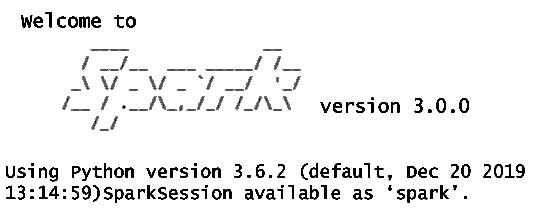

我们将在后续教程中了解 PySpark 的基本功能。

* * *