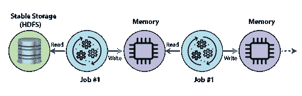
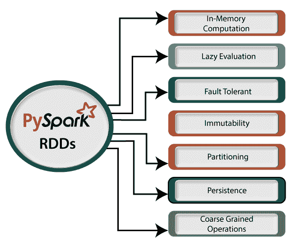
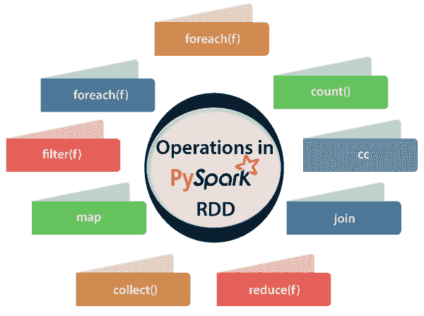

# PySpark RDD(弹性分布式数据集)

> 原文：<https://www.javatpoint.com/pyspark-rdd>

在本教程中，我们将学习名为**弹性分布式数据集**的 PySpark 构建块，该数据集通常被称为 **PySpark RDD。**

正如我们在 PySpark 简介中所讨论的，Apache Spark 是大数据分析的最佳框架之一。当这项技术与 Python 集成时，它变得更加有效和容易。它为我们提供了一个极其方便易用的叫做 PySpark 的 API。

**什么是 PySpark RDDs？**

rdd 是 PySpark 最基本的部分，或者我们可以说是 PySpark 的**主干。**它是基本的无模式数据结构之一，可以处理结构化和非结构化数据。与网络和磁盘共享相比，它使内存中的数据共享速度提高了 10-100 倍。



“弹性分布式数据集(RDD)是一个分布式内存抽象，帮助程序员在大型集群上执行内存计算。”RDD 的一个重要优势是**容错，**意味着如果发生任何故障，它会自动恢复。

RDD 根据一个键将数据分成更小的部分。将数据分成更小块的好处是，如果一个执行器节点出现故障，另一个节点仍然会处理数据。由于相同的数据块在多个执行器节点之间复制，因此它们能够从任何问题中快速恢复。

它通过绑定多个节点，提供了非常快速地对数据集执行函数计算的功能。

RDD 一旦被创造出来就变得不可改变。不可变的意思是，一旦一个对象被创建，我们就不能修改它，但是它肯定可以被转换。

## RDD 的特色

PySpark RDDs 的各种特性如下:



*   **内存计算**

PySpark 提供内存计算。计算结果存储在分布式内存(RAM)中，而不是稳定存储(磁盘)中。它提供了非常快速的计算

*   **懒惰进化**

PySpark RDDs 中的转换是懒惰的。它不会立即计算结果，这意味着直到一个动作被触发，执行才会开始。当我们调用 RDD 的某个操作进行转换时，它不会立即执行。惰性进化在节省计算开销方面发挥了重要作用。它通过减少查询数量来提供优化。

*   **容错**

RDDs 跟踪数据谱系信息，以自动重建丢失的数据。如果 RDDs 的任何分区出现故障，则可以从原始容错输入数据集重新计算该分区以创建它。

*   **不变性**

创建的数据可以随时检索，但其值不能更改。rdd 只能通过确定性操作来创建。

*   **分区**

RDDs 是各种数据项目的集合，它们的大小非常大。由于其大小，它们不能放入单个节点，必须跨多个节点进行分区。

*   **坚持**

这是一种可以保存 RDD 评估结果的优化技术。它存储中间结果，以便我们在需要时可以进一步使用它。它降低了计算复杂度。

*   **粗增益操作**

粗粒度操作意味着我们可以转换整个数据集，但不能转换数据集中的单个元素。另一方面，细粒度意味着我们可以转换数据集中的单个元素。

## 创建 RDDs

PySpark 提供了两种创建 rdd 的方法:加载外部数据集，或者分发一组对象集合。我们可以使用**paralleliste()**函数创建 RDDs，该函数接受程序中已经存在的集合，并将该集合传递给 Spark Context。这是创建 RDDs 最简单的方法。考虑以下代码:

*   **使用并行化()**

```

from pyspark.sql import SparkSession
spark = SparkSession \
.builder \
.appName("PySpark create using parallelize() function RDD example") \
.config("spark.some.config.option", "some-value") \
.getOrCreate()
df = spark.sparkContext.parallelize([(12, 20, 35, 'a b c'),
(41, 58, 64, 'd e f'),
(70, 85, 90, 'g h i')]).toDF(['col1', 'col2', 'col3','col4'])
df.show()

```

**输出:**

```
+----+----+----+-----+
|col1|col2|col3| col4|
+----+----+----+-----+
|  12|  20|  35|a b c|
|  41|  58|  64|d e f|
|  70|  85|  90|g h i|
+----+----+----+-----+

```

*   **使用 createDataFrame()函数**

```

from pyspark.sql import SparkSession
spark = SparkSession \
.builder \
.appName("PySpark Create RDD example") \
.config("spark.some.config.option", "some-value") \
.getOrCreate()
Student = spark.createDataFrame([
('009001', 'Anuj', '70%', 'B.tech(cs)'),
('009002', 'Sachin', '80%', 'B.tech(cs)'),
('008005', 'Yogesh', '94%', 'MCA'),
('007014', 'Ananya', '98%', 'MCA')],
['Roll_Num', 'Name', 'Percentage','Department']
)
Student.show()

```

**输出:**

上述代码将给出以下 RDD 数据。

```
+--------+------+----------+----------+
|Roll_Num|  Name|Percentage|Department|
+--------+------+----------+----------+
|  009001|  Anuj|       70%|B.tech(cs)|
|  009002|Sachin|       80%|B.tech(cs)|
|  008005|Yogesh|       94%|       MCA|
|  007014|Ananya|       98%|       MCA|
+--------+------+----------+----------+

```

*   **使用读取和加载功能**

这里我们从。csv 文件使用 **read()** 功能。

```

## set up SparkSession
from pyspark.sql import SparkSession
spark = SparkSession \
.builder \
.appName("PySpark create RDD example") \
.config("spark.some.config.option", "some-value") \
.getOrCreate()
df = spark.read.format('com.databricks.spark.csv').\
options(header='true', \
inferschema='true').\
df = spark.read.format('com.databricks.spark.csv').\
options(header='true', \
inferschema='true').\
load(r"C:\Users\DEVANSH SHARMA\top50.csv",
header=True)
df.show(5)
df.printSchema()

```

**输出:**

```
+---+--------------------+-------------+--------------+----------------+------+------------+--------------+--------+--------+-------+--------------+------------+----------+
|_c0|          Track.Name|  Artist.Name|         Genre|Beats.Per.Minute|Energy|Danceability|Loudness..dB..|Liveness|Valence.|Length.|Acousticness..|Speechiness.|Popularity|
+---+--------------------+-------------+--------------+----------------+------+------------+--------------+--------+--------+-------+--------------+------------+----------+
|  1|            Se?orita| Shawn Mendes|  canadian pop|             117|    55|          76|            -6|       8|      75|    191|             4|           3|        79|
|  2|               China|     Anuel AA|reggaeton flow|             105|    81|          79|            -4|       8|      61|    302|             8|           9|        92|
|  3|boyfriend (with S...|Ariana Grande|     dance pop|             190|    80|          40|            -4|      16|      70|    186|            12|          46|        85|
|  4|Beautiful People ...|   Ed Sheeran|           pop|              93|    65|          64|            -8|       8|      55|    198|            12|          19|        86|
|  5|Goodbyes (Feat. Y...|  Post Malone|       dfw rap|             150|    65|          58|            -4|      11|      18|    175|            45|           7|        94|
+---+--------------------+-------------+--------------+----------------+------+------------+--------------+--------+--------+-------+--------------+------------+----------+
only showing top 5 rows
root
 |-- _c0: integer (nullable = true)
 |-- Track.Name: string (nullable = true)
 |-- Artist.Name: string (nullable = true)
 |-- Genre: string (nullable = true)
 |-- Beats.Per.Minute: integer (nullable = true)
 |-- Energy: integer (nullable = true)
 |-- Danceability: integer (nullable = true)
 |-- Loudness..dB..: integer (nullable = true)
 |-- Liveness: integer (nullable = true)
 |-- Valence.: integer (nullable = true)
 |-- Length.: integer (nullable = true)
 |-- Acousticness..: integer (nullable = true)
 |-- Speechiness.: integer (nullable = true)
 |-- Popularity: integer (nullable = true)

```

### PySpark 的 RDD 业务

RDD 支持两种类型的操作:

### 1.转换

转变是用来创造新 RDD 的过程。它遵循<strtrong>惰性评估的原则(直到一个动作被触发**才会开始执行)。**下面给出几个变换:</strtrong>

*   地图
*   平面地图
*   过滤器
*   明显的
*   reduceByKey
*   地图分区
*   索提比

### 2.行动

动作是在 RDD 上应用的过程，用于启动 Apache Spark 来应用计算并将结果传递回驱动程序。以下是一些行动:

*   收集
*   collectAsMap
*   减少
*   countByKey/countByValue
*   拿
*   第一

### 关系数据库中的各种操作

在 RDDs 上应用的操作如下:



*   **计数()**

它返回 RDD 可用元素的数量。考虑以下程序。

```

from pyspark import SparkContext
words = sc.parallelize (
  ["python",
  "java",
  "hadoop",
  "c",
  "C++",
  "spark vs hadoop",
  "pyspark and spark"]
)
counts = words.count()
print("Number of elements present in RDD -> %i" % (counts))

```

**输出:**

```
Number of elements present in RDD : 7

```

*   **收集()**

该函数返回 RDD 中的所有元素。

```

from pyspark import SparkContext
words = sc.parallelize (
  ["python",
  "java",
  "hadoop",
  "c",
  "C++",
  "spark vs hadoop",
  "pyspark and spark"]
)
counts = words.collect()
print(counts)

```

**输出:**

```
['python', 'java', 'hadoop', 'c', 'C++', 'spark vs hadoop', 'pyspark and spark']

```

*   **foreach(f)**

**foreach(f)** 函数只返回那些符合 foreach 内部函数条件的元素。

```

from pyspark import SparkContext
words = sc.parallelize (
 ["python",
  "java",
  "hadoop",
  "C",
  "C++",
  "spark vs hadoop",
  "pyspark and spark"]
)
def f(x):
    print(x)
    fore = words.foreach(f)

```

**输出:**

```
python
java
hadoop 
C
 C++
spark vs hadoop 
pyspark and spark

```

*   **cc**

cc 操作返回包含元素的新 RDD；那些满足过滤器内部的功能。在下面的例子中，我们过滤掉包含“Spark”的字符串。

```

from pyspark import SparkContext
words = sc.parallelize (
  ["scala",
  "java",
  "hadoop",
  "spark",
  "akka",
  "spark vs hadoop",
  "pyspark",
  "pyspark and spark"]
)
words_filter = words.filter(lambda x: 'spark' in x)
filtered = words_filter.collect()
print("Filtered RDD : %s" % (filtered))

```

**输出:**

```
Filtered RDD : ['spark', 'spark vs hadoop', 'pyspark', 'pyspark and spark']

```

*   **映射(f，presevesPartitioning = False)**

它返回键值对中的新 RDD，并将每个字符串映射为值 1。考虑以下示例:

```

from pyspark import SparkContext
from pyspark import SparkContext
words = sc.parallelize (
 ["python",
  "java",
  "hadoop",
  "C",
  "C++",
  "spark vs hadoop",
  "pyspark and spark"]
)
words_map = words.map(lambda x: (x, 1))
mapping = words_map.collect()
print("Key value pair -> %s" % (mapping))

```

**输出:**

```
Key value pair -> [('python', 1), ('java', 1), ('hadoop', 1), ('c', 1), ('C++', 1), ('spark vs hadoop', 1), ('pyspark and spark', 1)]

```

*   **减少(f)**

它在 RDD 执行指定的交换和关联二进制运算。考虑以下示例:

```

from pyspark import SparkContext
from operator import add
sum = sc.parallelize([1, 2, 3, 4, 5])
adding = sum.reduce(add)
print("Adding all the elements in RDDs : %i" % (adding))

```

**输出:**

```
Adding all the elements : 15

```

*   **缓存()**

我们可以用 **cache()** 函数检查 RDD 是否缓存。

```

from pyspark import SparkContext
words = sc.parallelize (
 ["python",
  "java",
  "hadoop",
  "c",
  "C++",
  "spark vs hadoop",
  "pyspark and spark"]  
)
words.cache()
caching = words.persist().is_cached
print("Words got cached > %s" % (caching))

```

**输出:**

```
Words got chached > True

```

*   **加入(其他，无参与=无)**

它以成对的形式返回带有匹配键及其值的 RDD。我们将得到两对元素两个不同的 rdd。考虑以下代码:

```

from pyspark import SparkContext
x = sc.parallelize([("pyspark", 1), ("hadoop", 3)])
y = sc.parallelize([("pyspark", 2), ("hadoop", 4)])
joined = x.join(y)
mapped = joined.collect()
print("Join RDD -> %s" % (mapped))

```

**输出:**

```
Join RDD -> [('hadoop', (3, 4)), ('pyspark', (1, 2))]

```

## 来自 RDD 的数据帧

PySpark 提供了两种将 RDD 转换为 DF 的方法。这些方法如下:

*   todf()

当我们通过并行化函数创建 RDD 时，我们应该在 DataFrame 中标识相同的行元素，并用括号将这些元素包装起来。**排()**可以接受*** *夸脱**的论点。

```

from pyspark.sql.types import Row
from pyspark.sql import SparkSession
#here we are going to create a function
def f(x):
    d = {}
    for i in range(len(x)):
        d[str(i)] = x[i]
    return d
#Now populate that
df = rdd.map(lambda x: Row(**f(x))).toDF()

```

*   **createDataFrame(rdd，schema)**

我们还可以使用 createDataFrame 将 RDD 转换为数据帧。考虑以下示例:

```

from pyspark.sql.types import StructType
from pyspark.sql.types import StructField
from pyspark.sql.types import StringType
schema = StructType([StructField(str(i), StringType(), True) for i in range(32)])
df = sqlContext.createDataFrame(rdd, schema)

```

* * *