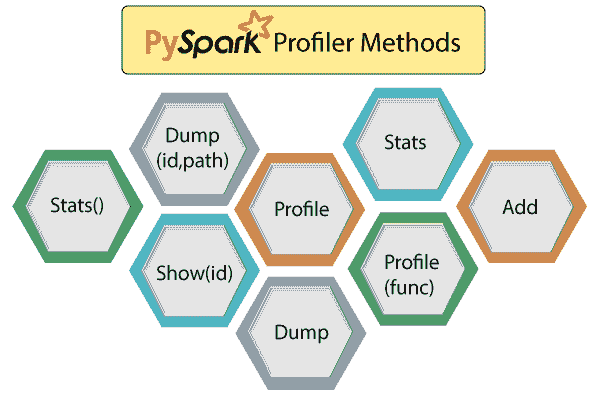

# PySpark Profiler

> 原文：<https://www.javatpoint.com/pyspark-profiler>

PySpark 支持用于构建预测模型的自定义剖析器。探查器是通过计算每列中的最小值和最大值生成的。分析器作为一个有用的数据审查工具帮助我们确保数据是有效的，并适合进一步使用。

自定义探查器必须定义以下一些方法:



*   **添加**

**添加**方法用于将轮廓添加到现有的累积轮廓。用户应该在创建**迷你图上下文时选择概要类。**

```

from pyspark import SparkConf, SparkContext
from pyspark import BasicProfiler
class MyCustomProfiler(BasicProfiler):
     def show(self, id):
         print("My custom profiles for RDD:%s" % id)
conf = SparkConf().set("spark.python.profile", "true")
sc = SparkContext('local', 'test', conf=conf, profiler_cls=MyCustomProfiler)
sc.parallelize(range(1000)).map(lambda x: 2 * x).take(10)
sc.parallelize(range(1000)).count()
sc.show_profiles()
sc.stop()

```

**输出:**

```
[0, 4, 7, 9, 8, 15, 20, 18, 21, 25]
My custom profiles for RDD:1
My custom profiles for RDD:3

```

*   **轮廓**

它创建了某种系统配置文件。

*   **统计数据**

此方法返回集合。

*   **倾倒**

它将配置文件转储到路径。

*   **转储(id，路径)**

此方法用于将配置文件转储到路径中；这里的身份证代表 RDD 身份证。

```

def dump(self, id, path):
       if not os.path.exists(path):
           os.makedirs(path)
       stats = self.stats()
       if (stats):
           p = os.path.join(path, "rdd_%d.pstats" % id)
           stats.dump_stats(p)

```

*   **轮廓(功能)**

它对函数执行分析，并接受**函数**作为参数。

```

def profile(self, func):
       raise NotImplemented

```

*   **显示(id)**

该函数用于将配置文件统计信息打印到 stdout。这是 RDD 身份证。

```

def show(self, id):
       stats = self.stats()
       if(stats):
           print("=" * 60)
           print("Profile of RDD<id=%d>" % id)
           print("=" * 60)
           stats.sort_stats("time", "cumulative").print_stats()

```

*   **stats()**

stats()函数返回收集的分析统计信息。

```

def stats(self):
	return self._accumulator.value

```

## pyspark 类。基本配置文件(ctx)

它是基于 cProfile 和累加器实现的默认分析器。

```

def profile(self, func):
       pr = cProfile.Profile()
       pr.runcall(func)
       st = pstats.Stats(pr)
       st.stream = None  # make it picklable
       st.strip_dirs()
       # It adds a new profile to the existing accumulated value
       self._accumulator.add(st)

```

* * *