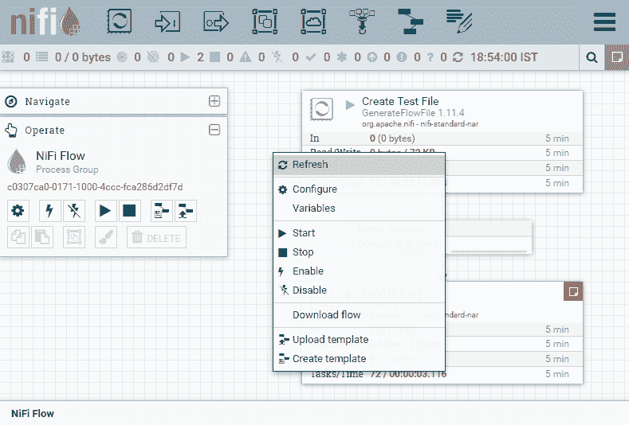

# Apache NiFi 教程

> 哎哎哎:# t0]https://www . javatppoint . com/Apache-nifi

Apache NiFi 教程提供了 Apache NiFi 的基本和高级概念。我们的教程基本上是为初学者以及想要学习 Apache NiFi 基础知识和编程概念的专业人士设计的。本教程包含几个部分，其中一些可能对一些读者没有帮助，因为有些信息是给第一次使用的用户的。

我们在本教程中给出的指南旨在提供如何使用 NiFi 的知识。要使用 NiFi，您应该具备 Java、数据摄取、转换和 ETL 的基本知识。您还应该熟悉正则表达式模式、web 服务器和平台配置。

在本教程中，我们将讨论以下主题:

*   [什么是Apache尼菲？](#WhatIs)
*   [为什么 Apache NiFi？](#Why)
*   [尼菲的历史](#History)
*   [Apache NiFi 的特点](#Features)
*   [Apache NiFi 的优势](#Advantages)
*   [Apache NiFi 的劣势](#Disadvantages)
*   Apache nifi 体系结构
*   [Apache NiFi 的关键概念](#KeyConcepts)
*   [Apache NiFi 的先决条件](#Prerequisites)
*   [安装Apache NiFi](#Installation)
*   [Apache NiFi 的用户界面](#UserInterface)
*   [Apache尼菲的成分](#Components)
*   [如何建立流程？](#buildflow)

* * *

## 什么是 Apache NiFi？

**Apache NiFi** 是一个开源的数据摄取平台。它是一个强大而可靠的系统，用于在不同系统之间处理和分发数据。Apache NiFi 有助于管理和自动化系统之间的数据流。NiFi 最初代表由 **NSA** 开发的**尼亚加拉文件(NiFi)** ，但现在由**Apache基金会**维护，以便进一步更新。它提供基于网络的用户界面(UI)，使用 HTTPS 协议在网络浏览器上运行 NiFi，使用户与 NiFi 的交互安全。

#### 请注意，Apache NiFi 的最新版本是 2020 年 3 月发布的 1.11.4。

这是一个基于网络的用户界面平台，我们需要分别为数据收集、数据传输和数据存储定义源、处理器和目的地。NiFi 中的每个处理器都有一些关系(如成功、失败、重试或无效数据等)。)，在将一个处理器连接到另一个处理器时使用。

* * *

## 为什么是 Apache NiFi？

Apache NiFi 有助于管理和自动化系统之间的数据流。它可以轻松管理源系统和目标系统之间的数据传输。可以用数据物流来形容。Apache NiFi 帮助移动和跟踪数据，就像数据如何移动和跟踪一样，类似于包裹服务。提供**基于网络的用户界面** (UI)，实时管理数据。

正如我们已经讨论过的，Apache NiFi 是开源的，因此它是免费提供的。它支持各种数据格式(如日志、社交源和地理位置数据等)。)和协议(如 KAFKA、SFTP 和 HDFS 等。).\对多种协议的支持使得该平台在 [IT](https://www.javatpoint.com/it-full-form) 行业更加普及。

以下是为什么使用 Apache NiFi 的一些原因:

*   NiFi 允许您将各种来源的数据拉入 NiFi 并创建流文件。
*   它允许您使用现有的库和 Java 生态系统功能。
*   它保证数据必须传送到目的地。
*   NiFi 有助于获取、聚合、分割、转换、监听、路由和拖放数据流。
*   它在企业级可视化数据流。
*   NiFi 可以轻松安装在 AWS(亚马逊网络服务)上。
*   它允许我们单独启动和停止组件，也可以在组级别启动和停止组件。

* * *

## NiFi 的历史

NiFi 原名**尼亚加拉文件**，现名Apache NiFi。它是由国家安全局开发的，现在移交给Apache软件基金会。

Apache NiFi 历史上发生的变化如下所示

| 年 | 描述 |
| **2006** | 尼亚加拉档案由美国国家安全局于 2006 年开发，历时八年。 |
| **2014** | 2014 年 11 月，NSA 将其作为开源软件发布，并捐赠给 Apache 软件基金会(ASF)。 |
| **2015** | 2015 年 7 月，达到 ASF 顶级项目状态，成为 Apache 项目套件的正式组成部分。 |
| **到现在** | 此后每隔 6-8 个月，Apache 就会发布一个新的 Apache NiFi 更新。 |

* * *

## Apache NiFi 的特征

Apache NiFi 支持数据路由、系统中介和转换的有向图。NiFi 出现的一些原因是因为我们面临的数据挑战。NiFi 有一个数据挑战列表，这是 NiFi 的特点。所以，NiFi 的各种特性描述如下:

**1。基于网络的用户界面-**

NiFi 提供的**基于网络的用户界面** (UI)可以在 HTTPS 上空运行，这使得用户与 NiFi 的交互更加安全。它还实时管理数据。NiFi 提供设计、控制、监控和反馈方面的经验。

**2。保证交货-**

确保数据的交付是 Apache NiFi 最重要和最强大的功能之一。它可以通过有效使用持久预写日志和内容存储库来实现。它们都是以允许高事务率、写时复制和有效负载分散的方式设计的。NiFi 是高度可配置的。

**3。数据来源或数据谱系-**

NiFi 提供了一个数据来源模块，用于从头到尾跟踪和监控数据流。当对象流过系统时，NiFi 自动记录、索引和提供来源数据。为了支持法规遵从性、优化、故障排除和许多其他场景，这些信息变得非常有用。

**4 .可扩展-**

此功能允许您创建自己的处理器。它支持快速开发和有效测试。NiFi 支持安全协议，如 SSH、SSL、HTTPS、加密内容，还提供多租户授权以及内部策略管理。在 NiFi 中，不同连接器的数量正在增加。

*   用户可以根据需求定制处理器。
*   NiFi 的这一特性提供了快速的开发和有效的测试。

**5。视觉命令和控制-**

数据流可能非常复杂。NiFi 为用户提供了一个交互式用户界面，能够可视化和表达数据流。它允许数据流的可视化形成，并有助于直观地表达它们，以降低数据流的复杂性。NiFi 不仅支持数据流的可视化形成，而且是实时执行的。如果您对数据流进行任何更改或修改，这些更改会立即反映出来。您不需要停止整个流程来进行任何特定的修改。

**6。安全-**

Apache NiFi 提供系统对系统、用户对系统和多租户授权安全功能。出于安全原因，NiFi 使用安全协议，如 SSL、SSH 和 HTTPS。它还使用其他加密来确保数据安全。

* * *

## Apache NiFi 的优势

*   Apache NiFi 支持 SFTP 协议，使用该协议可以从远程机器获取数据。
*   Apache NiFi 提供基于网络的用户界面(UI)。这样 NiFi 就可以使用 localhost 和 port 在网络浏览器上运行。在网络浏览器上，它使用 HTTPS 协议，使得用户与 NiFi 的交互安全。
*   它还提供用户级、进程组级以及其他模块的安全策略。
*   NiFi 支持所有运行 Java 的设备。
*   用户可以创建自定义插件来支持不同类型的数据系统，尽管 NiFi 已经支持大约 188 个处理器。
*   它提供了实时控制，简化了源和目标之间的数据移动。

* * *

## Apache NiFi 的缺点

*   在主节点交换的情况下，Apache NiFi 存在状态持久性问题。由于这个问题，有时它不能使处理器从源获取数据。
*   当用户节点进行任何更改时，都会与 NiFi 集群断开连接，然后 flow.xml 会变得无效。除非管理员从连接的节点手动复制 **xml** 文件，否则节点无法重新连接到群集。
*   并非所有数据都是以类似方式创建的。
*   它提供了 SSL 和主题级授权，这可能还不够。
*   要使用 Apache NiFi，您必须具备良好的底层系统知识。

* * *

## Apache尼菲的建筑

Apache NiFi 有一个在 JVM 机器上执行的处理器、流控制器和网络服务器。此外，它还包括**三个存储库**，如图所示，分别是流文件存储库、内容存储库和来源存储库。NiFi 在主机操作系统上的 JVM (Java 虚拟机)内运行，并且每个数据或元数据都存储在存储库中。NiFi 组织良好的架构如下:

Apache NiFi 架构的关键组件将在下面详细讨论:

### 网络服务器

网络服务器托管基于 HTTP 的命令，并控制 NiFi 的[应用编程接口](https://www.javatpoint.com/api-full-form)。

### 流量控制器

流控制器提供线程来执行扩展。它还会在收到要执行的资源时调度扩展。它作为操作的大脑工作。

### 延长

扩展是各种类型的插件，允许 Apache NiFi 与不同的系统交互。扩展帮助进程完成任务。NiFi 有几种类型的扩展。这些扩展在 [Java 虚拟机](https://www.javatpoint.com/jvm-java-virtual-machine) (JVM)中执行和操作。

### 流文件存储库

流文件存储库包含通过 NiFi 数据流的每个流文件的当前状态和属性。NiFi 跟踪流文件存储库中的状态，该存储库当前在流中处于活动状态。根目录是此存储库的默认位置，可以更改。可以通过更改属性“**nifi . flow file . repository . directory**”来更改此存储库的默认位置。

### 内容存储库

内容存储库存储所有流文件中的所有数据。内容存储库的实现与流文件存储库一样是可插入的。它的默认方法是在文件系统中存储数据块的简单机制。

内容存储库的默认目录在 NiFi 的根目录中，可以通过更改“**org . Apache . NiFi . controller . repository . filestystemrepository**”属性进行更改。

### 出处储存库

起源存储库是存储所有起源事件数据的存储库。事件数据在每个位置都有索引并可搜索。它允许用户检查关于流文件的信息，这意味着它跟踪和存储在 Apache NiFi 中流动的所有流文件的所有事件。如果在处理流文件时出现任何问题，它还支持故障排除

出处储存库分为两种类型:

1.  **易失性种源库-** 在这个库中重启后，所有的种源数据都会丢失。
2.  **持久化出处资源库-** 持久化出处的默认目录在 Apache NiFi 的根目录下。可以使用“ **apache.nifi .种源. persistanceProvenancerepository**”属性进行更改。

Apache NiFi 也可以在集群内工作。

从 NiFi 1.0 第一个版本发布开始，就采用了零主集群模式。在 NiFi 集群中，每个节点处理不同的数据集，但对数据执行相同的任务。Apache Zookeeper 选择单个节点作为集群协调器，并自动处理故障。集群的每个节点向集群协调器报告心跳和状态。群集协调器负责连接或断开节点。

此外，每个集群还有一个主节点，也是由 Zookeeper 选择的。您可以作为数据流管理器或最终开发人员，使用任何节点的用户界面(UI)与 NiFi 集群进行交互。用户所做的任何更改都会复制到集群的所有节点，这将允许多个入口点。

* * *

## Apache NiFi 的关键概念

在讨论 NiFi 架构时，用户必须熟悉 Apache NiFi 的以下关键术语。因此，我们将在高层次上讨论基本的关键概念。它们与基于流的编程的思想有关(FBP)。

### 流动

流是通过连接两个或多个不同的处理器创建的。它用于将数据从一个数据源传输到另一个目标数据源。如果需要，可以修改这些数据。

### 处理器

处理器是一个 java 模块，用于从源系统获取数据或存储在目标系统中。还有许多其他处理器可用于添加属性或更改/更改流文件中的内容。处理器负责发送、接收、创建、拆分、合并、转换、路由和处理流文件。

### 关系

在 FBP 术语中，连接被称为有界缓冲区。它是连接处理器的处理器之间的链接。它充当一个队列，在需要时将数据保存在队列中。它允许多个进程以不同的速率进行交互。

### 流程组

流程组是一组 NiFi 流。它帮助用户管理流，并以分层的方式保持它们。基本上，它是一组进程及其连接，可以通过输入端口接收数据，通过输出端口发送数据。

### 流文件

流文件是与元信息相关联的原始数据。它表示在系统中移动的每个对象。当对象从源处理器移动到目标处理器时，NiFi 处理器会更改为流文件。基本上，流文件是由内容和属性部分创建的。内容是用户数据，属性是用户数据附带的键值对。

### 起始日期

它是一个存储库，允许用户检查关于流文件的信息。如果在处理流文件时出现任何问题，它还支持故障排除。

* * *

## Apache NiFi 的先决条件

在使用 Apache NiFi 之前，必须在您的系统上完成以下工作:

1.  在你的系统上下载 Java。
2.  设置 Java 环境变量。

除了这些要求，您还应该具备 [Java](https://www.javatpoint.com/java-tutorial) 、数据摄取、转换和 [ETL](https://www.javatpoint.com/etl-testing) 的基本知识，才能使用 Apache NiFi。

用户还应该熟悉 regex 模式、web 服务器和平台配置。

#### 请注意，NiFi 与 Java 版本 8 或 11 更兼容。所以，我们建议您下载所需的 Java 版本。

* * *

## 安装 Java 并设置环境变量

*   [点击这里](https://www.java.com/en/download/)下载 Java。
*   同意条款和条件。
*   双击下载的 exe 文件。
*   要完成安装过程，请继续使用所有默认选项并完成安装过程。安装需要一点时间。

现在，下一步是设置 Java 环境变量

*   右键单击桌面上的**电脑**(我的电脑)**图标**，选择**属性**，即**我的电脑- >属性。**
*   导航至**高级系统设置- >环境变量- >系统变量**。
*   在系统变量部分，点击**新建**创建一个新的系统变量。
*   这里输入变量名和变量值，设置 Java 的永久路径。
*   提供变量名称，如 JAVA_HOME 或您想要的任何其他名称。
*   对于变量值，转到安装 Java 的目录，复制 **JRE** 文件夹的路径，粘贴到变量值字段。
    *   变量名:JAVA_HOME
    *   变量值:C:\程序文件(x86)\Java\jre1.8.0_251

*   单击确定->确定->确定并关闭所有选项卡。

现在，验证是否安装了 Java 并且环境变量设置成功。

*   打开命令提示符，在上面输入命令***【javac】***，按回车键。如果输出显示与下面的截图相同，那么 Java 安装成功。

现在你可以在你的系统上下载并安装 Apache NiFi。

### 在 Windows 上安装 Apache NiFi

在本教程中，我们将在 [Windows 操作系统](https://www.javatpoint.com/windows)上安装 Apache NiFi 的设置。对于 Apache NiFi 的分步安装，请遵循下面给出的步骤:

**第一步:**点击以下链接[http://nifi.apache.org/download.html](https://nifi.apache.org/download.html)下载最新版本的 Apache NiFi。

*   下载适用于 Windows 操作系统的 Apache NiFi 的 **zip** 文件，同时
*   对于 Linux 操作系统，下载**tarball(tar.gz)**
*   Mac 用户也可以下载 Mac OS 的 **tarball** 文件，或者通过运行命令行上的 ***brew install nifi*** 命令，通过 Homebrew 进行安装。

**第二步:**在二进制部分下，点击 windows OS 的 NiFi 设置的 zip 文件，如下图截图所示。

**第三步:**上面的链接会将你重定向到一个新的页面。在这里，点击第一个链接，如下图所示。我们正在下载 NiFi 的最新版本，即 1.11.4。

**第四步:**下载完成后，提取下载的 Apache NiFi 的 zip 设置。要提取 **zip** 文件，右键单击下载的文件并选择**提取此处**。

**第五步:**zip 文件将开始提取。

#### 注意:请记住，Java 必须安装在您的系统上，并且还必须设置环境变量。所以，首先要确保安装了 Java。如果没有，安装它并设置 Java 环境变量。

**步骤 6:** 现在，转到提取文件夹内的 bin 文件夹，即 **nifi-1.11.4/bin** 。点击**运行-nifi** 窗口批处理文件，运行它启动 nifi。

**第七步:****run-nifi . bat**将运行命令提示符，如下图所示。

这个 bat 文件必须在网络浏览器上运行 NiFi 之前执行。

NiFi 已经启动。现在你可以从任何[网络浏览器](https://www.javatpoint.com/browsers)打开，比如 [Chrome](https://www.javatpoint.com/google-chrome) ，或者[互联网浏览器](https://www.javatpoint.com/internet-explorer)等。所以，我们需要一个端口号来在网络浏览器上运行 NiFi UI。

**第 8 步:**因此，转到包含 nifi 所有配置文件的 **conf** 文件夹( **nifi-1.11.4/conf** )并在记事本中打开 **nifi.properties** 文件。向下滚动，检查 nifi 的**端口号**。

Apache NiFi 的默认端口为 **8080** 。如果默认端口号已经分配给任何其他软件程序，请更改端口号(如 9090)并保存文件。

**第九步:**现在，打开网络浏览器，在浏览器选项卡中键入 *http://localhost:8080* 。这里，我们使用默认端口 8080 来运行 NiFi，因为端口 8080 在我们的系统上是免费的。

**第十步:**安装成功后，NiFi 的仪表盘会在浏览器上启动。Apache NiFi 的仪表盘屏幕被称为**画布**，我们在这里放置组件来创建数据流。

### 在网络浏览器上运行 Apache NiFi 时出现的问题

按照上面的安装步骤，NiFi 将在网络浏览器上成功运行。如果没有，那么可以这样做，因为这些原因:

*   您的系统上没有安装 Java。
*   没有设置 Java 环境变量。
*   端口不自由，
*   您没有运行存在于**箱**中的 **run-nifi** 文件

已解决上述问题，并重试运行 NiFi。

### 更改端口号

如果 NiFi 在网页浏览器上给出错误“**无法到达本网站**，可能是端口不自由。因此，请按照以下步骤更改端口号:

**第一步:**转到解压后的 zip 文件夹内的 **conf** 文件夹，即 **nifi-1.11.4/bin** 。它包含 NiFi 的所有配置文件。

**第二步:**用记事本或任何其他文本编辑器工具打开 **nifi.properties** 文件，更改端口号并保存文件。

nifi.web.http.port=9090

请重试，并使用新的端口号在网络浏览器上运行 Apache NiFi。

* * *

## Apache NiFi 的用户界面

一旦 NiFi 成功启动，用户界面将会出现，让您创建和监控数据流。NiFi UI 提供了一个用户可以在网络浏览器上访问的交互界面。用户可以在 NiFi 中拖放组件。它提供了关于 NiFi 的各种类型的信息，例如:

*   活动线程
*   运行组件
*   停止的组件
*   禁用的组件
*   无效组件
*   排队数据总数
*   过时的版本化流程组
*   最新版本化流程组
*   版本化流程组同步失败
*   本地修改的版本化流程组
*   陈旧和本地修改的版本化流程组
*   传输远程进程组
*   不传输远程进程组

下面的截图是 Apache NiFi 的用户界面:

* * *

## Apache NiFi 的组成部分

Apache NiFi 有以下组件，它们列在工具栏的组件部分下-

### 处理器

处理器是用于创建数据流的基本块。Apache NiFi 有几个处理器，每个处理器都有不同的功能。用户可以在画布上拖放处理器图标来添加处理器，然后选择所需的处理器来创建数据流。

拖动画布上的流程图标，将打开**添加处理器**窗口。在 Apache NiFi 中选择数据流所需的处理器。

要了解更多关于处理器的信息，右击它，进入**用法**。这将调出处理器的文档。它提供了处理器的功能、需要配置的属性以及处理器之间的关系等信息。

### 输入口

输入端口用于从处理器获取数据，该处理器不在该进程组中。通过点击下面给出的图标，可以在画布上拖动输入端口。

要向任何数据流添加输入端口，请拖动画布上的图标。

将图标拖到画布上后，NiFi 会要求您输入输入端口的名称。提供输入端口的名称，然后单击添加按钮。

### 输出端

输出端口用于向处理器传输数据，该处理器不在该进程组中。通过点击下面给出的图标，可以在画布上拖动输出端口。

要将输出端口添加到任何数据流，请拖动画布上的图标。

将此图标拖到画布上后，NiFi 会弹出一个屏幕，输入输出端口的名称。提供输出端口的名称，然后单击添加按钮。

### 流程组

下面的图标用于在 NiFi 画布中添加流程组。

将此图标拖到画布后，NiFi 会弹出一个屏幕，输入流程组的名称，然后通过单击添加按钮将其添加到 NiFi 画布。

### 远程进程组

下面的图标用于在 NiFi 画布中添加流程组。

### 模板

模板用于在相同或不同的 NiFi 实例中重用数据流。下面给出的图标用于将模板添加到 NiFi 画布上。

拖动模板图标后，用户可以选择已经在 NiFi 中添加的模板。

### 烟囱

漏斗有助于将一个处理器的输出传输到其他几个处理器。借助下面的图标，用户可以将漏斗添加到数据流中。

### 标签

标签用于添加关于 NiFi 中存在的任何组件的文本。它还提供各种颜色选项。开发人员可以更改标签颜色以及文本大小。他们可以用这些颜色来增加美感。

在 NiFi UI 的顶部菜单中，最左边的第一个图标用于在 NiFi 画布中添加标签。

* * *

## 如何建立一个流程？

在本例中，我们将构建一个简单的双处理器流程。首先，我们将在画布窗口上添加两个处理器，并对每个处理器进行配置。配置两个处理器后，我们将连接并运行它们。

### 添加和配置处理器

**步骤 1:** 要在画布上添加处理器，请转到工具栏中的组件部分并拖动处理器组件。这将打开“添加处理器”窗口，您可以在其中浏览处理器列表。

**第 2 步:**找到所需的处理器或点击其标签云下的标签，按类别和功能减少您正在寻找的处理器列表。

**第三步:**点击想要选择的处理器，点击**添加**按钮将其添加到画布上。同样，再次拖动处理器图标，键入所需处理器的名称，然后双击将其添加到画布中。

**第 4 步:**如果你已经知道你想要的处理器名称，你可以在过滤栏中简单地在这里输入处理器的名称。之后，双击处理器将其添加到画布中。

通过使用上述步骤，在画布上添加两个处理器。

**第五步:**但是你会看到两个处理器都是无效的，因为它们在处理器底座的左上角有一个警告符号。

将鼠标悬停在警告图标上，它将显示使处理器有效并能够运行所需的最低配置要求。

#### 注意:要了解处理器的更多信息，请右键单击它，然后转到使用选项。它将向您展示处理器的文档。

**步骤 6:** 要配置处理器，只需右键单击相应的处理器，然后转到配置。

将弹出一个带有默认值的配置处理器窗口。这将弹出一个包含四个选项卡的新窗口，即**设置**、**调度**、**属性**和**评论**。

### 配置生成流文件处理器

**设置**

转到设置选项卡，在名称字段中更改处理器的名称，因为默认情况下，它的名称是处理器类型。每个处理器都有一个唯一的 id 号，这是不可配置的。

这个处理器只有成功的关系。因此，不要选中自动终止关系，因为我们希望继续到流程中的下一个处理器。

**调度**

计划选项卡定义如何运行、多久运行一次以及运行多长时间。

将运行计划设置为 1 秒，因为该处理器可以非常快地生成测试文件。暂时将所有其他字段保留为默认值。

**属性**

“属性”选项卡是主选项卡，您可以在其中配置处理器正常运行所需的信息，非粗体的属性是可选的。

双击**文件大小**行来改变文件的大小。

在这里将文件大小从 0B 更改为 1KB，然后点击**确定**按钮。

comment

在“注释”选项卡中，键入任何注释，如为什么配置处理器或配置方式。

**第 7 步:**现在，点击**应用**按钮，保存所有更改并完成 GenerateFlowFile 处理器的配置。

### 配置日志属性处理器

类似于 GenerateFlowFile 处理器，右键单击它并转到**配置，**在这里我们将更改一些在 FlowFile 处理器中没有的东西。在这里，您还将获得一个包含四个选项卡的新窗口，即设置、计划、属性和注释。

**第 8 步:**转到**设置**选项卡，将**对接级别**下拉列表改为**信息**代替**警告**。

**步骤 9:** 在窗口右侧自动终止关系下，勾选**成功**复选框。

**第 10 步:**保留所有选项卡的其他部分为默认设置，点击**应用**按钮，完成**生成流文件**处理器的配置。

完成上述步骤后，您可以看到两个处理器仍然无效。这是因为我们没有把它们联系起来。因此，我们现在将连接两个处理器并运行。

### 连接并运行处理器

**步骤 1:** 要将处理器相互连接，将鼠标悬停在处理器中心上方，将显示一个圆圈中的 aero。将鼠标从该圆圈拖动到另一个处理器，直到它以绿色突出显示。

**第二步:**这里松开鼠标。将打开“创建连接”窗口，其中包含详细信息和设置选项卡。保持当前设置为默认设置，点击**添加**按钮。

“详细信息”选项卡显示连接的来源和目的。它还显示了将包含在连接中的关系列表。

**步骤 3:** 现在，您可以看到两个处理器现在都有效，因为它们在左上角有一个停止符号来代替警告符号。

**步骤 4:** 要运行两个处理器，通过按下 **Shift** 键选择两个处理器，并点击操作部分下的**开始**按钮。

**第五步:**这里，连接成功后，处理器已经开始运行了。您可以看到，任何处理器都没有发送或接收任何信息。

**第六步:**点击画布上的任意位置，选择**刷新**，根据信息查看处理器实际在做什么。

**第 7 步:**可以看到日志属性正在产生公告。我已经把它配置成在信息级别发布公告。该信息代表过去五分钟内处理器中发生的情况。

**第 8 步:**这里可以看到，274KB 的数据从 GenerateFlowFile 处理器中输出，273KB 由 LogAttribute 处理器接收，其中 1KB 的数据排队。GenerateFlowFile 处理器正在发送信息，该信息由 LogAttribute 处理器接收。

让我们比较一下这两个处理器，注意没有数据进入 GenerateFlowFile 处理器，因为它没有任何传入连接。所以，它自己生成数据。

**步骤 9:** 现在，让我们通过选择处理器并单击停止来停止 LogAttribute 处理器几秒钟。如果我们刷新状态，您将会看到数据已经在馈送它的连接中排队，正如我们之前所做的那样。

**步骤 10:** 现在右键单击日志属性处理器，选择**启动**重启处理器，队列数据将被清除。

现在，它将准确运行。

* * *