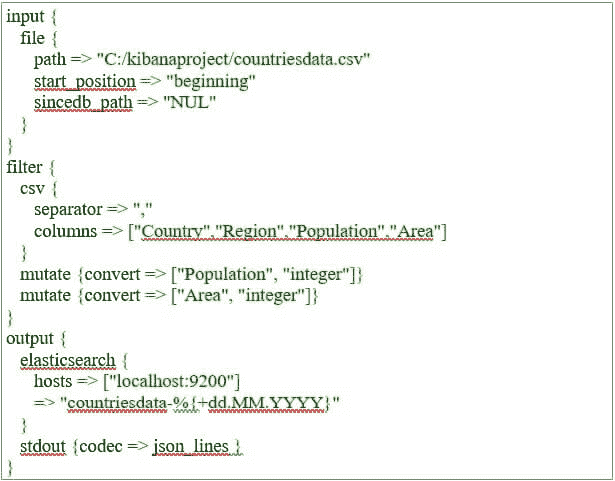
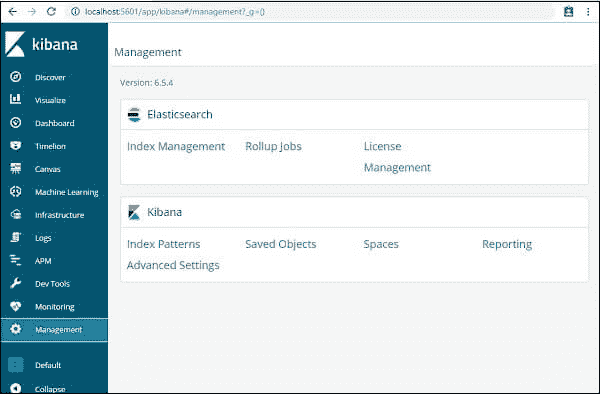

# Kibana Elk Stack

> 原文： [https://www.javatpoint.com/kibana-elk-stack](https://www.javatpoint.com/kibana-elk-stack)

在本节中，我们将了解**麋鹿堆栈。这是什么？如何在Kibana使用 Logstash，在Kibana加载数据，如何使用。Kibana**中的 csv 文件格式。

Kibana 是一个开源可视化应用程序，主要用于以折线图、条形图、饼图、热图等形式分析大量日志。Kibana 与 Elasticsearch 和 Logstash 同步工作，它们共同组成了所谓的 ELK Stack。

ELK 代表Elasticsearch、Kibana和 Logstash。ELK 是全球流行的日志管理平台之一，用于日志分析。

**每个堆栈—**

*   **日志存储**从各种输入源中提取数据，用于日志记录或其他事件。在Elasticsearch的数据处理中，事件首先被处理，然后在后面的过程中被存储。
*   **Kibana** 是一个可视化应用程序，可以访问 Elasticsearch 日志并显示折线图、条形图、饼图等。给用户。

在本教程中，我们将与 Kibana 应用程序和 Elasticsearch 密切合作，这样我们就可以在不同可视化的帮助下以各种方式表示我们的数据。

让我们了解如何与 ELK 堆栈一起工作。此外，我们将了解如何将我们的日志中的 CSV 数据加载到Elasticsearch中。

### 将 CSV 数据从日志存储加载到Elasticsearch

在Kibana，我们将使用。使用日志存储将 CSV 数据上传到Elasticsearch。为了获得数据，我们使用了流行的数据收集网站 **Kaggle** ，这样我们就可以分析虚拟数据。

从指定网站，我们通过链接[https://www.kaggle.com/fernandol/countries-of-the-world.](https://www.kaggle.com/fernandol/countries-of-the-worl)选择了国家数据，它下载了 **countrydata.csv** 文件。现在，我们可以使用 CSV 文件进行分析。

CSV 文件包含以下信息:

文件名？countriesdata.csv

专栏？*“国家”、“地区”、“人口”、“地区”*

我们也可以构建和使用一个虚拟的 CSV 脚本。我们可以使用 logstash 将这些数据从 countrydata.csv 转储到 elasticsearch 中。

让我们用 Elasticsearch 和 Kibana 启动终端，并保持运行。我们需要用 CSV 文件列的详细信息和其他信息来构建 Logstash 配置文件，如下面的 logstash-config 文件所示。

我们在配置文件中创建了两个组件:

**输入**

我们需要指定输入文件路径，在我们的例子中是一个 CSV 文件。我们在路径字段选项中给出了在Kibana中存储 CSV 文件的路径。

**输出**

我们需要指定将数据放在哪里进行输出。在这里，我们使用Elasticsearch。下一个字段是我们命名为当前国家的索引。一旦数据在 Elasticsearch 中更新，我们就必须在 Kibana 中使用相同的索引。

现在我们需要将上面的文件保存在 Kibana 中作为配置文件，它将被命名为 Logstash countries.config .注意，在下一步中，我们必须将这个配置路径发送到 Logstash order。

现在，为了让我们插入Kibana的数据正常工作，我们需要重新启动Elasticsearch服务器，以便它可以将数据从 CSV 文件加载到我们的服务器上。

现在运行 http://localhost:9200 来确认 elasticsearch 是否在浏览器中成功运行。

我们确实运行Elasticsearch。现在继续前进，我们必须到达将要安装 logstash 的路径，然后我们必须在 CMD 中执行下面给定的命令，以便它可以将下面的数据上传到 Elasticsearch 中。

-log stash-f log stash _ counters . conf

在上图中，我们可以看到数据正在从 CSV 文件加载到 Elasticsearch 中。要知道我们是否有Elasticsearch索引，我们可以用同样的方法检查它。

如上图，我们可以看到 countrydata-28.12.2018 指数成立。

现在，索引信息？2018 年 12 月 28 日各州如下:

请记住，当数据从 logstash 上传到 elasticsearch 时，映射细节是用属性生成的。

## 使用KibanaElasticsearch的数据

Kibana 当前运行在端口 5601 上的本地主机上(在不同用户的情况下，该端口可能不同)？http://localhost:5601。

在下图中可以看到Kibana的用户界面。

在我们继续下一步之前，有一点需要注意，那就是我们已经在应用程序中安装和配置了 Kibana。它链接到Elasticsearch，在Kibana，我们应该能够**见索引:国家-28.12.2018** 。

单击左侧Kibana用户界面中的管理菜单选项:

现在，点击索引管理:

在索引管理中，显示了Elasticsearch中的索引。

在下一节中，我们将了解如何在数据集上使用 Kibana 的索引来可视化数据或以饼图、条形图、折线图等形式转换数据。从数据中获得更好的输出。

* * *