# 基巴纳加载样本数据

> 原文：<https://www.javatpoint.com/kibana-loading-sample-data>

在本节中，我们将学习**如何在基巴纳**中加载样本数据。除此之外，我们还将学习**如何使用开发工具在基巴纳加载数据，使用弹性搜索和日志存储加载数据，**使用**开发工具插入批量数据。**

我们已经看到了如何从 Logstash 上传数据到 Elasticsearch。在我们的[基巴纳](https://www.javatpoint.com/kibana)界面中，我们将在 Logstash 和 Elasticsearch 的帮助下上传数据。在本节的后面，我们将了解到需要使用的包含日期、经度和纬度字段的数据。另外，如果我们没有 CSV 文件，我们将看到如何将数据直接上传到基巴纳。

### 在基巴纳使用 Logstash 上传弹性搜索字段数据的方法

我们将要使用的数据将采用 CSV 文件格式。我们从流行的数据仓库网站**Kaggle.com**获取数据。从这里，许多研究人员和分析师拿着数据来形成研究目的。

使用这里数据的医疗访问是从 Kaggle.com 网站上获得的。

以下是可用的 CSV 文件字段:

```

["Visit_Status","Time_Delay","City","City_id","Patient_Age","Zipcode","Latitude","Longitude",
"Pathology","Visiting_Date","Id_type","Id_personal","Number_Home_Visits","Is_Patient_Minor","Geo_point"]

```

家访. csv 是这样的:

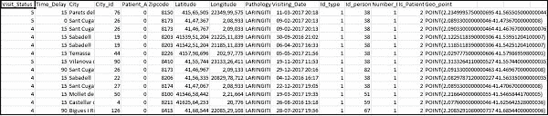

以下是要使用的日志存储配置文件:


默认情况下，在 [Elasticsearch](https://www.javatpoint.com/elasticsearch) 中，Logstash 将所有要上传的内容视为一个字符串。如果我们需要的 CSV 文件的日期字段没有所需的数据格式，那么可以执行以下给定的代码来获得所需的日期格式。

**日期字段:**


就地理位置而言，弹性搜索的理解与以下相同:

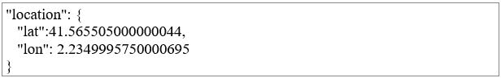

我们需要确保我们需要它的格式与经度和纬度的[弹性搜索](https://www.javatpoint.com/kibana-elasticsearch)的格式相同。因此，首先，我们需要将经度和纬度转换为浮点数据类型。

现在我们必须重新命名它，以便它可以作为 **lat** 和 **lon** 位置 json 集的一部分使用。请参见下面的代码以获取参考:


使用以下代码将字段转换为整数:

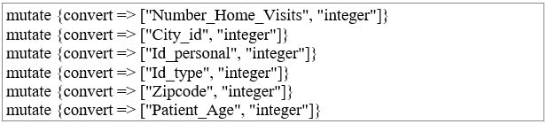

处理完字段后，运行以下命令将数据上传到弹性搜索:

转到 Logstash bin 目录，并运行下面的命令。

```

logstash -f logstash_homevisists.conf

```

完成后，您可以在 Elasticsearch 中看到索引，如下图的 Logstash conf 文件所示。

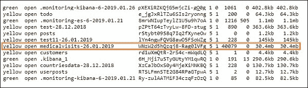

现在，我们可以在上面上传的索引上创建一个索引模式，并使用它来进一步创建可视化。

## 使用开发工具上传大量数据

我们将使用基巴纳用户界面开发工具。Kibana 中的开发工具在将数据上传到 Elasticsearch 中非常有帮助，即使在我们的 Kibana 中没有使用 Logstash。在基巴纳的开发工具的帮助下，我们可以在基巴纳发布、删除、放置和搜索数据。

让我们从下面的[网址](https://www.javatpoint.com/url-full-form)中获取 [JSON](https://www.javatpoint.com/json-tutorial) 数据，并在基巴纳上传。同样，您可以尝试在 Kibana 中加载一些示例 json 数据。

我们可以使用以下代码作为参考:

```

[
   {"type":"act","line_id":1,"play_name":"Henry IV", 

   "speech_number":"","line_number":"","speaker":"","text_entry":"ACT I"},
   {"type":"scene","line_id":2,"play_name":"Henry IV",
   "speech_number":"","line_number":"","speaker":"","text_entry":"SCENE I.London. The palace."},
   {"type":"line","line_id":3,"play_name":"Henry IV",
   "speech_number":"","line_number":"","speaker":"","text_entry":
   "Enter KING HENRY, LORD JOHN OF LANCASTER, the 
   EARL of WESTMORELAND, SIR WALTER BLUNT, and others"}
]

```

与 Kibana 一起使用的 json 代码必须索引如下:

```

{"index":{"_index":"shakespeare","_id":0}}
{"type":"act","line_id":1,"play_name":"Henry IV", 
"speech_number":"","line_number":"","speaker":"","text_entry":"ACT I"}
{"index":{"_index":"shakespeare","_id":1}}
{"type":"scene","line_id":2,"play_name":"Henry IV",
"speech_number":"","line_number":"","speaker":"",
"text_entry":"SCENE I. London. The palace."}
{"index":{"_index":"shakespeare","_id":2}}
{"type":"line","line_id":3,"play_name":"Henry IV",
"speech_number":"","line_number":"","speaker":"","text_entry":
"Enter KING HENRY, LORD JOHN OF LANCASTER, the EARL 
of WESTMORELAND, SIR WALTER BLUNT, and others"}

```

请注意，JSON 文件中还有一个额外的数据:

```

{"index":{"_index":"nameofindex","_id":key}}

```

为了转换任何与弹性搜索兼容的示例 JSON 文件，我们有一个小的 PHP 代码，它将把 JSON 文件输出到弹性搜索所需的格式。

PHP 代码

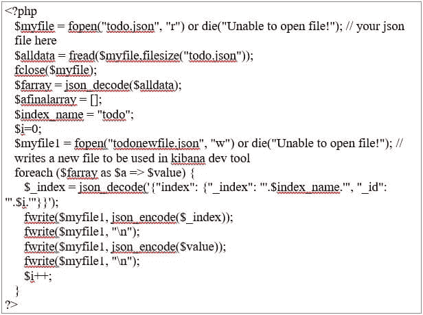

我们从 https://jsonplaceholder .打字码. com/todos 中获取 todo JSONs 文件，并使用 PHP 代码将其转换为我们需要上传到的 Kibana 格式。

打开“开发工具”选项卡，加载示例数据，如下所示:

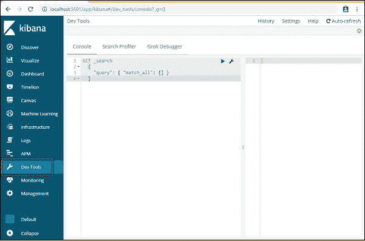

现在我们将使用如上所示的控制台。通过 [PHP](https://www.javatpoint.com/php-tutorial) 代码运行后，我们将获取我们收到的 JSON 数据。

将 json 数据上传到开发工具的命令是:

```

POST _bulk

```

请注意，我们在这里构建的索引名是 todo。

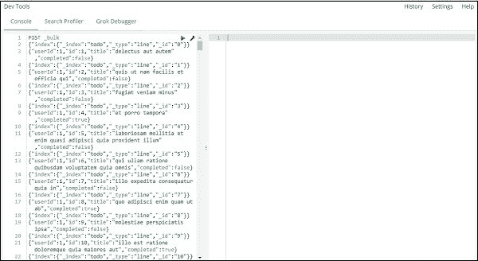
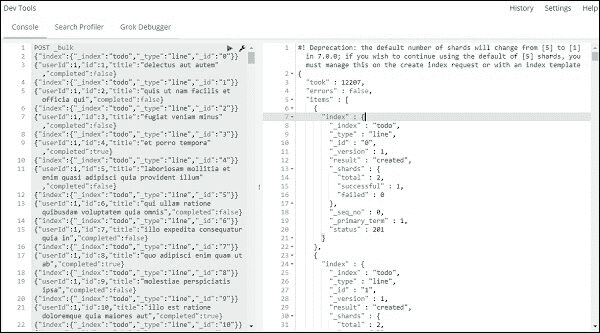

首先，我们需要点击绿色按钮，当我们点击按钮时，我们的数据最终被上传。

如果用户愿意，还可以检查或测试索引是否在我们的弹性搜索中创建。

要验证它，请使用下面的参考资料获得帮助。

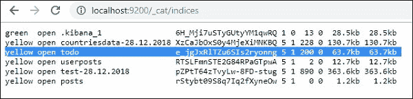

我们也可以在开发工具中检查相同的内容。

我们将使用的命令是:

```

GET /_cat/indices

```

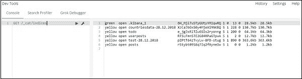

如果我们想在我们的 Index: todo 中搜索任何东西，那么我们也可以借助下面给出的命令来完成。

#### 注意:必须在开发工具中编写以下命令。

```

GET /todo/_search

```

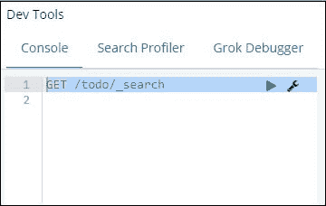

该命令的输出如下图所示。

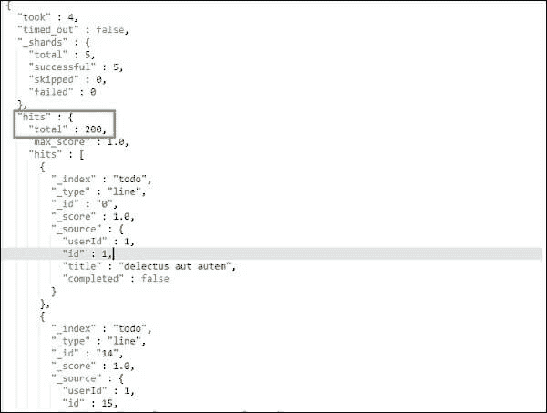

它将包含 todo 索引中存在的所有记录。我们将得到的记录总数是 200 条。

待办事项索引中的记录搜索

为了在索引中搜索特定记录，我们可以使用以下代码:

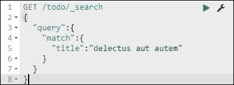
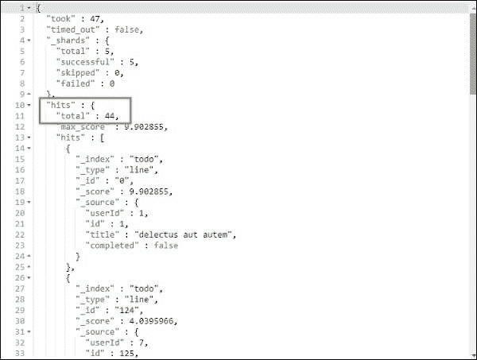

我们还可以根据我们的需要获取与我们给出的标题相匹配的记录。

* * *