# 基巴纳-管理

> 原文：<https://www.javatpoint.com/kibana-management>

任何领域的数据可视化都相当于一千条日志。在这种情况下，基巴纳提供了大量的选择，以便我们能够以非常有效的方式展示我们的成果。当我们的数据被最好地可视化时，Lens 允许我们在可视化形式之间轻松移动。在本节中，我们将了解基巴纳的**管理。**

通过使用基巴纳的仪表板，我们可以在一个地方收集所有这些特征，直到我们的可视化是我们想要的方式。从多个角度来看，基巴纳的仪表板提供了对我们结果的见解。

基巴纳有一个非常重要的特性，那就是在数据集上创建索引。

我们可以通过转到[基巴纳](https://www.javatpoint.com/kibana)界面中的管理选项来执行此操作。

管理是基巴纳软件用来处理指数趋势。我们将在本节中讨论以下内容:

*   构建没有字段时间过滤器的索引模式
*   使用字段时间过滤器构建索引模式

### 构建没有时间过滤器的索引字段

转到 Kibana UI 执行以下操作，然后在左下角菜单上，我们可以看到一个管理选项。点击它。

在下图中，我们可以看到与之前所说的相同。

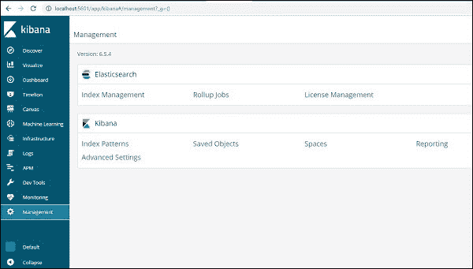

为了与基巴纳合作，我们必须首先构建索引，该索引由[弹性搜索](https://www.javatpoint.com/elasticsearch)填充。我们可以获得所有可用的索引，如弹性搜索中所示:

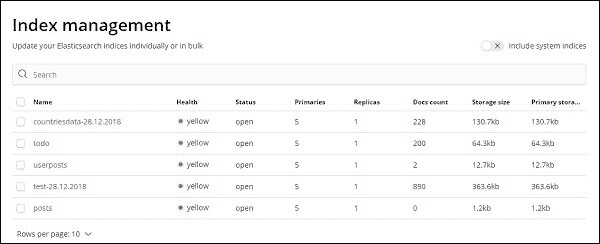

目前，[弹性搜索](https://www.javatpoint.com/kibana-elasticsearch)有上面给出的指标。文档数告诉我们索引中可用记录的数量。如果某个指标发生变化，单据数会继续调整。主存储告知我们每个上传索引的大小。

我们需要选择索引模式来在基巴纳构建一个新的索引，如下所示。

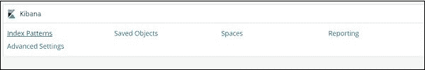

单击索引模式后，我们将看到以下屏幕-

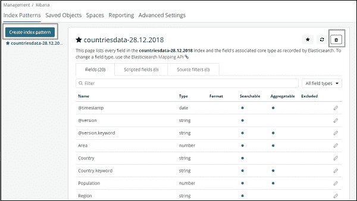

请注意，新索引是使用“构建索引模式”按钮创建的。请注意，我们已经在教程的最开始生成了国家数据-28.12.2018。

### 使用字段时间过滤器创建索引模式。

要创建新索引，请单击构建索引模板。

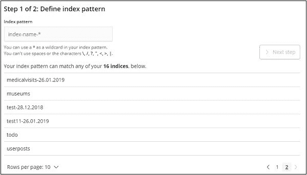

显示了弹性搜索索引，现在我们选择一个来构建新的索引。

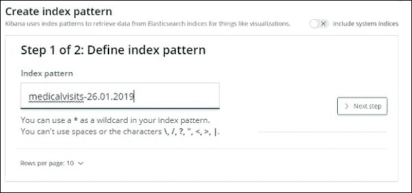

现在点击**下一步**按钮。下一步是设置环境。

时间过滤器字段的名称用于过滤基于时间的数据。下拉列表显示了与索引中的时间和日期相关的所有字段。

在下图中，我们将访问日期作为日期字段。选择“访问日期”作为时间过滤器中字段的名称。

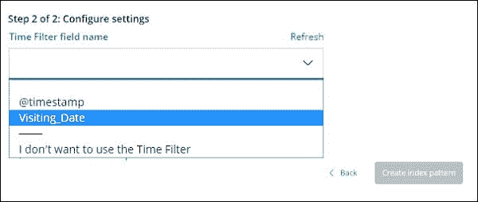

要创建索引模式，请单击创建索引模式按钮。完成后，它将显示我们的医疗访问索引-26.01.2019 中的所有字段。

我们在患者就诊索引中有以下字段-26.01.2019-

```

["Visit_Status","Time_Delay","City","City_id","Patient_Age","Zipcode","Latitude 
","Longitude","Pathology","Visiting_Date","Id_type","Id_personal","Number_Home_
Visits","Is_Patient_Minor","Geo_point"]

```

该索引包括所有到你家就医的数据。从 logstash 导入时，Elasticsearch 会添加一些附加字段。

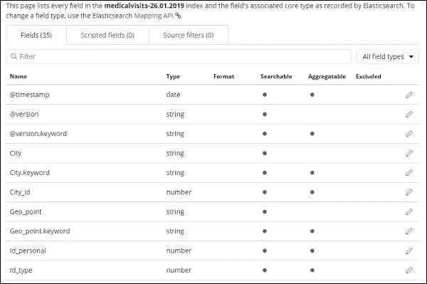 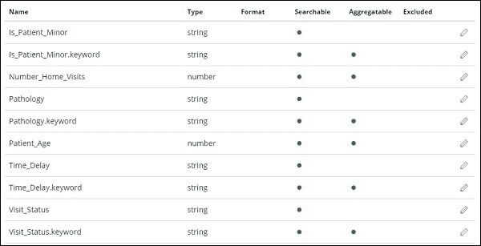 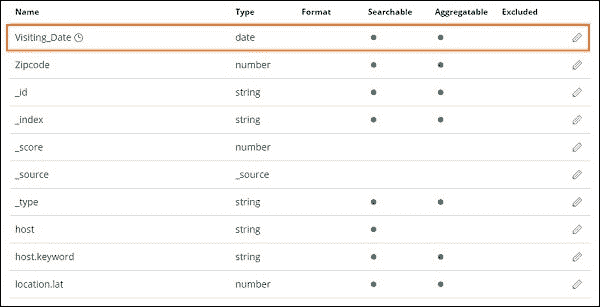 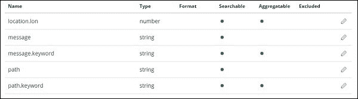

* * *