# Kibana GUI

> 原文： [https://www.javatpoint.com/kibana-gui](https://www.javatpoint.com/kibana-gui)

在本节中，我们将发现并了解**基巴纳图形用户界面**的界面。我们还将了解索引的创建、如何查看以及如何更改索引。

本教程介绍了基巴纳用户界面发现选项卡。我们将阅读更多关于以下概念的内容:

*   没有日期字段的索引
*   带有日期字段的索引

## 没有日期字段的索引

选择左侧菜单中显示的浏览:

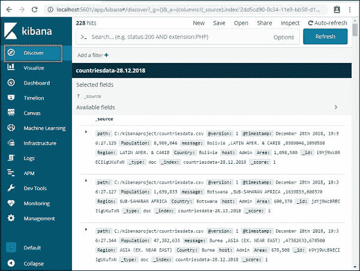

它在右侧显示了可用国内数据的详细信息-我们在上一章中创建的 28.12.2018 指数。

可用记录的总数将显示在左上角。

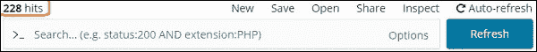

在这个选项卡中，我们可以获得索引内部的数据信息(counties data-28 . 12 . 2018)。在这里，我们可以看到上图左上角的**新建、保存、打开、共享、检查**、**自动刷新**等按钮。

单击自动刷新将显示如下所示的屏幕:

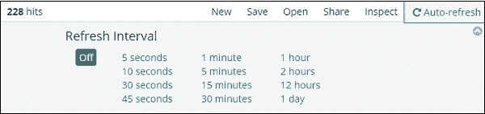

我们可以通过单击上面的秒、分或小时来设置自动刷新的时间间隔。每次间隔定时器后，我们设置 [Kibana](https://www.javatpoint.com/kibana) 会自动刷新屏幕，获取新数据。

指数数据:countriesdata-28.12.2018 如下所示。

所有字段与数据一起按行显示。点击箭头加宽行，我们会收到表格或 [JSON](https://www.javatpoint.com/json-tutorial) 格式的信息。

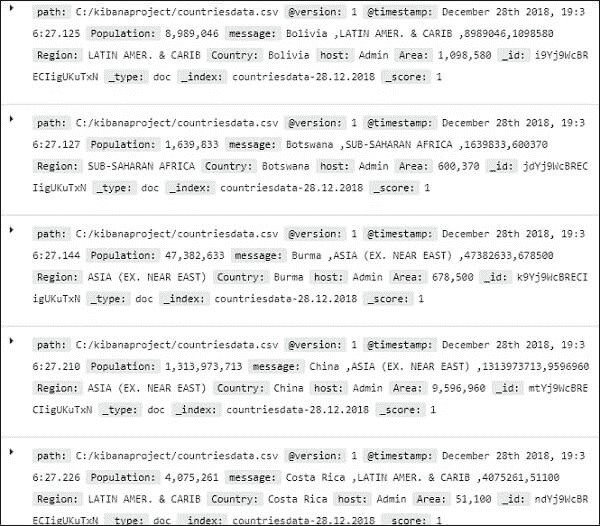 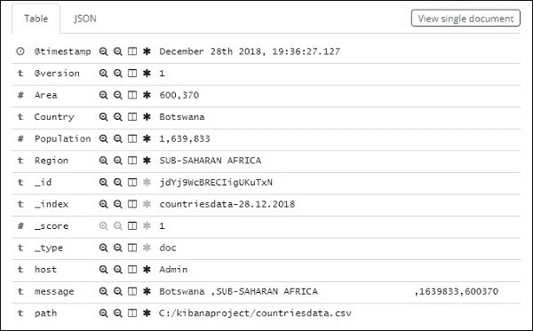

JSON 格式

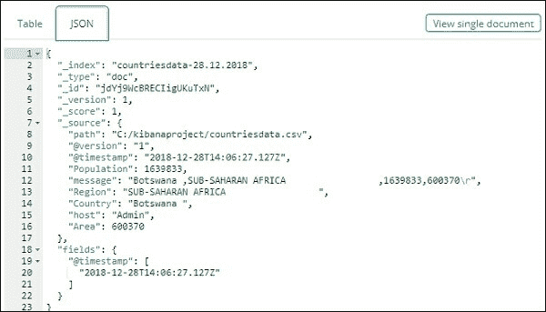

在左侧，有一个名为“查看单个文档”的按钮。


如果我们单击它，将显示页面中该行的数据，如下所示。

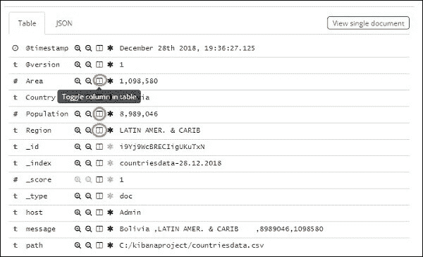 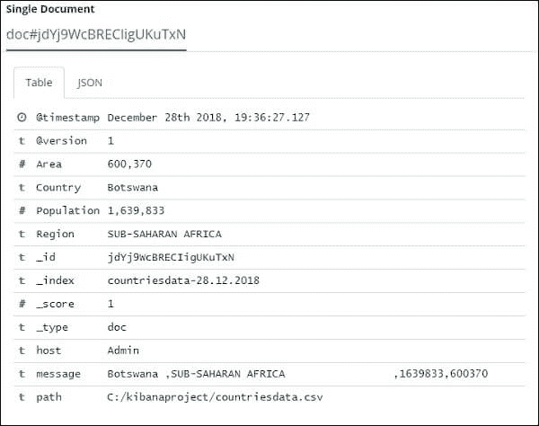

虽然我们在这里得到了所有的数据细节，但很难一一了解。

现在，让我们尝试以表格形式获取详细信息。扩展其中一行并在字段中按适当的切换列选项的一种方法如下所示。

单击可用表格选项中的切换列，我们将看到表格格式的数据。

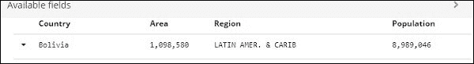

在这里，我们选择了国家、城市、地区和人口字段。扩展行折叠，我们现在可以看到表格格式的所有数据。

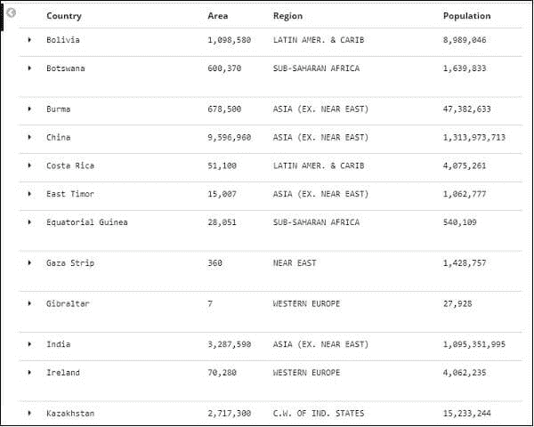

我们选择的字段显示在屏幕左侧，如下所示:

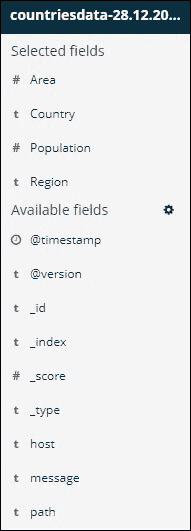

请注意，选定字段和可用字段有两种选择。我们选择以表格格式查看的字段是所选字段的一部分。如果我们选择删除任何字段，我们可以通过单击选定字段选项中的删除按钮来完成，该选项将显示在整个字段名称中。

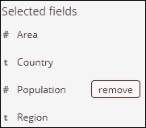

如果该字段被删除，它将包含在可用字段中，我们可以通过按下添加按钮来添加，该按钮将显示在我们想要的字段周围。通过从可用选项的可用字段中选择适当的字段，该方法也可用于获取表格格式的数据。

我们在 Kibana 的 Discover 部分有一个搜索选项，可以用来搜索索引中的数据。让我们在这里尝试与搜索选项相关的示例。

假设我们要搜索国家印度，我们可以做如下操作:

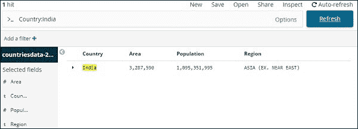

我们可以输入任务的细节，然后按下更新按钮。如果我们想寻找以 Aus 开头的国家，我们可以这样做:

选择更新以查看结果。

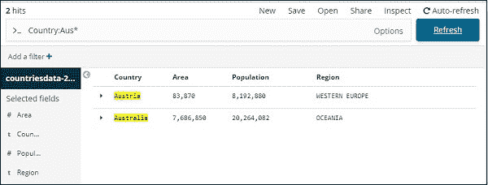

这里有两个以澳大利亚*开头的国家。如上所述，搜索栏有一个带有选项的按钮。当用户点击它时，会显示一个切换按钮，这有助于编写搜索问题。

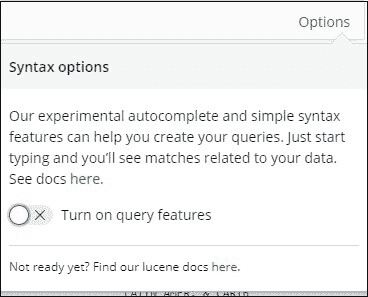

打开查询功能，键入搜索字段的名称，显示该字段的可用选项。

例如，国家是一个字符串，它显示以下字符串选项:

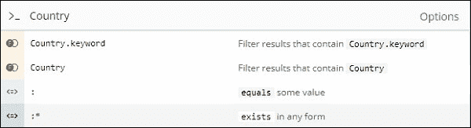

同样，区域是一个数字字段，它显示数字字段选项:

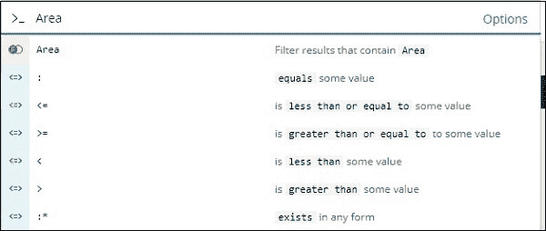

在 Discover 字段中，我们可以尝试各种组合，并根据自己的喜好过滤数据。我们可以使用“保存”按钮在“发现”选项卡中保存数据，以便将来使用。

点击右上角**确认保存**按钮，保存里面的数据，如下图。

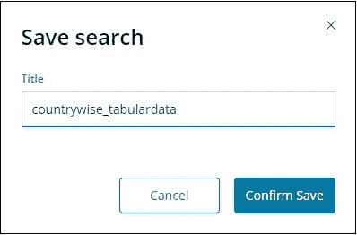

提供搜索标题，然后按确认保存保存。保存后，我们可以在下次访问“发现”选项卡时按右上角的“打开”按钮来获取保存的标题，如下所示。

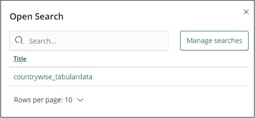

也可以使用右上角的“共享”按钮与其他人共享数据。点击它将允许我们找到如下所示的共享选项-

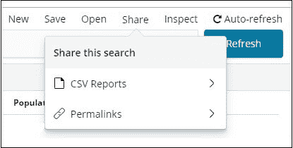

我们可以使用 CSV 报告或永久链接格式共享它。


在 CSV 报告上的选择是:

要与其他人共享报告，请单击生成 CSV。

然后点击备选永久链接，如下所示:

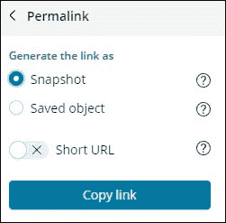

快照选项将包括与基巴纳的连接，该连接将查看任务中当前可用的数据。

保存的对象选择将包括一个基巴纳连接，它将显示我们任务中可用的最近数据。

```

Snapshot- http://localhost:5601/goto/309a983483fccd423950cfb708fabfa5 Saved Object:http://localhost:5601/app/kibana#/discover/40bd89d0-10b1-11e9-9876-4f3d759b471e?_g=() 

```

我们可以使用可用的“发现”选项卡和搜索工具，并且可以保存和与他人共享获得的结果。

## 带有日期字段的索引

转到“探索”选项卡，选择索引:医疗访问-26.01.2019

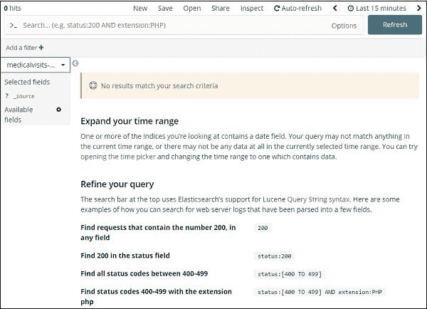

它显示消息**没有符合我们搜索标准的结果；**在我们已经选择的索引上的最后 15 分钟。该指数包括 2015 年、2016 年、2017 年和 2018 年的数据。

如下所示调整时间限制:

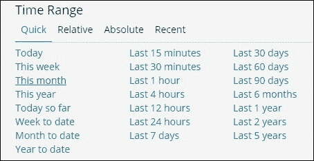

单击“完成”选项卡。

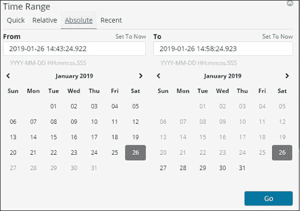

从 2017 年 1 月 1 日到 2017 年 12 月 31 日，选择日期，因为我们将查看 2017 年的数据。

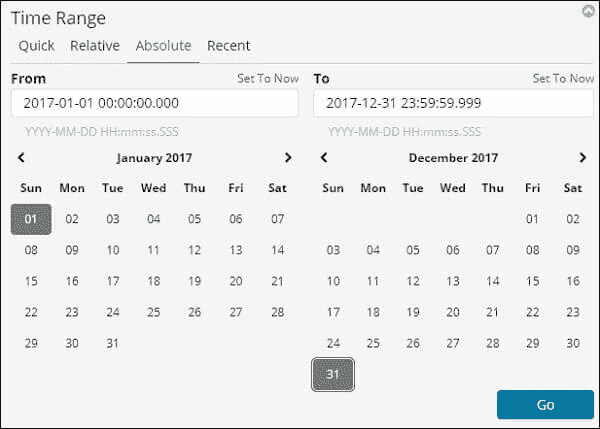

要添加时间范围，请按开始按钮。它显示数据和条形图如下:

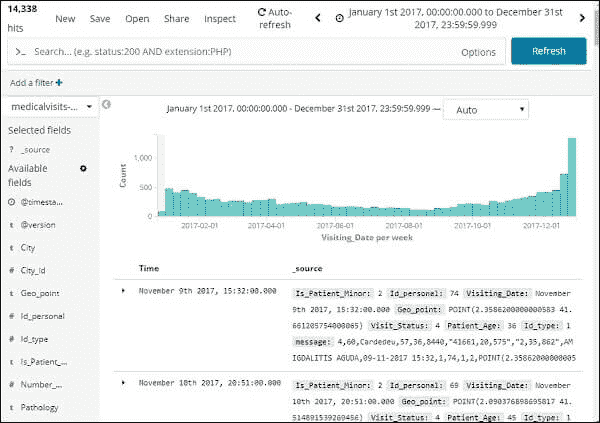

这是 2017 年的月度数据:

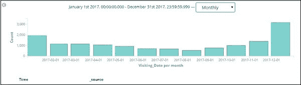

因为我们还存储了时间和日期，所以我们还可以过滤小时和分钟的数据。

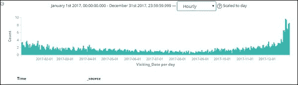

上图显示了 2017 年的每小时数据。

这里可以看到索引**患者就诊次数-26.01.2019** 的字段

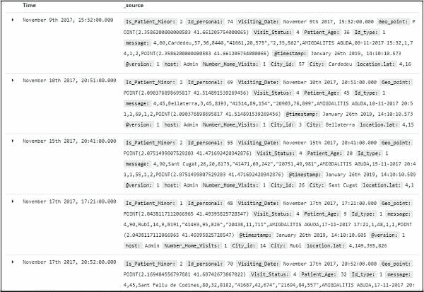

我们在左边有字段，如下所示:

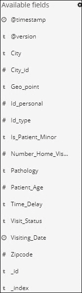

我们可以从如下所示的可用字段中选择字段，并将数据转换为表格格式。这里我们选择了以下字段-

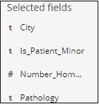

上面字段的空白数据如下所示:

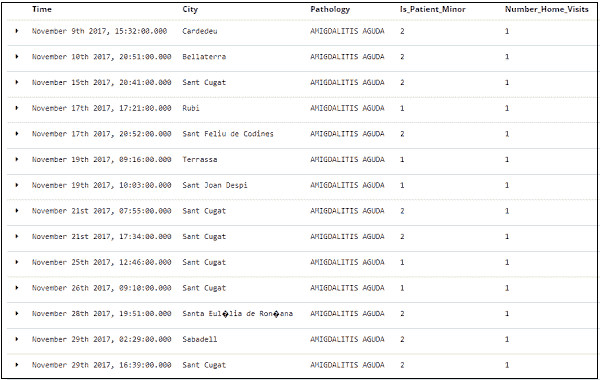

* * *