# Kibana-聚合

> 原文：<https://www.javatpoint.com/kibana-aggregation>

在本节中，我们将了解Kibana的聚合。我们将简要讨论Kibana的聚合是什么，聚合的类型。

## Kibana的聚合是什么？

聚集是在[Kibana](https://www.javatpoint.com/kibana)中创造期望观想的关键原则。

每当我们进行可视化时，我们都必须定义参数，这意味着我们希望如何对数据进行分组以对其执行度量。

在本教程中，我们将讨论两种基本类型的聚合:

*   桶聚合
*   度量聚合

## 桶聚合

一个桶由一个键和一个文本组成。进行聚合时，文档被放在各自的容器中。我们可以在下面的Kibana可视化时看到桶聚合的列表。

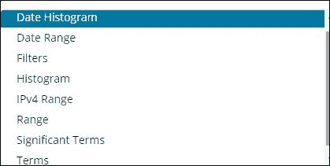

索引上的字段是国家名称、城市、人口、地区。我们在国家详细信息中有国家名称及其人口、地区和面积。

假设我们想从该地区获得明智的数据。然后，和地区中可用的国家成为我们的搜索查询，因此在这种情况下，我们的桶将由国家创建。

下图显示了一些桶，如 R1、R2、R3、R4、R5、R6，然后在转换之后，我们得到了 c1、c2、c3，它们是 R1 到 R6 桶的一部分。

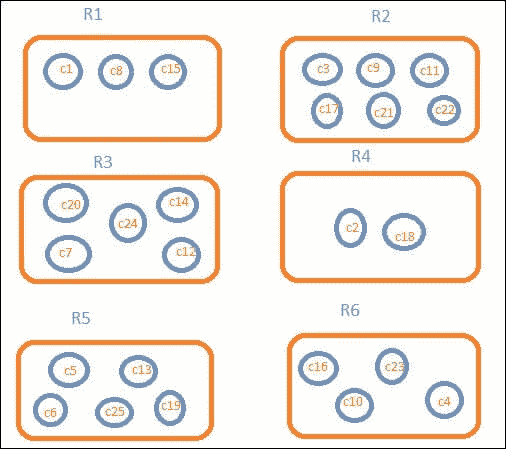

我们可以看到，在每个桶中，有几个圆圈。它们只是符合搜索标准的数据集群。我们在桶 R1 有 c1，c8 和 c15 号文件。这些文件是属于这一领域的国家，其他国家也是如此。如果算上 R1 的国家，R2 是 3 个，6 个，R3 是 6 个，R4 是 2 个，R5 是 5 个，R6 是 4 个。

我们有以下桶聚合选项:

*   日期直方图聚合
*   日期范围汇总
*   过滤器聚合
*   直方图聚合
*   IPv4 范围聚合
*   范围聚合
*   重要术语集合
*   术语聚合

### 日期直方图汇总

日期直方图聚合用于日期字段。因此，如果我们在索引中有一个日期字段，而不是这种聚合形式，则可以使用我们用来表示的索引。这是一个多桶聚合，这意味着作为一个以上桶的成员，我们将拥有任何文档。为了使这个聚合函数工作，我们还可以使用下面的参考图像。

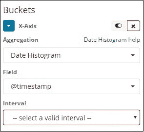

当我们选择聚合选项作为日期直方图时，将显示字段选项，该选项将仅提供与日期相关的字段。选择我们的扇区后，使用以下信息选择间隔:

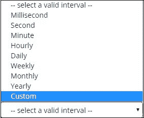

因此，从索引中选择的文档将根据所选的字段和时间间隔对文档进行分类。例如，如果我们将期间选择为每月，则与日期相关的文档将被转换为时段，并被放置在与月份相关的时段中，即 1 月-12 月。这里的时段是 1 月、2 月，..十二月

### 日期范围汇总

要使用这种聚合方法，我们需要一个日期字段。在这里，我们有一个日期设置，这是从日期和最新的。存储桶将根据给定的表单和截止日期保存文档。

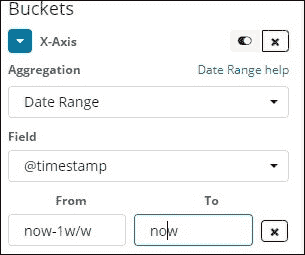

### 过滤器聚合

这些存储桶将使用基于源的类似聚合的过滤器来创建。在这里，我们可以得到一个多桶形状，因为一个文档可以驻留在一个或多个桶中，这取决于过滤标准。

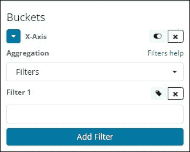

### 直方图聚合

它是应用于区域范围或数字范围的范围，然后数据集将根据该范围聚集在不同的组中。

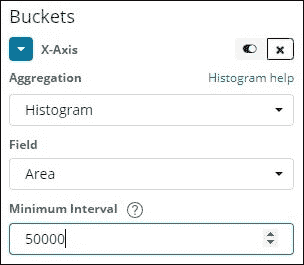

### IPv4 范围聚合

这种聚合主要用于 IP 地址。

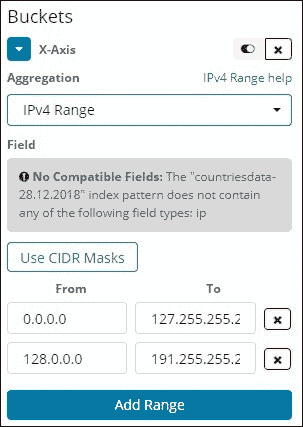

我们拥有的索引是 contriesdata-28.12.2018，它没有表单 IP 字段，因此它显示了如上所示的消息。如果我们碰巧有 IP 字段，如上所示，我们可以在其中指定“从”和“到”值。

### 范围聚合

这种类型的聚合函数由必须填充大量数字的数字字段组成。

如果需要，我们还可以添加更多的范围或范围字段。

### 重要术语汇总

这种聚合经常出现在字符串的字段中。

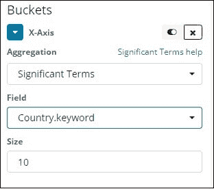

### 条款

我们在所有可用的字段上使用这种类型的聚合方法，例如，它们可以是日期、布尔值、字符串地址、数字、时间戳、 [IP](https://www.javatpoint.com/ip) 等。

这种类型的聚合函数广泛应用于不同类型数据集的所有地方。

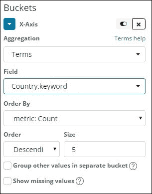

我们有一个选择顺序，根据我们选择的指标对数据进行分组。大小指的是我们想要查看的图表中的桶的数量。

## 度量聚合

度量聚合特别适用于对容器中包含的文档进行的数学度量。

下图显示了我们可以在软件中实现的度量聚合。

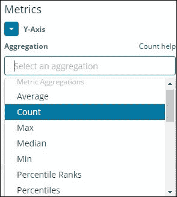

在这里，我们将讨论将在我们的软件中高度使用的几个重要的聚合函数。

*   平均函数或运算
*   计数功能或操作
*   最大功能或操作
*   最小功能或操作
*   求和函数或运算

给定的度量将应用于攻击桶中存在的所有单个项目。这是我们之前讨论过的同一件事。

接下来，让我们在此分析汇总指标列表:

### 平均的

这将为值提供存储桶中存在的文档的平均值。例如:

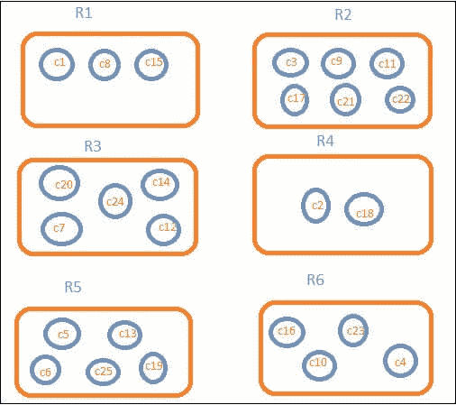

我们命名的水桶是从 R1 到 R6 的。我们在 R1 有 c1、c8 和 c15。考虑 c1 是 300，c8 是 500，c15 是 700。现在要得到 R1 海豹的平均价值

R1 = C1 值+c8 值+c15/3 值= 300 + 500 + 700 / 3 = 500。

对于桶 R1 来说，平均值是 500。

### 数数

存储桶中存在的文档数将给出。假设如果我们想计算该地区的国家数量，那么这将是我们桶中的文档总数。例如，R1 为 3，R2 为 6，R3 为 5，R4 为 2，R5 为 5，R6 为 4。

### 最大

这将给出文档在容器中的总价值。考虑上面的例子，如果我们在桶字段中有来自地区国家的数据。最大值应为每个国家面积最高的国家。所以每个地区都会有一个国家，即 R1-R6。

### 在

这将给存储桶中的文档一个最小值。考虑上面的例子，如果我们在桶字段中有来自地区国家的数据。最小值是每个区域面积最小的国家。所以每个地区都会有一个国家，即 R1-R6。

### 总额

这给出了容器中存在的文档值的总和。例如，如果我们想要该国的总面积或国家，如果我们考虑上述情况，它将是该国现有文件的总和。

如果我们有从 R1 到 R6 的区域范围的文件，将总结该区域的国家范围。

* * *